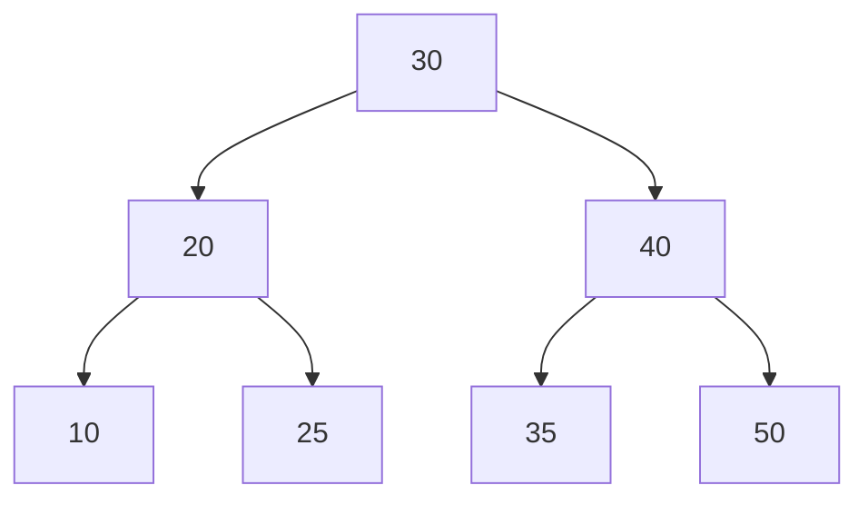
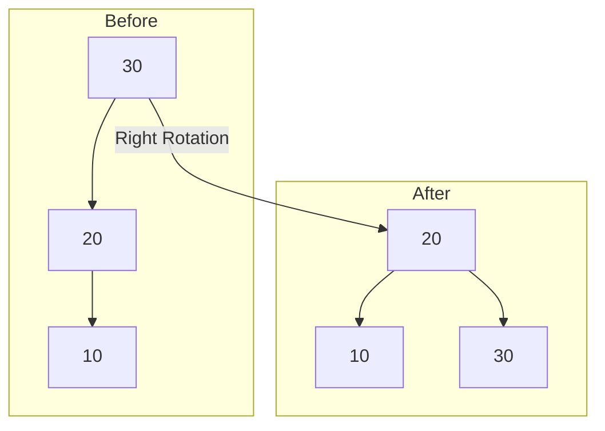
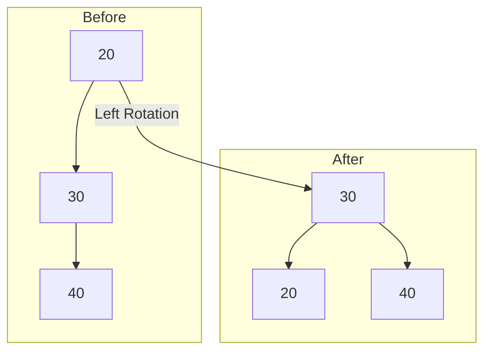

# AVL-SEARCH.md

## AVL Trees
An AVL tree is a type of self-balancing binary search tree. It automatically keeps itself balanced after insertions and deletions, so searching, inserting, and deleting are always fast.

## Left and Right Rotations
Rotations are special tree operations that help keep the tree balanced:
- **Left Rotation:** Moves a node down to the left and its right child up.
- **Right Rotation:** Moves a node down to the right and its left child up.

## The Balance Factor
The balance factor of a node is:
```
Balance Factor = height(left subtree) - height(right subtree)
```
- If the balance factor is -1, 0, or 1, the node is balanced.
- If it's less than -1 or greater than 1, the node is unbalanced and needs to be fixed.

## The Four "Out-of-Balance" Cases
When a node becomes unbalanced after an insertion or deletion, there are four possible cases:

### The Left-Left (LL) Case
- Happens when a node is inserted into the left subtree of the left child.
- Fixed with a single right rotation.

### The Right-Right (RR) Case
- Happens when a node is inserted into the right subtree of the right child.
- Fixed with a single left rotation.

### The Left-Right (LR) Case
- Happens when a node is inserted into the right subtree of the left child.
- Fixed with a left rotation on the left child, then a right rotation on the node.

### The Right-Left (RL) Case
- Happens when a node is inserted into the left subtree of the right child.
- Fixed with a right rotation on the right child, then a left rotation on the node.

## Retracing in AVL Trees
After an insertion or deletion, we retrace the path back up to the root, updating heights and performing rotations as needed to keep the tree balanced.

## How We Do AVL Tree Implementation in Python
- Each node stores its key, left/right children, and height.
- After every insert or delete, we update heights and check the balance factor.
- If a node is unbalanced, we perform the correct rotation(s) to fix it.

## AVL Delete Node Implementation
- Deletion works like in a regular binary search tree.
- After deleting, we retrace and rebalance the tree using rotations if needed.

## Time Complexity for AVL Trees
- **Search:** O(log n)
- **Insert:** O(log n)
- **Delete:** O(log n)

## O(log n) Explained
- "O(log n)" means the time it takes grows slowly as the number of nodes increases.
- For example, if you double the number of nodes, the number of steps only increases by one.
- This is much faster than O(n) (linear) or O(n^2) (quadratic) for large data sets.

## Visual Explanation: AVL Trees with Mermaid Diagrams

### Example: Balanced AVL Tree



- In this example, every node's left and right subtrees differ in height by at most 1, so the tree is balanced.

### Example: Right Rotation (LL Case)



- If you insert 10 into the left subtree of 20, the tree becomes unbalanced (LL case). A right rotation on 30 restores balance.

### Example: Left Rotation (RR Case)



- If you insert 40 into the right subtree of 30, the tree becomes unbalanced (RR case). A left rotation on 20 restores balance.

---

AVL trees are great for keeping data sorted and making sure all operations are fast, even as the tree grows!
