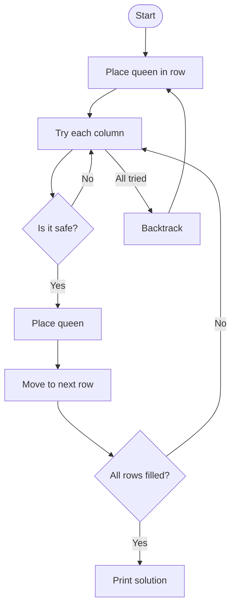

# Chapter 7: Backtracking Techniques

## Introduction
This chapter introduces backtracking, a problem-solving technique that builds solutions step by step and abandons them as soon as it determines they cannot work. You will learn how backtracking works through the classic N-Queens problem.

## Algorithms Implemented

### 1. N-Queens Problem (Backtracking)
The goal is to place N queens on an N x N chessboard so that no two queens threaten each other.

#### Key Functions:
- **is_safe:** Checks if a queen can be placed at a given position.
- **solve_n_queens:** Recursively tries to place queens row by row, backtracking when necessary.
- **n_queens_solver:** Sets up the board and starts the solving process.

```python
def is_safe(board, row, col, n):
    # Check this column on upper rows
    for i in range(row):
        if board[i][col] == 'Q':
            return False
    # Check upper left diagonal
    i, j = row - 1, col - 1
    while i >= 0 and j >= 0:
        if board[i][j] == 'Q':
            return False
        i -= 1
        j -= 1
    # Check upper right diagonal
    i, j = row - 1, col + 1
    while i >= 0 and j < n:
        if board[i][j] == 'Q':
            return False
        i -= 1
        j += 1
    return True

def solve_n_queens(board, row, n):
    if row == n:
        print("One solution:")
        print_chessboard(board)
        return True
    found_solution = False
    for col in range(n):
        if is_safe(board, row, col, n):
            board[row][col] = 'Q'
            if solve_n_queens(board, row + 1, n):
                found_solution = True
            board[row][col] = '.'
    return found_solution

def n_queens_solver(n):
    board = [['.' for _ in range(n)] for _ in range(n)]
    if not solve_n_queens(board, 0, n):
        print(f"No solution exists for {n} queens.")
```

**Step-by-step:**
1. Start with an empty board.
2. Try to place a queen in each column of the current row.
3. If it is safe, place the queen and move to the next row.
4. If a solution is found, print it. If not, backtrack and try a different position.

#### Mermaid Flowchart


## Algorithm Complexity (Time & Space)

### What is Time and Space Complexity?
- **Time complexity:** How the number of steps grows as the input size increases.
- **Space complexity:** How much extra memory is needed as the input grows.

### Complexity Analysis
- **N-Queens (backtracking):**
  - Time: $O(N!)$ (factorial time, grows very fast with $N$)
  - Space: $O(N^2)$ (for the board)

#### Proof & Cases
- The algorithm tries every possible arrangement, but prunes (cuts off) branches that cannot work.
- For small $N$, it is fast; for large $N$, it becomes slow.

## Important Notes
- Backtracking is useful for problems with constraints (like puzzles).
- It can be slow for large problems, but is very flexible.
- Pruning (stopping early) is key to making backtracking practical.

## Real-World Applications
- Solving puzzles (Sudoku, N-Queens, crosswords)
- Generating combinations and permutations
- Pathfinding in games

## Ideas for Self-Practicing
- Modify the N-Queens code to count all solutions, not just print them.
- Try solving Sudoku with backtracking.
- Write a backtracking algorithm for the subset sum problem.

## Further Readings & Connections
- [GeeksforGeeks: Backtracking](https://www.geeksforgeeks.org/backtracking-algorithms/)
- Learn about recursion (see Chapter 5) and dynamic programming (see Chapter 9).

---
**Key Terms:**
- **Backtracking:** Trying solutions step by step and undoing them if they don't work.
- **Pruning:** Cutting off branches that cannot lead to a solution.
- **Constraint:** A rule that must be followed in the solution. 