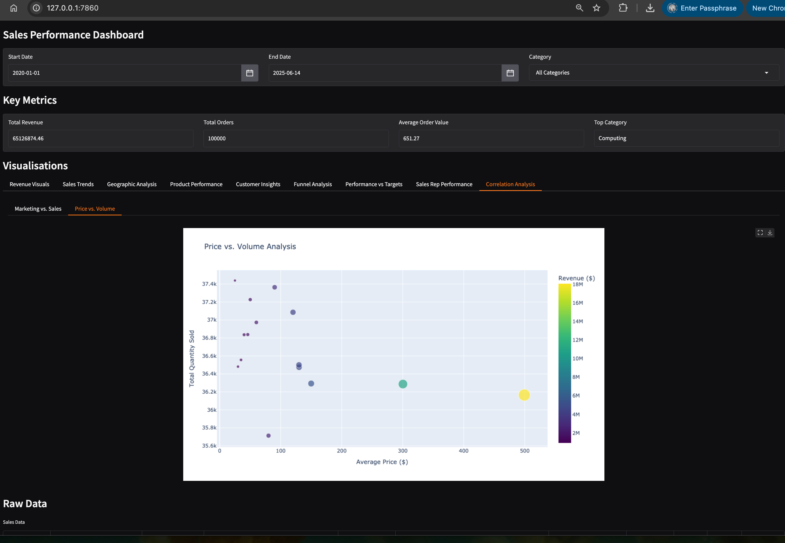

# Gradio Dashboard

This repo details how to construct a modern data dashboard using Python and the Gradio library. We focus on building interactive web applications for data insights, using a synthetic sales dataset as an example. The dashboard features include filters for dates and categories, key metric displays, data visualizations, and a raw data table. The article also provides a comparison between Gradio and Streamlit, noting Gradio's ease of use for machine learning model interfaces compared to Streamlit's more general data application capabilities. Code snippets are included for dataset generation, Gradio installation, and dashboard creation.

## Setup and Run

1. **Create a virtual environment:**

   ```bash
   python3 -m venv .venv
   ```

2. **Activate the virtual environment:**

   ```bash
   source .venv/bin/activate
   ```

3. **Install requirements:**

   ```bash
   pip install -r requirements.txt
   ```

4. **Generate synthetic data:**

   ```bash
   python generate-synthetic-data.py
   ```
   
   This script creates a synthetic sales dataset that will be used by the dashboard. The data will be saved in the `sales_data` directory.

The generated dataset looks like this:

```
head sales_data/sales_data.csv            
order_id,order_date,customer_id,customer_name,product_id,product_names,categories,quantity,price,total
0,2021-04-05,211,Customer_28394,210,Cabinet,Office,9,19.1,171.9
1,2022-12-29,614,Customer_31982,206,Paper,Stationery,2,25.37,50.74
2,2021-10-26,127,Customer_29215,208,Notebook,Stationery,9,41.18,370.62
3,2021-05-08,921,Customer_32061,203,Chair,Office,4,6.7,26.8
4,2021-07-18,786,Customer_28641,208,Notebook,Stationery,6,98.02,588.12
5,2023-06-12,778,Customer_21592,211,Plastic Cups,Sundry,7,39.96,279.72
6,2023-06-04,239,Customer_5325,203,Chair,Office,4,65.83,263.32
7,2024-08-20,280,Customer_31323,207,Pen,Stationery,8,47.32,378.56
8,2021-05-04,244,Customer_24531,211,Plastic Cups,Sundry,5,60.97,304.85
```
5. **Run the Gradio dashboard:**

   ```bash
   python gradio-dashboard.py
   ```

6. **Open the dashboard in your web browser:**

   Navigate to [http://127.0.0.1:7860](http://127.0.0.1:7860)

## Key Libraries

### Polars

[Polars](https://pola.rs/) is a lightning-fast DataFrame library for data manipulation and analysis, written in Rust. Key features include:

- **Performance**: Significantly faster than pandas for many operations due to its Rust implementation
- **Memory Efficiency**: Uses Arrow memory format for efficient memory usage
- **Lazy Evaluation**: Optimizes query execution plans for better performance
- **Multi-threaded**: Built from the ground up for parallel processing
- **API Familiarity**: Offers a pandas-like API for easier adoption

### Gradio

[Gradio](https://www.gradio.app/) is a Python library that allows you to quickly create customizable web interfaces for your machine learning models, data visualizations, and interactive applications. Features include:

- **Simplicity**: Create complex UIs with minimal code
- **Interactive Components**: Sliders, dropdowns, file uploads, and more
- **Shareable**: Easily share your interfaces via temporary links
- **Customizable**: Control layout and styling to match your needs
- **Integration**: Works well with popular ML frameworks and data libraries

### Cachetools

[Cachetools](https://pypi.org/project/cachetools/) provides various memoizing collections and decorators, including variants of the Python standard library's `@lru_cache` function decorator. Benefits include:

- **Performance Optimization**: Cache expensive function calls to avoid redundant computation
- **Memory Management**: Control cache size with LRU (Least Recently Used), TTL (Time To Live), and other eviction strategies
- **Flexibility**: Different cache types for different use cases
- **Thread Safety**: Optional thread-safe implementations

In this dashboard application, these libraries work together to provide efficient data processing (Polars), an interactive web interface (Gradio), and performance optimization through caching (Cachetools).

## Faker

[Faker](https://faker.readthedocs.io/en/master/) is a Python package that generates fake data for various purposes, such as testing or populating databases. It can create realistic-looking data for names, addresses, dates, and more. 

## Project Files

### generate-synthetic-data.py

This script generates a synthetic sales dataset that simulates real-world business data. It creates records with randomized yet realistic patterns for:

- Product categories
- Sales amounts
- Dates
- Customer demographics
- Regional information

The generated data is saved to `sales_data/sales_data.csv` and serves as the foundation for the dashboard visualizations.

### gradio-dashboard.py

This is the main application script that:

- Loads and processes the sales data using Polars
- Creates an interactive web interface with Gradio
- Implements filters, visualizations, and data tables
- Utilizes caching for performance optimization

When run, this script starts a web server that hosts the dashboard interface, making it accessible through your web browser.

### sales_data/

Directory containing the generated synthetic dataset used by the dashboard.

## Gradio vs. Streamlit Comparison

Both Gradio and Streamlit are popular Python frameworks for creating web-based data applications, but they have different strengths and use cases.

### Gradio Framework

**Strengths:**

- **ML Model Interfaces**: Excels at creating interfaces for machine learning models
- **Simplicity**: Generally requires less code for basic interfaces
- **Component Focus**: Designed around input/output components
- **API Integration**: Easy to turn interfaces into APIs
- **Customizable Themes**: Multiple built-in themes and styling options
- **Language Support**: Good support for NLP and audio processing tasks

**Limitations:**

- Less comprehensive for complex, multi-page applications
- Fewer built-in complex visualization components
- Community and ecosystem is growing but smaller than Streamlit's

### Streamlit Framework

**Strengths:**

- **Data Apps**: Better suited for complete data applications and dashboards
- **State Management**: More sophisticated state handling
- **Layout Control**: More options for controlling application layout
- **Ecosystem**: Larger ecosystem of components and extensions
- **Multi-page Support**: Native multi-page application capability
- **Caching**: Built-in caching mechanisms for data and computation

**Limitations:**

- Often requires more code than Gradio for simple interfaces
- Deployment can be more complex
- Less focused on ML model interfaces specifically

### When to Choose Gradio (like this project)

- You're primarily building interfaces for machine learning models
- You need a simple, quick solution with minimal code
- Your application focuses on processing inputs and generating outputs
- You want to easily share your interface with non-technical users
- You're integrating with other ML frameworks like HuggingFace

### When to Choose Streamlit

- You're building comprehensive data analytics applications
- Your app requires complex state management
- You need advanced layout control and multi-page capabilities
- Your application focuses more on visualizations than model interactions
- You're building a tool for data exploration rather than model demonstration

This project uses Gradio because it provides a straightforward way to create an interactive dashboard interface with minimal code while effectively handling the various components needed for our sales data visualization.

# Screenshots



More screenshots under `images/` folder.