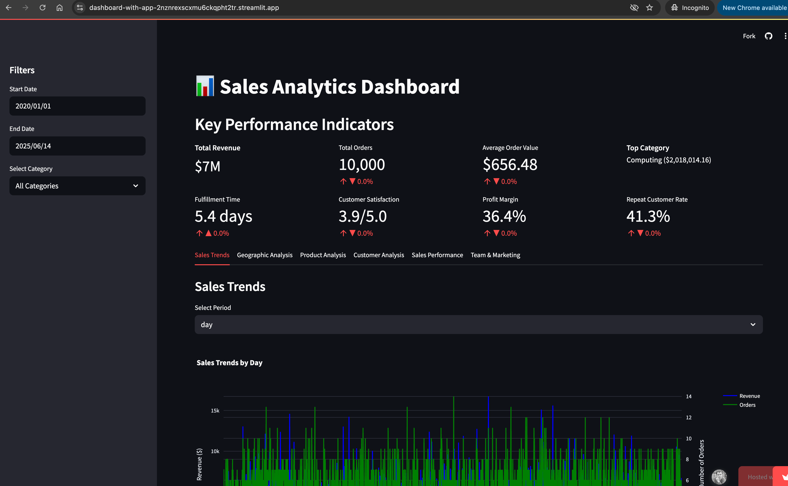

# Sales Analytics Dashboard

A comprehensive sales analytics dashboard built with Streamlit that provides insights into sales performance, trends, and key metrics.

## Features

- Interactive date range and category filters
- Key Performance Indicators (KPIs) with trend analysis
- Detailed data table view
- Responsive and user-friendly interface
- Real-time data visualization
- Customizable dashboard layout

## Installation

1. Clone this repository:
```bash
git clone <repository-url>
cd <repository-name>
```

2. Install the required dependencies:
```bash
pip install -r requirements.txt
```

## Running the Application

1. Make sure your sales data CSV file is in the `sales_data` directory and named `sales_data.csv`

2. Run the Streamlit app:
```bash
streamlit run streamlit_app.py
```

3. The application will open in your default web browser at `http://localhost:8501`

## Deploying to Streamlit Cloud

To deploy your dashboard online using Streamlit Cloud:

1. Create a GitHub repository and push your code:
```bash
git init
git add .
git commit -m "Initial commit"
git remote add origin <your-github-repo-url>
git push -u origin main
```

2. Go to [share.streamlit.io](https://share.streamlit.io/) and sign in with your GitHub account

3. Click "New app" and select:
   - Your repository
   - The branch (usually `main`)
   - The main file path (`streamlit_app.py`)

4. Configure your app:
   - Add any required secrets in the "Secrets" section if your app needs API keys or credentials
   - Set the Python version if needed
   - Add any additional packages in `requirements.txt`

5. Click "Deploy" and wait for the build to complete

Your dashboard will be available at a URL like: `https://username-app-name.streamlit.app`

Note: Make sure your `requirements.txt` file is up to date with all necessary dependencies for the deployment to work correctly.

## Data Requirements

The application expects a CSV file with the following columns:
- order_id
- customer_id
- product_id
- quantity
- price
- total
- customer_name
- product_names
- categories
- shipping_method
- delivery_date
- order_status
- customer_segment
- customer_location
- customer_age
- product_cost
- discount
- rating
- sales_rep
- campaign_id
- store_id
- store_region
- payment_method
- payment_status
- profit
- order_date

## Synthetic Data Generation

If you need to generate synthetic data for testing or development purposes, you can use the synthetic data generation script available at:
[generate-synthetic-data.py](https://github.com/vuhung16au/ACU/blob/main/DataScience/dashboard-with-gradio/generate-synthetic-data.py)

This script will create a CSV file with all the required columns and realistic-looking data that matches the data requirements above.

## Contributing

Feel free to submit issues and enhancement requests!

## Technology Stack

- Streamlit: For building the interactive web application
- Pandas: For data manipulation and analysis
- Plotly: For creating interactive visualizations
- Python: Core programming language

## Screenshots

