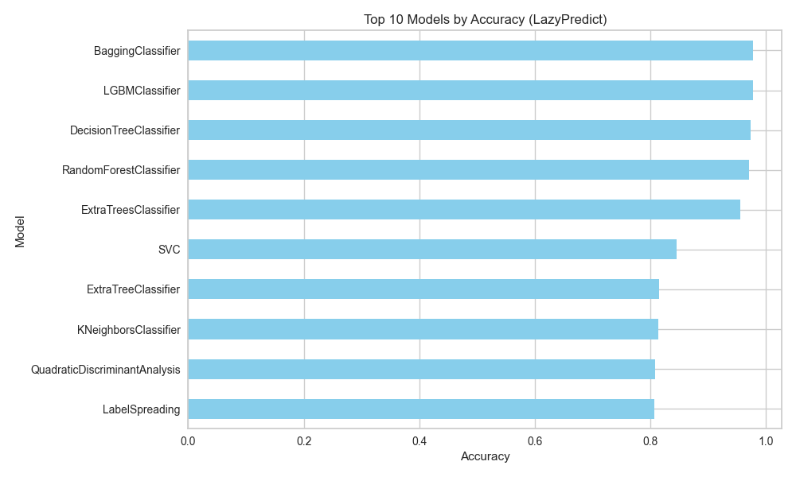

# Project Overview

This repo explains how to automate machine learning workflows using Python libraries like LazyPredict and PyCaret, how these tools streamline model selection and comparison, saving time and improving accuracy. We provide code examples and emphasizes that while understanding the underlying concepts is important, these libraries boost productivity by automating repetitive tasks, allowing data scientists to focus on other crucial aspects like feature engineering.

# LazyPredict Classifier Comparison

This project utilizes the `LazyPredict` library to automate the process of training and evaluating multiple classification models. It provides a quick way to benchmark various classifiers without extensive manual coding.


# PyCaret Overview
`pycaret` is a low-code machine learning library that simplifies the process of training and evaluating models. It allows users to quickly set up experiments, compare models, and visualize results with minimal code.

# LazyPredict Classifier Comparison with PyCaret
This project uses `LazyPredict` to compare the performance of various classification models on a dataset. It automates the process of training and evaluating multiple classifiers, providing a quick overview of their performance metrics.

The core part of this illustration is:

```python
from pycaret.classification import *
clf = setup(data=df, target=df.columns[-1])
best_model = compare_models()
```

This code sets up a dataset, compares multiple models, and identifies the best performer. The approach streamlines repetitive tasks, enabling focus on feature engineering and domain knowledge. While automation boosts productivity, understanding the underlying math remains valuable for informed decision-making.

# Project Setup

## Requirements

- Python 3.10 (recommended), or 3.11 
- Note: Python 3.13 is not yet fully compatible with some Machine Learning libraries used in this project

## Create and activate virtual environment

### macOS / Linux

```bash
# Using Python 3.10 or 3.11 is recommended
python3.11 -m venv .venv
# OR 
python3.10 -m venv .venv

source .venv/bin/activate
```

### Windows

```bash
# Using Python 3.10 or 3.11 is recommended
python3.11 -m venv .venv
# OR 
python3.10 -m venv .venv

.venv\Scripts\activate
```

Note: Verified with Python 3.10.18 on Mac OS Silicon.

## Install dependencies

```bash
pip install -r requirements.txt
```
## Run the program

```bash
python models-selection-wth-LazyPredict-PyCaret.py
```

## Troubleshooting

If you encounter dependency problems:

1. Make sure you're using Python 3.10, or 3.11
2. Upgrade pip: `pip install --upgrade pip`
3. Install dependencies with: `pip install -r requirements.txt`

# Usage 

Run the program and compare the results of different models:

The results look like this:

```
                                    Model  Accuracy  AUC  Recall  Prec.   F1  \
xgboost         Extreme Gradient Boosting      0.98 0.30    0.98   0.98 0.98   
dt               Decision Tree Classifier      0.97 0.29    0.97   0.97 0.97   
rf               Random Forest Classifier      0.97 0.30    0.97   0.97 0.97   
gbc          Gradient Boosting Classifier      0.97 0.00    0.97   0.97 0.97   
et                 Extra Trees Classifier      0.96 0.30    0.96   0.96 0.95   
lightgbm  Light Gradient Boosting Machine      0.92 0.29    0.92   0.93 0.92   
qda       Quadratic Discriminant Analysis      0.81 0.00    0.81   0.80 0.80   
lda          Linear Discriminant Analysis      0.77 0.00    0.77   0.77 0.74   
ridge                    Ridge Classifier      0.77 0.00    0.77   0.69 0.72   
ada                  Ada Boost Classifier      0.74 0.00    0.74   0.74 0.73   
nb                            Naive Bayes      0.67 0.24    0.67   0.59 0.63   
lr                    Logistic Regression      0.65 0.00    0.65   0.54 0.57   
knn                K Neighbors Classifier      0.60 0.22    0.60   0.54 0.55   
dummy                    Dummy Classifier      0.44 0.15    0.44   0.20 0.27   
svm                   SVM - Linear Kernel      0.39 0.00    0.39   0.44 0.32   

          Kappa  MCC  TT (Sec)  
xgboost    0.97 0.97      0.06  
dt         0.96 0.96      0.02  
rf         0.96 0.96      0.24  
gbc        0.96 0.96      1.24  
et         0.93 0.93      0.09  
lightgbm   0.89 0.89      1.80  
qda        0.72 0.72      0.01  
lda        0.65 0.66      0.01  
ridge      0.63 0.65      0.01  
ada        0.61 0.62      0.07  
nb         0.49 0.50      0.01  
lr         0.42 0.45      0.44  
knn        0.36 0.37      0.02  
dummy      0.00 0.00      0.01  
svm        0.14 0.20      0.06 
```

--- 

