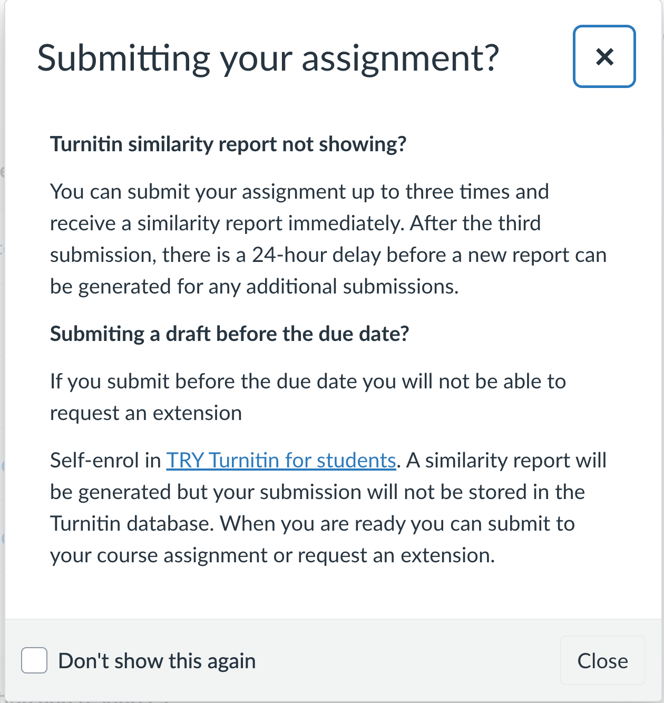

# Notes on Assignment 3

## 3rd part

5m in presentation

- Finish the report
- Table of contents for your report

- Create outline for your presentation
- Base on the outline, create script for your presentation, using GPT 

- Practice your presentation: speaking, recording, and improve it (several times)

Tools to record your presentation: MS Stream

Structure of your presentation:
- 15 - 30 seconds introduction: Executive summary
- 1 - 4.5 minutes: Main findings, results.
- Last 30 seconds: Conclusion. 

# Quick review of the last lecture (week 10)

- Topic 1: Introduction to Neural Networks (NNs)
- Topic 2: The Perceptron
- Topic 3: Iris Classification with NN
- Topic 4: Tensorflow and Keras

- Multiple-Layered Perception (MLP)

## Tensorflow
- Tensorflow is a powerful library for building and training machine learning models.
- It provides a high-level API for building and training models, as well as a low-level API for more advanced users.

## Keras
- Keras is a high-level API for building and training deep learning models.
- It is built on top of TensorFlow and provides a simple and intuitive interface for building complex models.

# Warming-up Topics

## Deepfake
- [Deepfake](https://www.youtube.com/watch?v=7akzhpx0EIU&ab_channel=NewScientist) & Detection

## Turnitin
- Turnitin updated in Canvas: How it works? What does it signify?

- Similarity score
- AI writing detection score
 

Answers: 
- Similarity score
- AI writing detection score
 
## How real is images created by Gemini AI?

Prompt: 
- create an image: A market scene in a rural village in India.
- create an image: A market scene in a rural village in Vietnam.

And why? 

## New AI Tools released recently 
- OpenAI Codex: Coding assistant (Released May 16, 2025)
- Anthropic's Claude 3 3.7 Sonnet Thinking (reasoning)
- Google Notebook ML: A research tool for ML, video overview.

# Week 11 Topics

- Topic 1: Deep Learning Training Algorithm
- Topic 2: Classification NNs and Fashion MNIST
- Topic 3: Regression NNs and California Housing

In this lecture, we will try to think like a developer and a data scientist, how to learn a new framework. 

# NN-Visuals: Neural Network Architectures

[NN-Visuals: Neural Network Architectures](https://neural-network-visualisation.vercel.app/)

# How to Train a NN?

- Training a neural network involves adjusting the weights and biases of the network to minimize the loss function.
- The loss function measures how well the network is performing on the training data.

Refer to [NN-Visuals: Neural Network Architectures](https://neural-network-visualisation.vercel.app/) for a visual representation of the training process.

# Backpropagation Training Algorithm

- Backpropagation is a supervised learning algorithm used for training neural networks.
- It involves two main steps: forward propagation and backward propagation.
- Forward propagation involves passing the input data through the network to obtain the output.
- Backward propagation involves calculating the gradients of the loss function with respect to the weights and biases of the network and updating them accordingly.
- The process is repeated for multiple epochs until the loss function converges to a minimum value.
- The learning rate is a hyperparameter that controls the step size of the weight updates.

Refer to [NN-Visuals: Neural Network Architectures](https://neural-network-visualisation.vercel.app/) 

## Backpropagation calculus Summary (Summarise the above video)

(3blue1brown) [Backpropagation calculus | DL3](https://www.youtube.com/watch?v=Ilg3gGewQ5U&t=3s&ab_channel=3Blue1Brown)
(3blue1brown) [Backpropagation calculus | DL4](https://www.youtube.com/watch?v=tIeHLnjs5U8&t=8s&ab_channel=3Blue1Brown)

- Step 1: Forward Pass
- Step 2: Calculate Loss
- Step 3: Backward Pass (Gradient Computation): This is backpropagation phase
- Step 4: Parameter Update
- Step 5: Repeat

(Next steps in a pipeline)
- Step 6: Stop when the loss converges to a minimum value
- Step 7: Evaluate the model on the test data
- Step 8: Save the model for future use
- Step 9: Use the model for predictions on new data
- Step 10: Fine-tune the model if necessary

## Stochastic Gradient Descent (Step 3)

| Term | Definition |
|------|-----------|
| **Sample** | A single data point from your dataset. |
| **Batch** | A subset of the entire training dataset that is used to compute the gradient and update the model's weights in one iteration of the training process. |
| **Epoch** | One complete pass through the entire training dataset. You will see the results of training once an epoch is completed in TensorFlow/Keras. |
| **Iteration** | A single update of the model's weights based on a batch of data. The number of iterations in an epoch is equal to the number of batches in the dataset. |

### What Is the Difference Between Batch and Epoch?
- Batch: A subset of the training data.
- Epoch: A full pass over the entire training dataset. Consists of multiple batches.

# Activation Functions

Here are the mathematical definitions for each of those activation functions, short and on a single line:

* **Logistic (Sigmoid) function:** $f(z) = \frac{1}{1 + e^{-z}}$
* **Hyperbolic Tangent (Tanh) function:** $f(z) = \frac{e^z - e^{-z}}{e^z + e^{-z}}$
* **Rectified Linear Unit (ReLU) function:** $f(z) = \max(0, z)$

# Loss Functions

* **Cross-Entropy Loss (for Binary Classification):** 

$$L(y, \hat{y}) = -(y \log(\hat{y}) + (1 - y) \log(1 - \hat{y}))$$

* **Mean Squared Error (MSE):** 

$$L(y, \hat{y}) = \frac{1}{N} \sum_{i=1}^{N} (y_i - \hat{y}_i)^2$$

* **Mean Absolute Error (MAE):** 

$$L(y, \hat{y}) = \frac{1}{N} \sum_{i=1}^{N} |y_i - \hat{y}_i|$$

# Example of Binary Classification: Email Spam Detection

- Spam
- Not Spam

## Fuzzy logic and Binary Classification

An email is: "0.8 Spam" and "0.2 Not Spam."

Q: Does [SpamAssassin](https://spamassassin.apache.org/) use ML to classify emails? or it is a rule-based system?

# Example of Multi class Classification: Gmail Category Classification

- Social
- Promotions
- Updates
- Forums
- Scheduled
- (User defined)

# Clean Code by Robert C. Martin 

- Bad code vs Good code
- Good comments vs Bad comments
- Meaningful names
- Error handling
- Unit test 
- Refactor

- Put everything together with AI Agents 

# Tutorial Regression with Keras

(ACU) [Tutorial Regression with Keras](https://colab.research.google.com/drive/1aP3M7xRNxcd7bvfCN6Zw3IVEONcqrom2?usp=sharing)

# Tutorial Image Classification with Keras

(ACU) [Tutorial Image Classification with Keras](https://colab.research.google.com/drive/1aLOLL98pSKtZ5662PZbEMJwYwyPIsVSO?usp=sharing)

# TensorFlow + Keras Text Classification

[TensorFlow + Keras Text Classification](https://colab.research.google.com/drive/1mewvU9nWBv-U8awLIHvje7DMpUT48DWn)

# TensorFlow + Keras Image Classification

[TensorFlow + Keras Image Classification](https://colab.research.google.com/drive/1cQ8Xa_y9mZ0Mc0N0gZWFR0B--EevWDiA)

# Learn More about Deep Learning

(to keep you busy in the next 3 months)
- Follow the course [MIT Introduction to Deep Learning | 6.S191](https://introtodeeplearning.com/) & [Youtube Playlist](https://www.youtube.com/playlist?list=PLtBw6njQRU-rwp5__7C0oIVt26ZgjG9NI). Pros: Newer contents & engaging sample code. Recommeneded for those who want to an overview about deep learning in short time.

- Alternatively, read the part II of the book "Hands-On Machine Learning with Scikit-Learn, Keras, and TensorFlow" & practice the code ([github](https://github.com/ageron/handson-ml3)).Cons: Old contents, requires a lot of time to read and practice the code. Recommended for those who want to take a deep dive into deep learning seriously.

To practice with the code
- Practice with [Keras examples](https://keras.io/examples/)
- Practice with [TensorFlow examples](https://www.tensorflow.org/tutorials)
- (Optional) Learn [pytorch](https://pytorch.org/) if you want to work with vision

