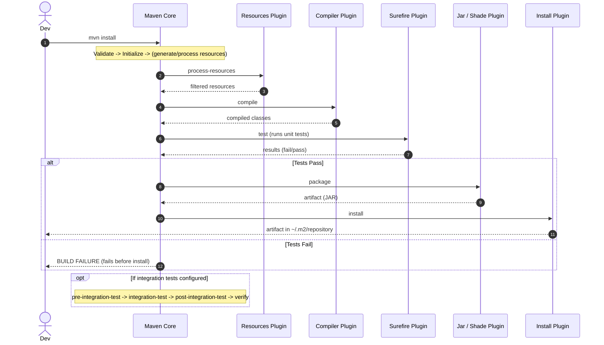

# Maven Lifecycle

Understanding Maven's build lifecycles helps you know what actions (plugin goals) run and when. Maven has 3 standard lifecycles: `clean`, `default` (aka *build*), and `site`. Each lifecycle is an ordered list of **phases**. Running a phase runs that phase **and all earlier phases** in the same lifecycle.

---
 
## 1. clean Lifecycle

| Phase | Typical Goals |
|-------|---------------|
| pre-clean | (custom) |
| clean | `maven-clean-plugin:clean` removes `target/` |
| post-clean | (custom) |

Command examples:

- `mvn clean`

---
 
## 2. default (build) Lifecycle (Common Packaging: jar)

| Phase | What It Means | Common Plugin Goals (jar project) |
|-------|---------------|-----------------------------------|
| validate | POM sanity, structure | (none by default) |
| initialize | Set properties | (none) |
| generate-sources | Produce code (e.g. from annotation processors) | code generators |
| process-sources | Filter/adjust sources | resources/plugins |
| generate-resources | Create resources | (none) |
| process-resources | Copy/filter `src/main/resources` to `target/classes` | `resources:resources` |
| compile | Compile main code | `compiler:compile` |
| process-classes | Bytecode enhancement | (e.g. weaving) |
| generate-test-sources | Generate test code | (none) |
| process-test-sources | Filter test sources | resources |
| generate-test-resources | Generate test resources | (none) |
| process-test-resources | Copy/filter `src/test/resources` | `resources:testResources` |
| test-compile | Compile test code | `compiler:testCompile` |
| process-test-classes | Post-process test bytecode | (none) |
| test | Run unit tests | `surefire:test` |
| prepare-package | Pre-package steps (shade, war struct) | e.g. `shade:shade` (if bound) |
| package | Create artifact (jar, war, etc.) | `jar:jar` (or relevant) |
| pre-integration-test | Start containers, DBs | failsafe pre steps |
| integration-test | Run integration tests | `failsafe:integration-test` |
| post-integration-test | Stop resources | `failsafe:verify` (partly) |
| verify | Additional checks (signatures, quality) | (custom) |
| install | Copy artifact to local repo (`~/.m2/repository`) | `install:install` |
| deploy | Copy artifact to remote repo | `deploy:deploy` |

Command examples:

- `mvn package`
- `mvn test`
- `mvn install`
- `mvn deploy`

Notes:

- If you run `mvn install`, everything up to and including `install` runs.
- `deploy` requires distributionManagement or repository parameters and a built artifact.
- If no test framework present, `test` succeeds quickly.

### Packaging Influence

The `packaging` value (`jar`, `war`, `pom`, etc.) decides which default goals bind to phases. Example: `jar` binds `jar:jar` to `package`; `pom` has no `package` artifact; `war` binds `war:war`.

---
 
## 3. site Lifecycle

| Phase | Typical Goals |
|-------|---------------|
| pre-site | (custom) |
| site | `site:site` generate docs |
| post-site | (custom) |
| site-deploy | Publish site |

Command examples:

- `mvn site`
- `mvn site-deploy`

---
 
## 4. Plugins & Goal Bindings

Maven itself coordinates; real work is in plugins. A *goal* is a single task; a *phase* can have multiple goals bound. You can:

- Bind a plugin goal in the `<executions>` section.
- Invoke a goal directly: `mvn dependency:tree` (skips lifecycle except minimal setup).

Excerpt pattern:

```xml
<build>
  <plugins>
    <plugin>
      <groupId>org.apache.maven.plugins</groupId>
      <artifactId>maven-compiler-plugin</artifactId>
      <version>3.13.0</version>
      <configuration>
        <release>21</release>
      </configuration>
    </plugin>
  </plugins>
</build>
```

Binding example (attach shade at `package`):

```xml
<plugin>
  <groupId>org.apache.maven.plugins</groupId>
  <artifactId>maven-shade-plugin</artifactId>
  <version>3.5.3</version>
  <executions>
    <execution>
      <phase>package</phase>
      <goals><goal>shade</goal></goals>
    </execution>
  </executions>
 </plugin>
```

---
 
## 5. Common Commands Cheat Sheet

| Goal / Phase | When to Use |
|--------------|-------------|
| `mvn clean` | Start fresh build (delete target) |
| `mvn compile` | Just compile main code |
| `mvn test` | Compile + run unit tests |
| `mvn package` | Produce the artifact (jar/war) |
| `mvn install` | Make artifact available to other local projects |
| `mvn deploy` | Publish to remote repository |
| `mvn -DskipTests package` | Build but skip unit tests (still compiles them) |
| `mvn -DskipTests -Dmaven.test.skip=true package` | Skip compiling & running tests |

---
 
## 6. Failure Diagnosis (Example Noted In Project)

Error: `Failed to execute goal ... maven-deploy-plugin:... deploy ... The packaging for project ... did not assign a file to the build artifact` typically means:

- `package` phase didn't produce an artifact (e.g. packaging `pom` or earlier failure), or
- A plugin removed/replaced the main artifact before `deploy`, or
- You invoked `deploy` before `package` created output (rare if lifecycles intact), or
- Multi-module aggregator with no artifact trying to deploy.

Fix: Ensure `packaging` is `jar` (or relevant), `mvn package` succeeds, and the built file exists in `target/` before `mvn deploy` (it will automatically run previous phases).

---
 
## 7. Best Practices

- Pin plugin versions (reproducibility).
- Keep lifecycle bindings minimal; prefer explicit plugin configs over ad-hoc goal calls in scripts.
- Use profiles for environment-specific tweaks (JDK release, OS classifiers, signing, etc.).
- Separate fast unit tests (Surefire) from slower integration tests (Failsafe) using the appropriate phases.

---
 
## 8. Mental Model

Think: Lifecycle (ordered phases) -> each phase triggers bound plugin goals -> goals perform work -> result flows to next phase -> final artifact(s) installed/deployed.

### Sequence Diagram (mvn install)

Below shows a simplified interaction when you run `mvn install` (default lifecycle). The clean lifecycle is separate and only runs if you explicitly add `clean` (e.g. `mvn clean install`).



### Legend

- Phases not explicitly messaged (validate, initialize, verify) bracket the shown plugin goal calls.
- Each arrow from Maven represents one or more goals bound to that phase.

---
Reference: <https://maven.apache.org/guides/introduction/introduction-to-the-lifecycle.html>
