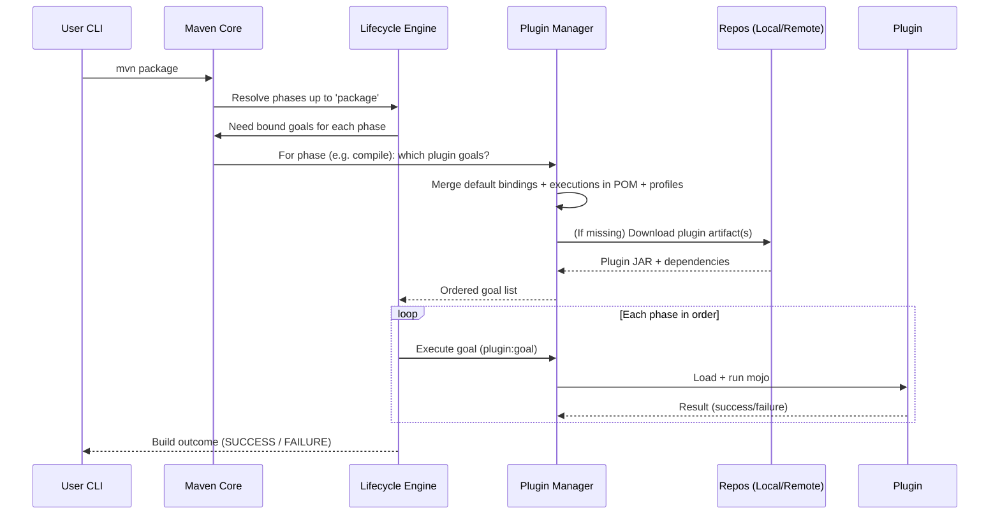

# Maven Plugins Guide

A practical, exam‑ready & troubleshooting‑oriented overview of Maven plugins: what they are, how they are located, bound, configured, overridden, diagnosed, and commonly used.

---
 
## 1. Big Picture

Maven itself is a *plugin execution framework*. Nearly all lifecycle work is delegated to plugin *goals*. A *lifecycle phase* (e.g. `compile`, `test`, `package`, `install`, `deploy`) is just an ordered label; when you invoke a phase, Maven looks up which plugin goals are **bound** to each earlier phase and executes them in order.

```text
phase ---> bound goals (plugin:goal) ---> effect on project output
```

You may:

* Rely on default bindings (e.g. `maven-compiler-plugin:compile` at `compile` phase for `jar` packaging).
* Add additional executions (attach extra goals to phases).
* Directly invoke a goal: `mvn dependency:tree` or `mvn org.apache.maven.plugins:maven-shade-plugin:3.5.0:shade`.

---
 
## 2. Key Concepts
 
| Term | Meaning |
|------|---------|
| Plugin | A packaged set of related *goals* (JAR with metadata). |
| Goal | A single task (e.g. `compiler:compile`, `surefire:test`). |
| Execution | A configured instance of a goal (with id, phase, configuration). |
| Binding | Association of an execution (goal) to a lifecycle phase. |
| Default Binding | Goal implicitly attached based on packaging type. |
| Direct Goal Invocation | Run a goal without phases (`mvn jar:jar`). Lifecycle up to `jar` **is not** run unless you specify a phase. |
| Plugin Prefix | Short name (e.g. `shade`) that Maven resolves to the plugin artifact. |
| Plugin Management | A section providing *defaults* (esp. versions) inherited by child POMs; it does **not** activate the plugin by itself. |
| Effective POM | The fully merged POM after inheritance + profiles (use `mvn help:effective-pom`). |

---
 
## 3. Plugin Resolution & Invocation Flow

Mermaid sequence showing how Maven determines which goals to run when you type `mvn package`:
 


---
 
## 4. Types / Families of Plugins
 
| Category | Examples | Notes |
|----------|----------|-------|
| Core Build | `maven-compiler-plugin`, `maven-jar-plugin`, `maven-resources-plugin` | Usually have default bindings. |
| Testing | `maven-surefire-plugin`, `maven-failsafe-plugin` | `surefire` for unit tests (`test` phase); `failsafe` for integration tests (`integration-test`, `verify`). |
| Packaging / Assembly | `maven-jar-plugin`, `maven-war-plugin`, `maven-shade-plugin`, `maven-assembly-plugin`, `jlink`, `javafx-maven-plugin` | Control final artifact shape. |
| Quality / Analysis | `maven-enforcer-plugin`, `maven-checkstyle-plugin`, `spotbugs-maven-plugin`, `versions-maven-plugin` | Often bound to `validate` or `verify`. |
| Reporting / Site | `maven-site-plugin`, `maven-javadoc-plugin`, `jacoco-maven-plugin` | Generate docs / coverage. |
| Dependency Insight | `maven-dependency-plugin` | Diagnostics, copy, unpack, analyze. |
| Distribution | `maven-install-plugin`, `maven-deploy-plugin` | Install to local repo; deploy to remote repository manager. |
| Misc / Utility | `exec-maven-plugin`, `build-helper-maven-plugin`, `properties-maven-plugin` | Extends lifecycle with app‑specific tasks. |

---
 
## 5. Default Lifecycle vs Plugins

For packaging `jar`, Maven implicitly binds (simplified):

```text
validate: (none core)
compile: maven-compiler-plugin:compile
process-test-classes: maven-compiler-plugin:testCompile
resources: maven-resources-plugin:resources
testResources: maven-resources-plugin:testResources
test: maven-surefire-plugin:test
package: maven-jar-plugin:jar
install: maven-install-plugin:install
deploy: maven-deploy-plugin:deploy
```
Different packaging (e.g. `pom`, `war`, `maven-plugin`, `javafx` via external plugin) changes bindings.

View bindings:

```bash
mvn help:describe -Dcmd=compile -Ddetail
mvn help:effective-pom
```

---
 
## 6. Adding or Customizing a Plugin

Minimal example adding (or customizing) shade plugin:

```xml
<build>
  <plugins>
    <plugin>
      <groupId>org.apache.maven.plugins</groupId>
      <artifactId>maven-shade-plugin</artifactId>
      <version>3.5.0</version>
      <executions>
        <execution>
          <id>fat-jar</id>
          <phase>package</phase>
          <goals><goal>shade</goal></goals>
          <configuration>
            <createDependencyReducedPom>true</createDependencyReducedPom>
            <transformers>
              <transformer implementation="org.apache.maven.plugins.shade.resource.ManifestResourceTransformer">
                <mainClass>com.example.App</mainClass>
              </transformer>
            </transformers>
          </configuration>
        </execution>
      </executions>
    </plugin>
  </plugins>
</build>
```
Notes:

* `<executions>` attaches `shade` goal to `package`.
* Without `<phase>` you would have to run goal explicitly: `mvn shade:shade`.
* Configuration can be externalized via properties or profiles.

---
 
## 7. Plugin vs Plugin Management

```xml
<build>
  <pluginManagement>
    <plugins>
      <plugin>
        <artifactId>maven-compiler-plugin</artifactId>
        <version>3.13.0</version>
        <configuration>
          <release>21</release>
        </configuration>
      </plugin>
    </plugins>
  </pluginManagement>
  <plugins>
    <plugin>
      <artifactId>maven-compiler-plugin</artifactId>
    </plugin>
  </plugins>
</build>
```
Why this pattern?

* Manage version centrally (esp. in parent POM) while children just declare `<plugin>` to *activate* usage.
* Avoid version drift / build instability.

---
 
## 8. Version Strategy & Reproducibility
Best practices:
* Always pin plugin versions (except very stable ones like `maven-jar-plugin`—still recommended to pin for deterministic CI).
* Use properties to update easily: `<maven.compiler.plugin.version>3.13.0</maven.compiler.plugin.version>`.
* For all standard plugins: consult https://maven.apache.org/plugins/ .
* Re-run with `-U` if snapshots or updated plugin metadata needed.
* Reproducible builds: lock plugin versions + use build number / timestamp normalization (e.g. `reproducible-build-maven-plugin`).

---
 
## 9. Inheritance & Aggregation Effects
 
| Scenario | Behavior |
|----------|----------|
| Parent defines plugin in `<pluginManagement>` only | Child must still add `<plugin>` to activate. |
| Parent defines plugin under `<plugins>` | Children inherit executions unless they redefine with matching `<id>`. |
| Multi-module aggregator root executes phase | All reactor modules participate; plugin executions run per module in topological order. |

Overriding an execution: same `<id>` in child; omit a goal to remove it or alter configuration.

---
 
## 10. Ordering Rules
Within a *single phase* the order of execution is:
1. All plugin executions (goals) in the order they were aggregated from: default bindings first, then plugin executions as they appear in the POM (after inheritance merge) by plugin declaration order.
2. For multiple executions of the same plugin bound to same phase: order of `<execution>` elements.

Implication: Place critical transformations (e.g. bytecode weaving) earlier if outputs are re-consumed by later goals.

---
 
## 11. Direct Goal Invocation vs Phases
Command forms:
 
| Form | Runs Lifecycle? | Example | When to Use |
|------|-----------------|---------|-------------|
| `mvn package` | Yes (all earlier phases) | Normal build | Standard builds |
| `mvn dependency:tree` | Only that goal | Quick inspection | Non-lifecycle tasks |
| `mvn compiler:compile` | Only compile goal (no tests/resources processed) | Rapid iteration (rare) | Debug plugin behavior |
| `mvn -DskipTests package` | Yes (tests skipped) | CI fast path | Speed |

Be careful: skipping phases can yield stale or partial outputs.

---
 
## 12. Commonly Used Plugins (Cheat Sheet)
 
| Need | Plugin & Goal(s) | Tip |
|------|------------------|-----|
| Compile Java | `maven-compiler-plugin:compile` | Use `<release>` for multi-release JDKs. |
| Run Unit Tests | `maven-surefire-plugin:test` | `-Dtest=Class#method` filters. |
| Run Integration Tests | `maven-failsafe-plugin:integration-test` & `verify` | Requires pattern `*IT.java`. |
| Fat JAR | `maven-shade-plugin:shade` | Prefer over assembly for relocating deps. |
| Copy Dependencies | `maven-dependency-plugin:copy-dependencies` | For layering container images. |
| Enforce Rules | `maven-enforcer-plugin:enforce` | E.g. ban duplicate deps, enforce JDK. |
| Code Coverage | `jacoco-maven-plugin:prepare-agent` + `report` | Bind report to `verify`. |
| Static Analysis | `spotbugs-maven-plugin:check` | Add exclude filters for generated code. |
| Style Checks | `maven-checkstyle-plugin:check` | Fail build on style violations. |
| Version Updates | `versions-maven-plugin:use-latest-releases` | Dry run first. |
| JavaFX Packaging | `org.openjfx:javafx-maven-plugin:run` | Attach run goal or JVM args. |
| Native Image (GraalVM) | `org.graalvm.buildtools:native-maven-plugin:native-image` | Profile‑gated. |

---
 
## 13. Creating a Custom Plugin (High Level)
1. Set packaging: `<packaging>maven-plugin</packaging>`.
2. Add dependency on `maven-plugin-api` & (optionally) `maven-plugin-annotations`.
3. Create a Mojo class:
```java
@Mojo(name = "greet", defaultPhase = LifecyclePhase.VALIDATE, threadSafe = true)
public class GreetMojo extends AbstractMojo {
  @Parameter(property = "greet.name", defaultValue = "World")
  private String name;
  public void execute() throws MojoExecutionException {
    getLog().info("Hello " + name);
  }
}
```
4. Build & install: `mvn install` -> plugin artifact in local repo.
5. Use: `mvn com.acme:my-plugin:1.0.0:greet -Dgreet.name=Team` or bind via `<executions>`.

---
 
## 14. Diagnostics & Troubleshooting
 
| Symptom | Likely Cause | Fix |
|---------|--------------|-----|
| `... did not assign a file to the build artifact` at `deploy` | Packaging/plugin before `deploy` produced no primary artifact (e.g. misconfigured shade or replaced classifier) | Ensure your packaging phase still produces main JAR; verify `maven-jar-plugin` not disabled; check shade `<shadedArtifactAttached>` vs replacement. |
| Plugin version conflict | Parent vs child declaring different versions | Consolidate under `<pluginManagement>`. |
| Goal not running | Not bound to phase or profile inactive | Add `<phase>` in execution; activate profile. |
| Unexpected plugin run twice | Declared execution + default binding | Override by redefining execution with same goal & set `<inherited>false>` or adjust configuration. |
| ClassNotFound during plugin | Plugin dependency missing | Add `<dependencies>` inside plugin definition (rare). |
| Slow build | Re-run goals redundantly or downloading snapshots | Pin versions; disable snapshots; use build cache strategies. |

Useful flags:
```bash
-X                 # full debug
-Dmaven.plugin.validation=VERBOSE
-Dmaven.repo.local=/tmp/custom-repo
```
Describe plugin: `mvn help:describe -Dplugin=org.apache.maven.plugins:maven-compiler-plugin -Ddetail`.

---
 
## 15. Best Practices Summary
* Always pin plugin versions; manage centrally.
* Keep executions minimal—avoid binding goals you rarely need (invoke ad hoc instead).
* Fail fast with `enforcer` for JDK & dependency hygiene.
* Separate integration tests via failsafe plugin (do not overload surefire).
* Prefer shade for uber‑jar with relocation; use assembly for multi-file distributions.
* Review effective POM in CI to catch accidental version drift.
* Make builds reproducible: deterministic timestamps, pinned plugins, explicit encodings.

---
 
## 16. Quick Reference: Invocation Forms
```bash
# Run standard build to package
mvn clean package
# Run a single plugin goal (no full lifecycle)
mvn dependency:tree
# Force plugin version explicitly (good for reproducibility)
mvn org.apache.maven.plugins:maven-dependency-plugin:3.6.1:analyze
# Show help for a goal
mvn help:describe -Dcmd=shade -Ddetail
```

---
 
## 17. Further Reading
* Official Plugin Index: https://maven.apache.org/plugins/
* Plugin Developer Guide: https://maven.apache.org/guides/plugin/guide-java-plugin-development.html
* Default bindings per packaging: https://maven.apache.org/ref/current/maven-core/default-bindings.html

---
 
## 18. Checklist Review (Applied to This Project)
 
| Need | Current Status | Suggested Action |
|------|---------------|------------------|
| Java Version control | Check `maven-compiler-plugin` configured | Ensure `<release>` set (e.g. 21). |
| Fat JAR | Shade plugin already (produced *-fat.jar*)? | Confirm correct main class & manifest. |
| Deployment error (no artifact) | Observed in screenshot | Verify primary artifact produced before `deploy` – ensure jar plugin still active when shading. |
| Test execution speed | Possibly default | Add `-DskipTests` only for local quick builds, not CI. |

---
Happy building!
