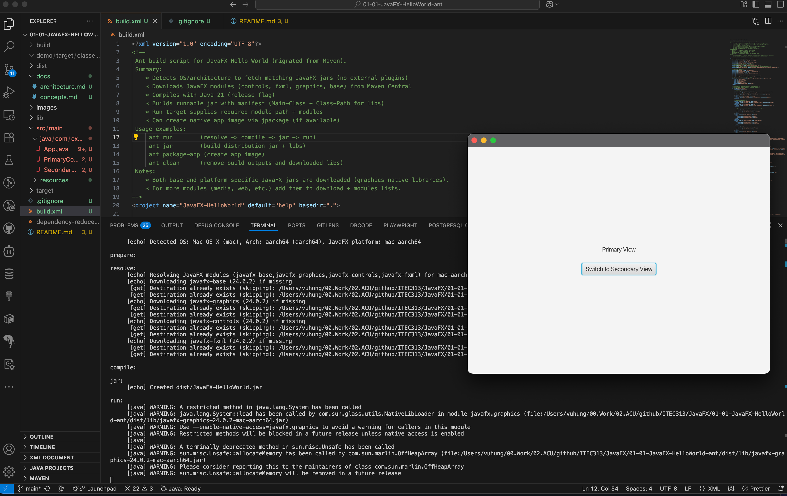

# JavaFX Hello World (Ant Only)

This is a minimal JavaFX 21+ Hello World project built **exclusively with [Apache Ant](https://ant.apache.org/index.html)**. Maven artifacts, scripts and configuration have been removed.

## Why Ant?

Ant provides full transparency and fine-grained control of each build step without the overhead of a higher-level build lifecycle. This project demonstrates:

* Automatic OS + architecture detection (mac-aarch64, mac-x64, linux, linux-aarch64, win) to fetch matching JavaFX jars.
* Zero external Ant tasks required (pure core Ant).
* Download + cache of JavaFX modules straight from Maven Central (controls, fxml, graphics, base).
* Compilation targeting Java 21 using `--release 21`.
* Runnable jar assembly with manifest `Main-Class` and proper `Class-Path` for libs.
* Optional native app image creation with `jpackage` (if present in the JDK).

## Why not Ant?

- Ant is not recommended for large or complex projects due to its verbosity and lack of advanced features found in modern build tools.
- Ant requires a lot of manual configuration writing `build.xml` files, which can be error-prone and hard to maintain.

## Prerequisites

* JDK 21 (or later) installed and on PATH (`java -version`).
* Apache Ant 1.10+ (`ant -version`).

## Quick Start

```bash
ant run          # resolve -> compile -> jar -> run
```

## Common Targets

| Target        | Description |
|---------------|-------------|
| `resolve`     | Downloads required JavaFX jars (+ platform-specific natives) into `lib/`. |
| `compile`     | Compiles Java sources (depends on `resolve`). |
| `jar`         | Builds `dist/JavaFX-HelloWorld.jar` and copies libs to `dist/lib/`. |
| `run`         | Runs the application using the built jar. |
| `package-app` | Uses `jpackage` to create a native app image in `dist/image/`. |
| `clean`       | Removes `build/`, `dist/`, `lib/`. |

## Property Overrides

Override at command line (defaults in parentheses):

```bash
ant -Djavafx.version=24.0.2 -Dmodules=javafx.controls,javafx.fxml run
ant -Djavafx.platform=mac-aarch64 run   # force a platform classifier if auto-detect mismatches
```

Main configurable properties:

* `javafx.version` (24.0.2)
* `modules` (javafx.controls,javafx.fxml)
* `main.class` (com.example.App)
* `javafx.platform` (auto-detected; can override)

## Running the Built Jar Manually

```bash
ant jar
java --module-path dist/lib --add-modules javafx.controls,javafx.fxml -jar dist/JavaFX-HelloWorld.jar
```

Optional (suppress native access warnings in newer JDKs):

```bash
java --enable-native-access=javafx.graphics \
	--module-path dist/lib --add-modules javafx.controls,javafx.fxml \
	-jar dist/JavaFX-HelloWorld.jar
```

## Creating a Native App Image

```bash
ant package-app
# macOS
open dist/image/JavaFX-HelloWorld.app
```

`jpackage` must exist at `${JAVA_HOME}/bin/jpackage` (included in most modern JDK distributions).

## Project Layout

```text
build.xml          Ant build script
src/main/java      Java sources
src/main/resources FXML + resources
build/             (generated) compiled classes
lib/               (generated) downloaded JavaFX jars
dist/              (generated) distribution jar + libs (and app image)
```

## Screenshot



---

Enjoy building with Ant!

