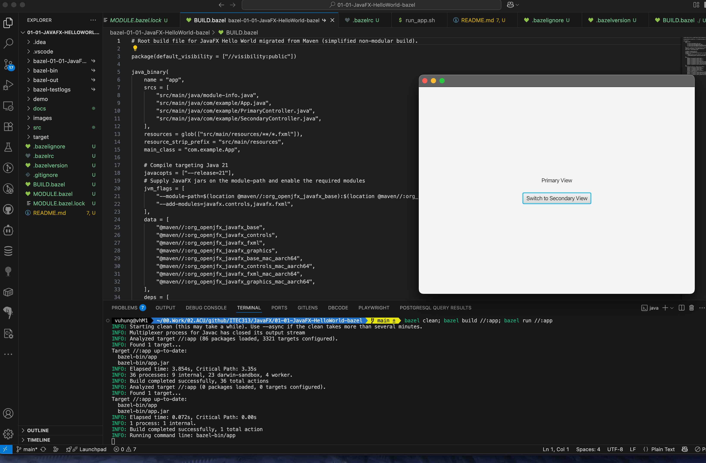

# JavaFX Hello World Example

How to build and run a simple JavaFX application that displays "Hello, World!" using Bazel.

## Build & Run with Bazel

This project uses Bazel (8.3.1+). Maven is no longer used.

```bash
# Build the JavaFX binary
bazel build //:app

# Run the application
bazel run //:app

# The output jar
ls -l bazel-bin/app.jar

# Run the jar directly (JavaFX runs fine on classpath with 21.x)
java -cp bazel-bin/app.jar:$(bazel cquery --output=files @maven//:org_openjfx_javafx_controls) com.example.App
```

### jpackage (optional)

You can still create a native app bundle using the jar Bazel produced:

```bash
JAR=bazel-bin/app.jar
APP_NAME=JavaFX-HelloWorld-Bazel
jpackage \
	--name "$APP_NAME" \
	--type app-image \
	--input $(dirname "$JAR") \
	--main-jar $(basename "$JAR") \
	--java-options "--add-opens=javafx.graphics/com.sun.javafx.tk=ALL-UNNAMED" \
	--icon images/JavaFX-HelloWorld.png || true
open "$APP_NAME.app"
```

## Screenshot of JavaFX Hello World Application



## About Bazel

### What is Bazel?
Bazel is Google's open‑source, high-performance, multi-language build system. It emphasizes: reproducibility (hermetic, sandboxed actions), correctness (explicit dependencies), scalability (large mono‑repos), incremental speed (fine‑grained DAG + remote cache), and portability (same command locally, CI, or remote executors).

### Bazel vs Maven vs Gradle (Java focus)
 
| Aspect | Bazel | Gradle | Maven |
|--------|-------|--------|-------|
| Dependency model | Explicit; external repos declared (bzlmod) | Flexible (Groovy/Kotlin DSL) | Declarative POM (XML) |
| Incremental speed | Very fast with caching + parallelism | Good (incremental tasks) | Slower (lifecycle phases) |
| Remote cache / build farm | First-class | Possible (Enterprise features) | Limited (needs extensions) |
| Reproducibility | Strong via sandboxing | Medium (tasks can be impure) | Medium (plugins may be impure) |
| Multi-language mono‑repo | Strong (one tool) | Moderate | Weak (mostly Java) |
| Plugin / ecosystem richness | Smaller for Java specifics | Very large | Very large |
| Learning curve | Steeper (less convention) | Moderate | Easiest (convention) |
| IDE import simplicity | Improving; needs rules | Excellent | Excellent |

Trade‑off summary: Bazel gives determinism + scale; Gradle gives flexibility + rich plugins; Maven gives simplicity + ubiquity.

### Bazel build configuration in this project
 
Files:

* `MODULE.bazel` – Enables bzlmod. Declares the module (`javafx_hello`) and pulls JavaFX Maven artifacts via `rules_jvm_external`'s `maven.install`. This replaces a Maven `pom.xml` or Gradle dependency block.
* `BUILD.bazel` – Declares build targets. The key rule here is `java_binary(name = "app", ...)` which produces `app.jar`.
* (Generated) `bazel-*/` – Output & symlink trees produced by Bazel (do not commit).
* `run_app.sh` (referenced by a small `sh_binary`) – Optional helper wrapper (not required; you can use `bazel run //:app`).

Important attributes in `java_binary`:

* `srcs` – Java sources (includes `module-info.java`).
* `resources` + `resource_strip_prefix` – Package FXML files inside the jar with clean paths.
* `main_class` – Entry point (`com.example.App`).
* `javacopts` – Force compilation targeting Java 21.
* `deps` – JavaFX modules (both generic and platform-classifier artifacts) supplied by the generated `@maven` repo.
* `jvm_flags` – Builds a `--module-path` at run time and adds required JavaFX modules.
* `data` – Ensures runtime availability of dynamic native libraries (platform-specific JavaFX jars).

### Dependency management (bzlmod + rules_jvm_external)
 
`MODULE.bazel` uses:

* `bazel_dep` to bring in `rules_jvm_external`.
* `use_extension` / `maven.install` to list Maven coordinates (JavaFX 21.0.4 + macOS aarch64 natives).
* `use_repo(maven, "maven")` exposes a synthetic repository named `@maven`; individual artifacts become labels like `@maven//:org_openjfx_javafx_controls`.

### Typical developer loop
 
```bash
bazel build //:app      # compile only
bazel run //:app        # build + execute
bazel test //...        # (add tests later)
```

 
### When to choose Bazel here

Even for a small JavaFX sample, using Bazel demonstrates how you'd scale to many modules, share remote cache in CI, and pin exact transitive artifacts without a full Maven/Gradle toolchain.


### Why not Use Bazel?

- Too complex for small projects
- Not as widely adopted in the Java ecosystem
- Lack of community support and resources compared to Maven/Gradle