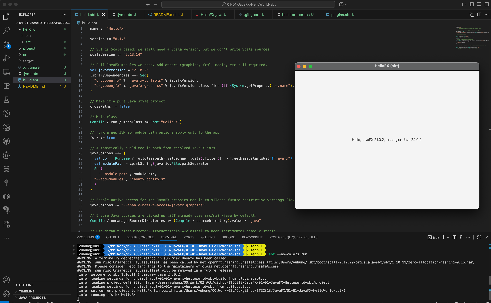

# Build HelloFX with `sbt`

Simple JavaFX Hello World sample configured for [sbt](https://www.scala-sbt.org/).

## Why sbt

[The build.sbt file](build.sbt):

* KISS: simple syntax
* No XML
* Short build definition
* Easy to maintain

## Run (macOS / Linux / Windows)

From the project root:

```bash
sbt run
```

This will download JavaFX artifacts for your platform automatically and launch the app.

## build.sbt explained

Key lines in `build.sbt` and what they do:

* `name`, `version` – Basic project metadata.
* `scalaVersion` – Satisfies sbt's need for a Scala toolchain (project itself is pure Java).
* `val javafxVersion` – Central place to bump JavaFX version.
* `libraryDependencies` – Pulls required JavaFX modules (`javafx-controls`, `javafx-graphics`). A classifier is chosen dynamically so macOS ARM (Apple Silicon) uses `mac-aarch64`, otherwise generic `mac`.
* `crossPaths := false` – Prevents Scala version being appended to the artifact name (keeps it Java‑style).
* `Compile / run / mainClass := Some("HelloFX")` – Declares the application main class (in `src/main/java`).
* `fork := true` – Runs the app in a separate JVM so added JVM/module options only affect the launched app, not the sbt shell.
* `javaOptions ++= { ... }` – At runtime, automatically builds the `--module-path` from resolved JavaFX jars and adds `--add-modules javafx.controls`.
* `javaOptions += "--enable-native-access=javafx.graphics"` – Suppresses future native access warnings for JavaFX graphics (Java 22+ change).
* `Compile / unmanagedSourceDirectories += ...` – Redundant clarity: ensures Java sources directory is included (sbt already defaults to `src/main/java`).

Adding more JavaFX modules:

* Add dependencies (e.g. `"org.openjfx" % "javafx-media" % javafxVersion` with the same classifier logic if platform natives are needed).
* Extend the `--add-modules` list: change to `"javafx.controls,javafx.media"` (comma-separated) or programmatically build from the chosen modules.

Packaging a runnable fat JAR (simple approach):

* Add the sbt-assembly plugin (not currently configured) or use `sbt package` then run with explicit module path pointing at downloaded JavaFX jars in `~/.ivy2/cache` (or rely on `--module-path` logic via `sbt run`). For teaching purposes `sbt run` is usually sufficient.

Running with custom JVM options:

```bash
sbt "run --args"
```
Edit `javaOptions` for persistent changes.
 

### .jvmopts

This project also includes a `.jvmopts` file:

```text
--enable-native-access=ALL-UNNAMED
```

Differences / roles:
 
* `.jvmopts` applies to the JVM that runs sbt itself (the build tool process).
* `javaOptions` in `build.sbt` applies only to the forked application process started by `sbt run` (because `fork := true`).

Here we enable native access for all unnamed modules in the sbt launcher to preempt / silence future restricted native access warnings originating from helper tooling (distinct from the app-specific `--enable-native-access=javafx.graphics`). If you later need broader native access inside the app, add or adjust the `javaOptions` entries rather than changing `.jvmopts`.

## Notes

* JavaFX modules (controls, graphics) are added via `libraryDependencies`.
* The module path is assembled automatically from the resolved JavaFX jars.
* Native access warning suppression: build already adds `--enable-native-access=javafx.graphics`.
    If you introduce additional modules needing native access (e.g. media, web), extend with a
    comma-separated list or use `ALL-UNNAMED` for broader enablement.

## Screenshots


