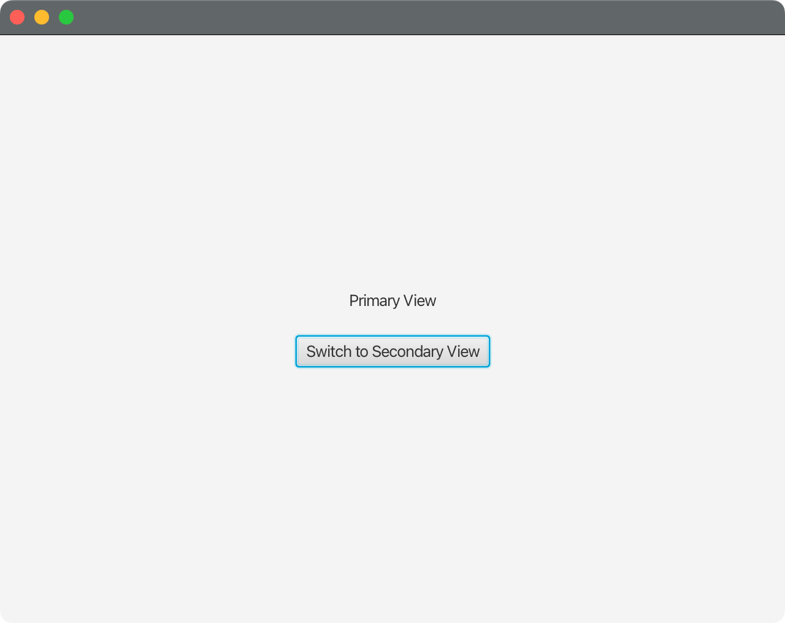
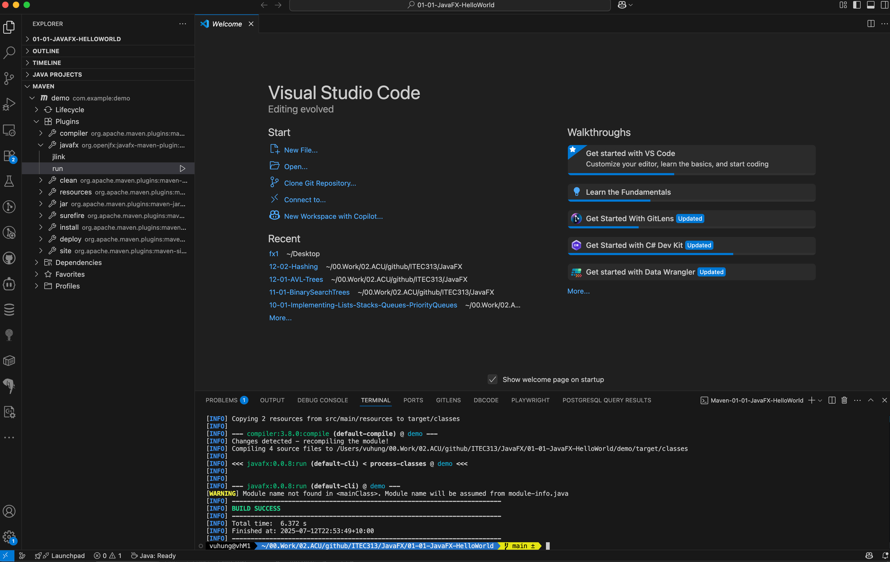

# JavaFX Hello World Example

[How to](https://code.visualstudio.com/docs/java/java-gui) build and run a simple JavaFX application that displays "Hello, World!" using Maven using VS Code.

## Maven Commands

### Clean, Compile and Run

To clean, compile and run the JavaFX application:

```bash
# Clean previous builds
mvn clean

# Compile the application
mvn compile

# Run the JavaFX application
mvn javafx:run
```

Or run all steps in one command:

```bash
mvn clean compile javafx:run
```

### Run the JAR File Directly

After building the project with `mvn clean package`, you can run the generated JAR file directly:

```bash
# Navigate to the target directory
cd target

# Run the JAR file with JavaFX modules
java --module-path lib --add-modules javafx.controls,javafx.fxml -jar JavaFX-HelloWorld-1.0.jar
```

Note: The JAR file includes a proper manifest with the main class, so it can be executed directly. However, since it's a JavaFX application, you need to specify the module path and required JavaFX modules.

### Package and Create Standalone Application

To create a standalone native application that can be distributed without requiring Java installation:

```bash
# Clean, compile, package and create native app
mvn clean package jpackage:jpackage
```

This command will:

- Clean any previous builds
- Compile the JavaFX application
- Package it into a JAR file
- Copy all JavaFX dependencies to the `target/lib` folder
- Create a native application in `target/dist/`

On macOS, this creates a `.app` bundle in `target/dist/JavaFX-HelloWorld.app` that can be run by double-clicking or using:

```bash
open target/dist/JavaFX-HelloWorld.app
```

## Screenshot of JavaFX Hello World Application




