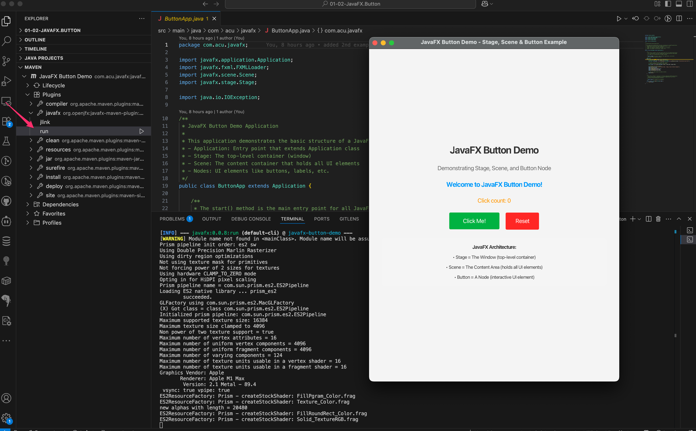

# JavaFX Button Demo Project

This is a comprehensive JavaFX application that demonstrates the fundamental concepts of JavaFX architecture, specifically focusing on **Stage**, **Scene**, and **Button** components.

## 🏗️ Project Structure

```text
src/
├── main/
│   ├── java/
│   │   ├── module-info.java                    # Module descriptor
│   │   └── com/acu/javafx/
│   │       ├── ButtonApp.java                  # Main Application class
│   │       └── controller/
│   │           └── ButtonController.java       # Event handler controller
│   └── resources/
│       └── fxml/
│           └── button-view.fxml                # UI layout definition
└── pom.xml                                     # Maven configuration
```

## 📚 Core JavaFX Concepts Explained

### 1. **Application**

- The entry point of any JavaFX application
- Must extend `javafx.application.Application`
- Override the `start(Stage stage)` method
- Called by the JavaFX runtime system

### 2. **Stage** 🪟

- **What it is**: The top-level container that represents the window
- **Think of it as**: The window frame of your application
- **Key properties**:
  - Title bar
  - Window controls (minimize, maximize, close)
  - Resizable properties
  - Window size and position

### 3. **Scene** 🎬

- **What it is**: The content container that holds all UI elements
- **Think of it as**: The canvas or content area inside the window
- **Key properties**:
  - Root node (the top-level container for all UI elements)
  - Size (width and height)
  - CSS styling capabilities

### 4. **Nodes** (Button, Label, etc.) 🔘

- **What they are**: Individual UI components
- **Think of them as**: Building blocks of your user interface
- **Examples**: Button, Label, TextField, ImageView, etc.
- **Key properties**:
  - Event handlers
  - Styling
  - Layout properties

## 🎯 Architecture Relationship

```text
Application
    └── Stage (Window)
        └── Scene (Content Area)
            └── Root Node (Container)
                ├── Button (Interactive Element)
                ├── Label (Text Display)
                └── Other Nodes...
```

## 🚀 How to Run the Project

### Prerequisites

- Java 11 or higher
- Maven 3.6+
- JavaFX 17+ (included via Maven dependencies)

### Running with Maven

```bash
# Clean and compile the project
mvn clean compile

# Run the JavaFX application
mvn javafx:run
```

or 

```bash 
sh ./run.sh
```

### Alternative: Run with Java

```bash
# Compile first
mvn compile

# Run with module path (adjust paths as needed)
java --module-path /path/to/javafx/lib --add-modules javafx.controls,javafx.fxml -cp target/classes com.acu.javafx.ButtonApp
```

## 🎮 Application Features

1. **Interactive Button**: Click to see the counter increment
2. **Dynamic Updates**: Button text changes based on click count
3. **Reset Functionality**: Reset the counter back to zero
4. **Visual Feedback**: Status messages and styling changes
5. **Educational Info**: Built-in explanation of JavaFX concepts

## 🎨 Key Learning Points

1. **Separation of Concerns**:
   - FXML for UI layout
   - Controller for event handling
   - Main class for application setup

2. **Event Handling**:
   - `@FXML` annotation for injection
   - `onAction` attributes in FXML
   - Method binding between FXML and Controller

3. **Styling**:
   - CSS-like styling in FXML
   - Programmatic styling in Java
   - Font and color customization

4. **Layout Management**:
   - VBox for vertical arrangement
   - HBox for horizontal arrangement
   - Padding and spacing for clean layouts

## 🔧 Customization Ideas

- Add more button types (Toggle, Radio, etc.)
- Implement different event types (hover, key press)
- Add animations and transitions
- Create multiple scenes and switch between them
- Add menus and additional UI controls

## 📖 Additional Resources

- [Official JavaFX Documentation](https://openjfx.io/)
- [JavaFX CSS Reference Guide](https://openjfx.io/javadoc/17/javafx.graphics/javafx/scene/doc-files/cssref.html)
- [FXML Introduction](https://openjfx.io/javadoc/17/javafx.fxml/javafx/fxml/doc-files/introduction_to_fxml.html)

## Screenshots


