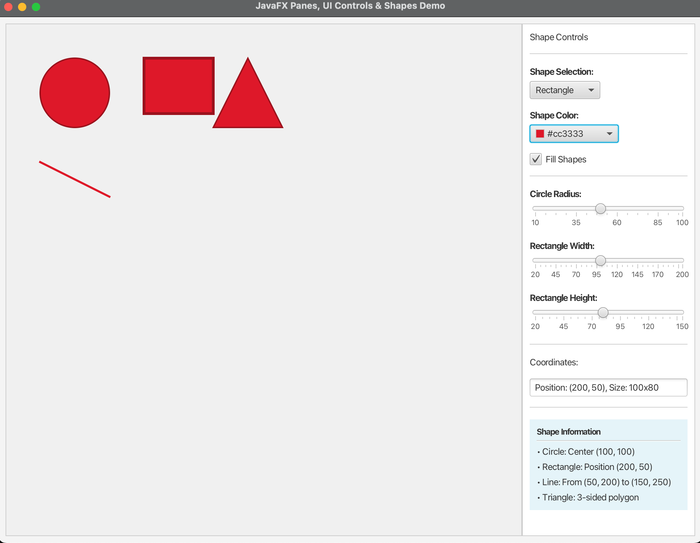

# JavaFX Panes, UI Controls & Shapes Demo

A comprehensive JavaFX application that demonstrates how to use JavaFX panes, UI controls, and shapes.

## Features

This application includes the following features:
- **Display a Circle** - Interactive circle with adjustable radius
- **Display a Rectangle** - Rectangle with adjustable width and height  
- **Display a Line** - Static line shape
- **Display a Triangle** - Polygon shape representing a triangle
- **Interactive UI Controls** - Sliders, color picker, combo box, checkboxes
- **Multiple Pane Layouts** - BorderPane, VBox, HBox for organizing components
- **Real-time Shape Manipulation** - Modify shapes dynamically using controls

## Project Structure

```
src/main/java/
├── com/example/
│   ├── ShapesDemo.java    # Main JavaFX application
│   └── Launcher.java      # Alternative launcher class
└── module-info.java       # Module configuration (optional)
pom.xml                    # Maven build configuration
```

## JavaFX Concepts Demonstrated

### 1. Panes (Layout Management)
- **BorderPane** - Main layout with center and right regions
- **VBox** - Vertical arrangement of controls
- **HBox** - Horizontal arrangement when needed
- **Pane** - Free-form layout for shapes

### 2. UI Controls
- **Slider** - For adjusting circle radius and rectangle dimensions
- **ColorPicker** - For changing shape colors
- **ComboBox** - For selecting which shape to highlight
- **CheckBox** - For toggling shape fill
- **TextField** - For displaying coordinate information
- **Label** - For descriptive text
- **Separator** - For visual organization

### 3. Shapes
- **Circle** - With center point and radius
- **Rectangle** - With position and dimensions
- **Line** - With start and end points
- **Polygon** - Triangle shape with multiple vertices

## Prerequisites

- Java 11 or higher
- Maven 3.6 or higher
- JavaFX 19 (automatically downloaded by Maven)

## Building and Running

### Option 1: Using Maven (Recommended)

1. **Build the project:**
   ```bash
   mvn clean compile
   ```

2. **Run the application:**
   ```bash
   mvn javafx:run
   ```

### Option 2: Using Maven with Executable JAR

1. **Create executable JAR:**
   ```bash
   mvn clean package
   ```

2. **Run the JAR (requires JavaFX runtime):**
   ```bash
   java --module-path /path/to/javafx/lib --add-modules javafx.controls,javafx.fxml -jar target/javafx-shapes-demo-1.0.0.jar
   ```

### Option 3: Using IDE

1. Import the project as a Maven project
2. Ensure JavaFX is configured in your IDE
3. Run the `ShapesDemo` or `Launcher` class

## Application Layout

The application window is divided into two main areas:

- **Left Side (Drawing Area)**: Displays all shapes in a gray-bordered pane
- **Right Side (Control Panel)**: Contains all interactive controls organized in sections

## Interactive Features

1. **Shape Selection**: Use the combo box to select and highlight different shapes
2. **Size Adjustment**: Use sliders to modify circle radius and rectangle dimensions
3. **Color Changes**: Use the color picker to change shape colors
4. **Fill Toggle**: Use the checkbox to toggle between filled and outlined shapes
5. **Coordinate Display**: View real-time coordinate information for selected shapes

## Code Highlights

### Pane Layout Structure
```java
BorderPane root = new BorderPane();
root.setCenter(drawingPane);      // Shapes area
root.setRight(controlPanel);      // Controls area
```

### Shape Creation
```java
Circle circle = new Circle(100, 100, 50);
Rectangle rectangle = new Rectangle(200, 50, 100, 80);
Line line = new Line(50, 200, 150, 250);
Polygon triangle = new Polygon();
```

### Event Handling
```java
circleRadiusSlider.valueProperty().addListener((obs, oldVal, newVal) -> {
    circle.setRadius(newVal.doubleValue());
    updateCoordinateDisplay();
});
```

## Troubleshooting

1. **Module Path Issues**: If you encounter module path issues, use the `Launcher` class instead of `ShapesDemo`
2. **JavaFX Not Found**: Ensure JavaFX is properly installed and configured
3. **Build Failures**: Check that Java 11+ and Maven are properly installed

## Educational Value

This demo is perfect for learning:
- JavaFX application structure and lifecycle
- Layout management with different pane types
- Event-driven programming with UI controls
- 2D graphics and shape manipulation
- Property binding and listeners
- Scene graph concepts

## Screenshots

