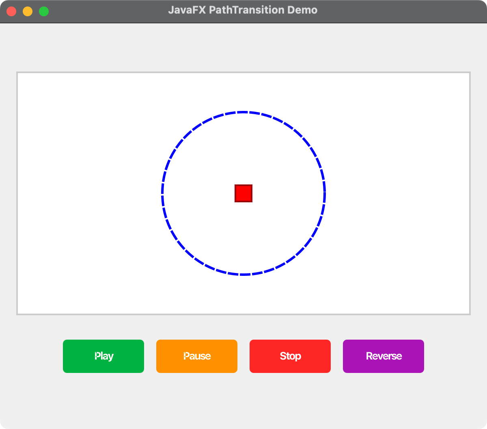

# JavaFX Event Handling Demos

This project demonstrates various JavaFX event handling techniques through multiple focused applications.

## Project Structure

The project has been refactored into smaller, focused files:

### Core Files

- **`HandleEvent.java`** - Basic event handling demo with OK/Cancel buttons
- **`Launcher.java`** - Menu application to choose which demo to run

### Individual Event Demos

- **`MouseEventDemo.java`** - Mouse event handling with interactive circle
- **`KeyboardEventDemo.java`** - Keyboard event handling with interactive rectangle
- **`DragDropEventDemo.java`** - Drag and drop event handling with draggable rectangle
- **`WheelEventDemo.java`** - Wheel event handling with scrollable rectangle
- **`FocusEventDemo.java`** - Focus event handling with text fields

### Comprehensive Demo

- **`ComprehensiveEventDemo.java`** - All event types combined in a tabbed interface

## How to Run

### Option 1: Use the Launcher (Recommended)
```bash
mvn javafx:run -Djavafx.mainClass=com.acu.javafx.handleeventdemo.Launcher
```

The launcher provides a menu to choose which demo to run.

### Option 2: Run Individual Demos

#### Basic Event Demo
```bash
mvn javafx:run -Djavafx.mainClass=com.acu.javafx.handleeventdemo.HandleEvent
```

#### Mouse Event Demo
```bash
mvn javafx:run -Djavafx.mainClass=com.acu.javafx.handleeventdemo.MouseEventDemo
```

#### Keyboard Event Demo
```bash
mvn javafx:run -Djavafx.mainClass=com.acu.javafx.handleeventdemo.KeyboardEventDemo
```

#### Drag & Drop Event Demo
```bash
mvn javafx:run -Djavafx.mainClass=com.acu.javafx.handleeventdemo.DragDropEventDemo
```

#### Wheel Event Demo
```bash
mvn javafx:run -Djavafx.mainClass=com.acu.javafx.handleeventdemo.WheelEventDemo
```

#### Focus Event Demo
```bash
mvn javafx:run -Djavafx.mainClass=com.acu.javafx.handleeventdemo.FocusEventDemo
```

#### Comprehensive Event Demo
```bash
mvn javafx:run -Djavafx.mainClass=com.acu.javafx.handleeventdemo.ComprehensiveEventDemo
```

## Demo Descriptions

### Basic Event Demo (`HandleEvent.java`)
- Simple OK and Cancel buttons
- Demonstrates basic event handler implementation
- Uses separate handler classes for each button

### Mouse Event Demo (`MouseEventDemo.java`)
- Interactive circle that responds to mouse events
- Demonstrates: click, drag, enter, exit, move events
- Visual feedback with color changes
- Event counter display

### Keyboard Event Demo (`KeyboardEventDemo.java`)
- Interactive rectangle that responds to keyboard events
- Demonstrates: key press, release, typed events
- Color changes based on key presses (R=Red, G=Green, B=Blue, etc.)
- Focus management

### Drag & Drop Event Demo (`DragDropEventDemo.java`)
- Draggable rectangle with drag and drop functionality
- Demonstrates: drag detected, drag over, drag dropped, drag done events
- Visual feedback during drag operations

### Wheel Event Demo (`WheelEventDemo.java`)
- Rectangle that scales based on scroll wheel events
- Demonstrates wheel scroll events
- Zoom in/out functionality

### Focus Event Demo (`FocusEventDemo.java`)
- Text fields with focus event handling
- Demonstrates focus gained/lost events
- Visual feedback with background color changes

### Comprehensive Event Demo (`ComprehensiveEventDemo.java`)
- All event types combined in a tabbed interface
- Event logging with timestamps
- Event counters for each type
- Clear log functionality

## Event Types Demonstrated

1. **Mouse Events**
   - `setOnMouseClicked`
   - `setOnMousePressed`
   - `setOnMouseReleased`
   - `setOnMouseEntered`
   - `setOnMouseExited`
   - `setOnMouseMoved`
   - `setOnMouseDragged`

2. **Keyboard Events**
   - `setOnKeyPressed`
   - `setOnKeyReleased`
   - `setOnKeyTyped`

3. **Drag & Drop Events**
   - `setOnDragDetected`
   - `setOnDragOver`
   - `setOnDragDropped`
   - `setOnDragDone`
   - `setOnDragEntered`
   - `setOnDragExited`

4. **Wheel Events**
   - `setOnScroll`

5. **Focus Events**
   - `focusedProperty().addListener()`

## Key Features

- **Modular Design**: Each event type has its own focused demo
- **Simple Implementation**: Basic event handling kept as simple as possible
- **Visual Feedback**: All demos provide visual responses to events
- **Event Logging**: Comprehensive demo includes detailed event logging
- **Event Counters**: Track number of events for each type
- **Cross-Platform**: Works on all platforms that support JavaFX

## Learning Objectives

- Understand different types of JavaFX events
- Learn how to implement event handlers
- See visual feedback in response to events
- Understand event propagation and handling
- Learn best practices for event-driven programming

## Requirements

- Java 11 or higher
- JavaFX 11 or higher
- Maven for build management

## Screenshots

