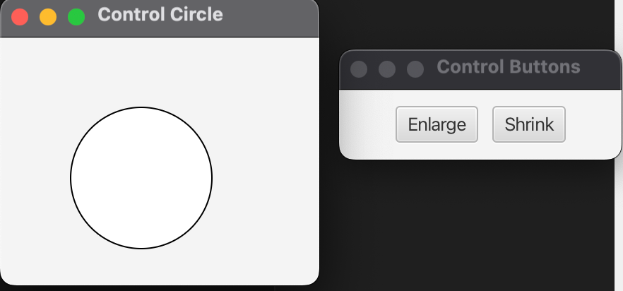

# ControlCircle - JavaFX Application

A JavaFX application that demonstrates circle control with event handling. This application shows a circle that can be enlarged or shrunk using buttons, demonstrating fundamental JavaFX concepts including event handling, UI components, and multi-window management.

## Features

- **Interactive Circle Control**: Enlarge and shrink a circle using buttons
- **Multi-Window Interface**: Separate windows for circle display and controls
- **Event Handling**: Modern lambda expression event handlers
- **Cross-Platform**: Runs on macOS, Windows, and Linux
- **Responsive Design**: Immediate visual feedback for user interactions

## Screenshots

The application displays:
- A main window with a circle that can be controlled
- A secondary window with "Enlarge" and "Shrink" buttons
- Real-time visual feedback as the circle size changes

## Prerequisites

- **Java**: OpenJDK 24 or later
- **Maven**: 3.9.x or later
- **JavaFX**: 21 (included in dependencies)

## Quick Start

### Using Maven (Recommended)

#### On macOS/Linux:
```bash
chmod +x run.sh
./run.sh
```

#### On Windows:
```cmd
run.bat
```

### Direct Execution

#### On macOS/Linux:
```bash
chmod +x run_direct.sh
./run_direct.sh
```

## Project Structure

```
02-03-ControlCircle/
├── src/
│   └── main/
│       └── java/
│           └── com/
│               └── acu/
│                   └── javafx/
│                       └── controlcircle/
│                           ├── ControlCircle.java    # Main application
│                           └── Launcher.java         # Application entry point
├── docs/
│   ├── architecture.md    # Detailed architecture documentation
│   └── concepts.md        # Main concepts and design decisions
├── pom.xml                # Maven configuration
├── run.sh                 # Unix/Linux/macOS execution script
├── run.bat               # Windows execution script
├── run_direct.sh         # Direct Java execution script
├── .gitignore            # Git ignore rules
└── README.md             # This file
```

## How It Works

### Application Flow

1. **Initialization**: The application creates a circle and control buttons
2. **Window Setup**: Two separate windows are created - one for the circle, one for controls
3. **Event Registration**: Button click handlers are registered using lambda expressions
4. **User Interaction**: Users can click "Enlarge" or "Shrink" buttons
5. **Visual Update**: The circle radius changes immediately, providing visual feedback

### Key Components

- **ControlCircle**: Main application class extending `javafx.application.Application`
- **Circle**: JavaFX shape that responds to radius changes
- **Buttons**: UI controls with event handlers
- **Layout Containers**: Pane for circle, HBox for buttons

### Event Handling

The application uses modern Java lambda expressions for event handling:

```java
// Enlarge button handler
btEnlarge.setOnAction(e -> {
    circle.setRadius(circle.getRadius() + 2);
});

// Shrink button handler
btShrink.setOnAction(e -> {
    circle.setRadius(circle.getRadius() > 2 ? 
        circle.getRadius() - 2 : circle.getRadius());
});
```

## Technical Details

### Dependencies

- **JavaFX Controls**: UI components (buttons, layouts)
- **JavaFX FXML**: For potential FXML support
- **Maven Plugins**: JavaFX Maven plugin for running the application

### Build Configuration

The project uses Maven with:
- Java 24 compilation target
- JavaFX 21 runtime
- Cross-platform dependency management
- Executable JAR creation capability

### Platform Support

- **macOS**: Intel (x86_64) and Apple Silicon (ARM64)
- **Windows**: x86_64 and ARM64
- **Linux**: x86_64 and ARM64

## Development

### Building from Source

```bash
mvn clean compile
```

### Running Tests

```bash
mvn test
```

### Creating Executable JAR

```bash
mvn clean package
```

The executable JAR will be created in the `target/` directory.

## Architecture

The application follows a simple MVC pattern:
- **Model**: Circle object with radius property
- **View**: UI components (circle shape, buttons)
- **Controller**: Event handlers that modify the model

For detailed architecture information, see [docs/architecture.md](docs/architecture.md).

## Concepts

This application demonstrates:
- JavaFX application lifecycle
- Event-driven programming
- UI component interaction
- Multi-window application design
- Lambda expressions in event handling

For detailed concept explanations, see [docs/concepts.md](docs/concepts.md).

## Troubleshooting

### Common Issues

1. **JavaFX not found**: Ensure JavaFX dependencies are properly configured
2. **Maven not found**: Install Maven and ensure it's in your PATH
3. **Java version issues**: Ensure Java 24 is installed and configured

### Platform-Specific Notes

- **macOS**: Works with both Intel and Apple Silicon Macs
- **Windows**: Ensure JavaFX runtime is properly configured
- **Linux**: May require additional graphics libraries

## Contributing

1. Fork the repository
2. Create a feature branch
3. Make your changes
4. Test thoroughly
5. Submit a pull request

## License

This project is part of the ACU JavaFX learning series.

## References

- [JavaFX Documentation](https://openjfx.io/)
- [Maven Documentation](https://maven.apache.org/)
- [Original Example](https://liveexample.pearsoncmg.com/html/ControlCircle.html)

## Screenshots

