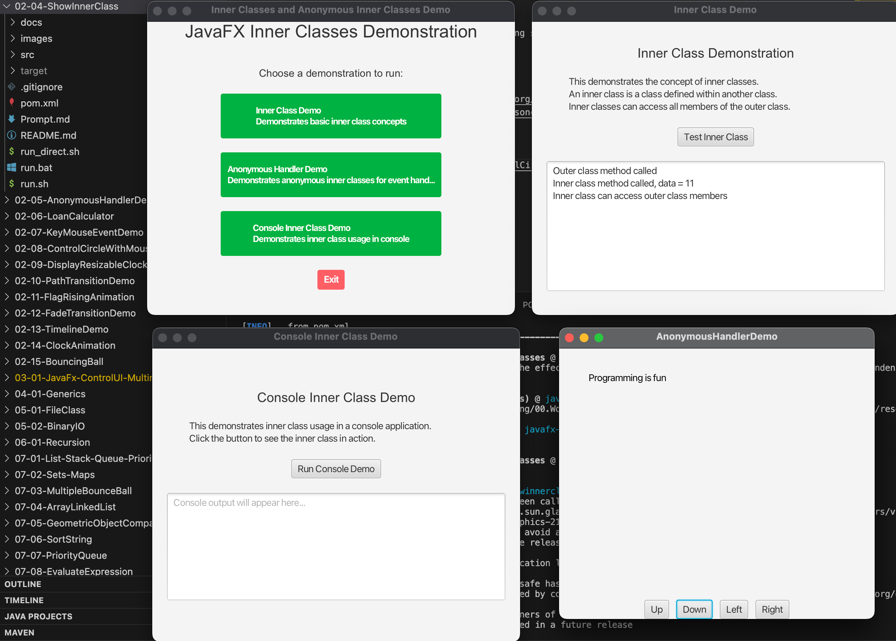

# JavaFX ShowInnerClass Demo

A comprehensive JavaFX application that demonstrates **Inner Classes** and **Anonymous Inner Classes** concepts through interactive examples.

## 📚 Overview

This project demonstrates two fundamental Java concepts using JavaFX:

1. **Inner Classes**: Classes defined within another class with access to outer class members
2. **Anonymous Inner Classes**: Unnamed inner classes for one-time implementations, commonly used for event handling

## 🎯 Learning Objectives

- Understand the concept and syntax of inner classes
- Learn how anonymous inner classes work for event handling
- See practical examples of these concepts in JavaFX applications
- Compare different approaches to event handling (traditional vs anonymous inner classes vs lambda expressions)

## 🏗️ Project Structure

```
02-04-ShowInnerClass/
├── src/main/java/com/acu/javafx/showinnerclass/
│   ├── Launcher.java              # Main application launcher
│   ├── ShowInnerClass.java        # Inner class demonstration
│   └── AnonymousHandlerDemo.java  # Anonymous inner class demo
├── docs/
│   ├── concepts.md                # Detailed concept explanations
│   └── architecture.md            # Application architecture
├── pom.xml                        # Maven configuration
├── run.sh                         # Unix/Linux/macOS run script
├── run.bat                        # Windows run script
├── run_direct.sh                  # Direct Java execution script
└── README.md                      # This file
```

## 🚀 Quick Start

### Prerequisites

- **Java**: OpenJDK 24 or later
- **Maven**: 3.9.x or later
- **Platform**: macOS, Windows, or Linux

### Running the Application

#### Option 1: Using Maven (Recommended)

**macOS/Linux:**
```bash
./run.sh
```

**Windows:**
```cmd
run.bat
```

#### Option 2: Direct Maven Command

```bash
mvn clean javafx:run -Djavafx.mainClass=com.acu.javafx.showinnerclass.Launcher
```

#### Option 3: Direct Java Execution

```bash
./run_direct.sh
```

## 🎮 Application Features

### 1. Launcher Interface
The main application provides a clean menu interface to choose between different demonstrations:

- **Inner Class Demo**: Demonstrates basic inner class concepts
- **Anonymous Handler Demo**: Shows anonymous inner classes for event handling
- **Console Demo**: Interactive console-based inner class demonstration

### 2. Inner Class Demo
Demonstrates the core concepts of inner classes:

- **Class Definition**: Shows how to define an inner class
- **Access Demonstration**: Inner class accessing outer class members
- **Console Output**: Real-time demonstration of inner class behavior

### 3. Anonymous Handler Demo
Interactive JavaFX application demonstrating anonymous inner classes:

- **Text Movement**: Move text with Up/Down/Left/Right buttons
- **Event Handling**: Four different anonymous inner class event handlers
- **Boundary Checking**: Prevents text from moving outside the window
- **Real-time Feedback**: Immediate visual response to user actions

## 📖 Code Examples

### Inner Class Example

```java
public class ShowInnerClass {
    private int data;
    
    public void m() {
        InnerClass instance = new InnerClass();
        instance.mi();
    }
    
    class InnerClass {
        public void mi() {
            data++; // Can access outer class member
            System.out.println("Inner class method called, data = " + data);
        }
    }
}
```

### Anonymous Inner Class Example

```java
btUp.setOnAction(new EventHandler<ActionEvent>() {
    @Override
    public void handle(ActionEvent e) {
        text.setY(text.getY() > 10 ? text.getY() - 5 : 10);
    }
});
```

## 🔧 Technical Specifications

### Development Environment
- **Target Platform**: macOS Silicon (ARM64) - primary development environment
- **Java Version**: OpenJDK 24
- **Maven Version**: 3.9.x or later
- **JavaFX Version**: 21

### Cross-Platform Compatibility
The project is buildable and runnable on:
- **macOS**: Intel (x86_64) and Apple Silicon (ARM64)
- **Windows**: x86_64 and ARM64
- **Linux**: x86_64 and ARM64

### Build Configuration
- Platform detection properties for automatic architecture detection
- JavaFX dependencies with platform-specific classifiers
- Maven compiler plugin configured for Java 24
- JavaFX Maven plugin for running the application

## 📚 Educational Content

### Inner Classes
- **Definition**: A class defined within another class
- **Access**: Can access all members of the outer class
- **Compilation**: Compiled as `OuterClassName$InnerClassName.class`
- **Visibility**: Can be public, protected, or private

### Anonymous Inner Classes
- **Definition**: Inner classes without explicit names
- **Usage**: Combine declaration and instantiation in one step
- **Event Handling**: Perfect for JavaFX event handlers
- **Compilation**: Compiled as `OuterClassName$n.class`

### Event Handling Approaches
1. **Traditional**: Separate class implementing EventHandler
2. **Anonymous Inner Class**: Inline implementation
3. **Lambda Expression**: Modern concise syntax

## 🛠️ Building from Source

### Prerequisites
```bash
# Check Java version
java -version

# Check Maven version
mvn -version
```

### Build Steps
```bash
# Clone or navigate to project directory
cd 02-04-ShowInnerClass

# Clean and compile
mvn clean compile

# Run the application
mvn javafx:run -Djavafx.mainClass=com.acu.javafx.showinnerclass.Launcher

# Create executable JAR
mvn clean package
```

## 🧪 Testing

### Running Individual Demos

**Inner Class Demo:**
```bash
mvn javafx:run -Djavafx.mainClass=com.acu.javafx.showinnerclass.ShowInnerClass
```

**Anonymous Handler Demo:**
```bash
mvn javafx:run -Djavafx.mainClass=com.acu.javafx.showinnerclass.AnonymousHandlerDemo
```

### Console Testing
```bash
# Test inner class behavior
java -cp target/classes com.acu.javafx.showinnerclass.ShowInnerClass
```

## 📖 Documentation

### Detailed Documentation
- **[Concepts](docs/concepts.md)**: Comprehensive explanation of inner classes and anonymous inner classes
- **[Architecture](docs/architecture.md)**: Application design patterns and structure

### Key Concepts Covered
- Inner class definition and usage
- Anonymous inner class syntax and applications
- JavaFX event handling patterns
- Cross-platform JavaFX development
- Maven build configuration

## 🔍 Troubleshooting

### Common Issues

**JavaFX not found:**
```bash
mvn dependency:resolve
```

**Java version issues:**
```bash
# Check Java version
java -version

# Ensure Java 24+ is installed
```

**Maven issues:**
```bash
# Clean and rebuild
mvn clean install
```

### Platform-Specific Notes

**macOS:**
- Works with both Intel and Apple Silicon
- JavaFX dependencies automatically detected

**Windows:**
- Use `run.bat` for Windows execution
- Ensure Java is in PATH

**Linux:**
- Use `run.sh` for Unix/Linux execution
- May need to install JavaFX separately on some distributions

## 🤝 Contributing

This is an educational project. Contributions are welcome:

1. Fork the repository
2. Create a feature branch
3. Make your changes
4. Add tests if applicable
5. Submit a pull request

## 📄 License

This project is part of the ITEC313 JavaFX learning series.

## 📸 Screenshots



---

**Happy Learning! 🎓**

For more information about JavaFX and inner classes, check out the detailed documentation in the `docs/` folder.
