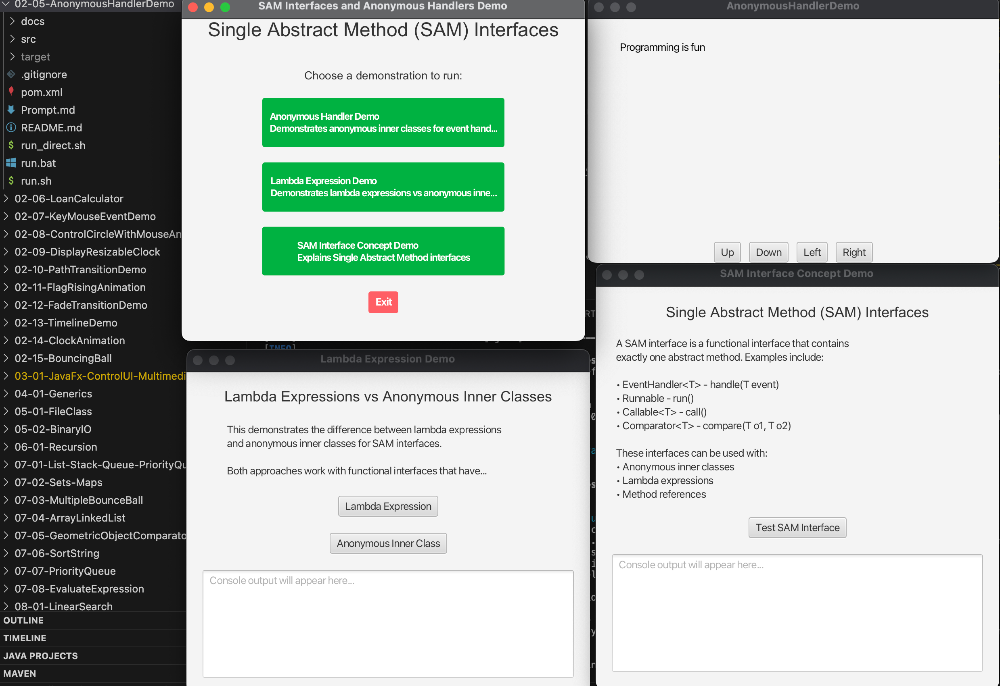

# JavaFX AnonymousHandlerDemo

A JavaFX application that demonstrates Single Abstract Method (SAM) interfaces and anonymous inner classes for event handling.

## Overview

This project demonstrates the concept of Single Abstract Method (SAM) interfaces, also known as functional interfaces, in Java. The application shows how these interfaces can be used with both anonymous inner classes and lambda expressions for event handling in JavaFX.

**Key Features:**
- Interactive demonstrations of SAM interfaces
- Comparison between anonymous inner classes and lambda expressions
- Educational UI with step-by-step explanations
- Cross-platform compatibility
- Modern JavaFX 21 implementation

## Single Abstract Method (SAM) Interfaces

A SAM interface is a functional interface that contains exactly one abstract method. These interfaces are the foundation for lambda expressions and anonymous inner classes in Java.

**Examples of SAM interfaces:**
- `EventHandler<T>` - `handle(T event)`
- `Runnable` - `run()`
- `Callable<T>` - `call()`
- `Comparator<T>` - `compare(T o1, T o2)`

## Project Structure

```
02-05-AnonymousHandlerDemo/
├── src/
│   ├── main/
│   │   └── java/
│   │       └── com/
│   │           └── acu/
│   │               └── javafx/
│   │                   └── anonymoushandlerdemo/
│   │                       ├── Launcher.java              # Application entry point
│   │                       └── AnonymousHandlerDemo.java  # Main demonstration
│   └── test/
│       └── java/
│           └── com/
│               └── acu/
│                   └── javafx/
│                       └── anonymoushandlerdemo/
├── docs/
│   ├── concepts.md      # Main concepts and design decisions
│   └── architecture.md  # Detailed architecture documentation
├── pom.xml              # Maven build configuration
├── run.sh               # Unix/Linux/macOS execution script
├── run.bat              # Windows execution script
├── run_direct.sh        # Direct Java execution script
└── README.md            # This file
```

## Prerequisites

- **Java**: OpenJDK 24 or later
- **Maven**: 3.9.x or later
- **JavaFX**: 21 (included in dependencies)

## Quick Start

### Using Maven (Recommended)

**Unix/Linux/macOS:**
```bash
cd 02-05-AnonymousHandlerDemo
chmod +x run.sh
./run.sh
```

**Windows:**
```cmd
cd 02-05-AnonymousHandlerDemo
run.bat
```

### Manual Execution

1. **Compile the project:**
   ```bash
   mvn clean compile
   ```

2. **Run the application:**
   ```bash
   mvn javafx:run -Djavafx.mainClass=com.acu.javafx.anonymoushandlerdemo.Launcher
   ```

### Direct Java Execution

```bash
chmod +x run_direct.sh
./run_direct.sh
```

## Demonstrations

The application provides three main demonstrations:

### 1. Anonymous Handler Demo

The core demonstration showing how to use anonymous inner classes for event handling. Features:
- Interactive text movement with button controls
- Anonymous inner class implementations of `EventHandler<ActionEvent>`
- Real-time UI updates
- Boundary checking for text movement

### 2. Lambda Expression Demo

Compares lambda expressions with anonymous inner classes:
- Side-by-side comparison of both approaches
- Console output showing execution
- Educational explanations of differences
- Interactive testing of both methods

### 3. SAM Interface Concept Demo

Explains the theoretical concepts behind SAM interfaces:
- Definition and examples of SAM interfaces
- Interactive testing of different SAM interfaces
- Console output for educational purposes
- Step-by-step explanations

## Key Concepts Demonstrated

### Anonymous Inner Classes

Anonymous inner classes are inner classes without a name that combine declaring an inner class and creating an instance in one step.

**Example:**
```java
button.setOnAction(new EventHandler<ActionEvent>() {
    @Override
    public void handle(ActionEvent e) {
        // handle the event
    }
});
```

### Lambda Expressions

Lambda expressions provide a concise way to implement SAM interfaces.

**Example:**
```java
button.setOnAction(e -> {
    // handle the event
});
```

### Event Handling in JavaFX

JavaFX uses the event-driven programming model where:
- Events are generated by user interactions
- Event handlers (implementations of SAM interfaces) respond to events
- The `EventHandler<T>` interface is the primary SAM interface for event handling

## Technical Specifications

### Development Environment

- **Target Platform**: macOS Silicon (ARM64) - primary development environment
- **Java Version**: OpenJDK 24
- **Maven Version**: 3.9.x or later
- **JavaFX Version**: 21

### Cross-Platform Compatibility

The project is buildable and runnable on:
- **macOS**: Intel (x86_64) and Apple Silicon (ARM64)
- **Windows**: x86_64 and ARM64
- **Linux**: x86_64 and ARM64

### Build Configuration

- Platform detection properties for automatic architecture detection
- JavaFX dependencies with platform-specific classifiers
- Maven compiler plugin configured for Java 24
- JavaFX Maven plugin for running the application
- Cross-platform dependency management

## Code Examples

### Anonymous Inner Class Event Handler

```java
btUp.setOnAction(new EventHandler<ActionEvent>() {
    @Override
    public void handle(ActionEvent e) {
        text.setY(text.getY() > 10 ? text.getY() - 5 : 10);
    }
});
```

### Lambda Expression Event Handler

```java
btUp.setOnAction(e -> {
    text.setY(text.getY() > 10 ? text.getY() - 5 : 10);
});
```

### Custom SAM Interface Implementation

```java
Runnable runnable = new Runnable() {
    @Override
    public void run() {
        System.out.println("Hello from anonymous inner class!");
    }
};
runnable.run();
```

## Learning Objectives

1. **Understand SAM Interfaces**: Learn what makes an interface a functional interface
2. **Anonymous Inner Classes**: Master the syntax and usage of anonymous inner classes
3. **Lambda Expressions**: Understand the relationship between lambdas and SAM interfaces
4. **Event Handling**: Learn how to handle JavaFX events effectively
5. **Code Organization**: Practice clean, well-structured JavaFX applications

## Best Practices

1. **Choose the Right Approach**: Use lambda expressions for simple cases, anonymous inner classes for complex logic
2. **Consistent Naming**: Follow Java naming conventions for classes and methods
3. **Error Handling**: Always include proper exception handling in event handlers
4. **Documentation**: Comment complex logic and explain design decisions
5. **Testing**: Test event handlers thoroughly to ensure proper functionality

## Troubleshooting

### Common Issues

1. **JavaFX not found**: Ensure JavaFX 21 is properly installed and configured
2. **Maven build fails**: Check that Maven 3.9.x or later is installed
3. **Java version issues**: Ensure Java 24 or later is installed and set as default
4. **Platform-specific issues**: Check that the correct JavaFX modules are available for your platform

### Debug Mode

To run with debug information:
```bash
mvn clean javafx:run -Djavafx.mainClass=com.acu.javafx.anonymoushandlerdemo.Launcher -X
```

## Contributing

1. Fork the repository
2. Create a feature branch
3. Make your changes
4. Add tests if applicable
5. Submit a pull request

## License

This project is part of the ITEC313 JavaFX learning materials.

## References

- [JavaFX Documentation](https://openjfx.io/)
- [Java Lambda Expressions](https://docs.oracle.com/javase/tutorial/java/javaOO/lambdaexpressions.html)
- [SAM Interfaces](https://liveexample.pearsoncmg.com/html/AnonymousHandlerDemo.html)
- [Maven JavaFX Plugin](https://openjfx.io/openjfx-docs/#maven)

## Screenshots


