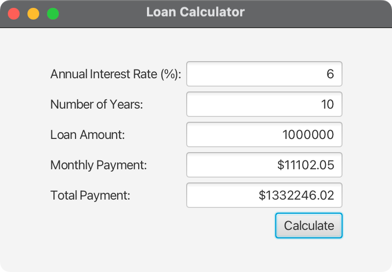

# JavaFX Loan Calculator

A comprehensive JavaFX application that demonstrates loan calculation functionality with both graphical user interface (GUI) and console-based interfaces.

## Overview

This project implements a loan calculator application based on the examples from:
- [LoanCalculator.html](https://liveexample.pearsoncmg.com/html/LoanCalculator.html)
- [TestLoanClass.html](https://liveexample.pearsoncmg.com/html/TestLoanClass.html)
- [Loan.html](https://liveexample.pearsoncmg.com/html/Loan.html)

The application provides:
- **GUI Interface**: Modern JavaFX-based loan calculator
- **Console Interface**: Command-line testing interface
- **Cross-Platform Support**: Runs on macOS, Windows, and Linux
- **Comprehensive Error Handling**: User-friendly error messages and validation

## Features

### 🎯 Core Functionality
- Calculate monthly loan payments
- Calculate total loan payments
- Support for various loan terms and interest rates
- Real-time calculation with immediate results

### 🖥️ User Interface
- Clean, modern JavaFX interface
- Grid-based layout for organized presentation
- Input validation with error dialogs
- Formatted currency output
- Responsive design

### 🔧 Technical Features
- Cross-platform compatibility (macOS, Windows, Linux)
- Modular JavaFX architecture
- Comprehensive error handling
- Input validation and sanitization
- Memory-efficient calculations

## Project Structure

```
02-06-LoanCalculator/
├── src/
│   ├── main/
│   │   ├── java/
│   │   │   ├── com/acu/javafx/loancalculator/
│   │   │   │   ├── Launcher.java           # Application entry point
│   │   │   │   ├── LoanCalculator.java     # Main GUI application
│   │   │   │   ├── Loan.java               # Business logic model
│   │   │   │   └── TestLoanClass.java      # Console testing interface
│   │   │   └── module-info.java            # Java module configuration
│   │   └── resources/                      # Application resources
│   └── test/
│       └── java/                           # Unit tests
├── docs/
│   ├── concepts.md                         # Main concepts documentation
│   └── architecture.md                     # Architecture documentation
├── pom.xml                                 # Maven build configuration
├── run.sh                                  # Unix/Linux/macOS execution script
├── run.bat                                 # Windows execution script
├── run_direct.sh                          # Direct Java execution script
└── README.md                              # This file
```

## Prerequisites

### Required Software
- **Java**: OpenJDK 24 or later
- **Maven**: 3.9.x or later
- **JavaFX**: 21 (included in dependencies)

### Platform Support
- **macOS**: Intel (x86_64) and Apple Silicon (ARM64)
- **Windows**: x86_64 and ARM64
- **Linux**: x86_64 and ARM64

## Installation & Setup

### 1. Clone the Repository
```bash
git clone <repository-url>
cd 02-06-LoanCalculator
```

### 2. Verify Prerequisites
```bash
# Check Java version
java -version

# Check Maven version
mvn -version
```

### 3. Build the Project
```bash
# Clean and compile
mvn clean compile

# Or build with tests
mvn clean test
```

## Running the Application

### Option 1: Using Maven (Recommended)
```bash
# Unix/Linux/macOS
./run.sh

# Windows
run.bat

# Or directly with Maven
mvn javafx:run
```

### Option 2: Direct Java Execution
```bash
# Unix/Linux/macOS
./run_direct.sh

# Or manually
java --module-path "target/classes" \
     --add-modules javafx.controls,javafx.fxml \
     com.acu.javafx.loancalculator.Launcher
```

### Option 3: Console Interface
```bash
# Run the console-based test interface
java -cp target/classes com.acu.javafx.loancalculator.TestLoanClass
```

## Usage

### GUI Interface

1. **Launch the Application**
   - Run the application using one of the methods above
   - The loan calculator window will appear

2. **Enter Loan Details**
   - **Annual Interest Rate**: Enter the yearly interest rate (e.g., 8.25)
   - **Number of Years**: Enter the loan term in years (e.g., 30)
   - **Loan Amount**: Enter the principal amount (e.g., 200000)

3. **Calculate Payments**
   - Click the "Calculate" button
   - View the results in the read-only fields:
     - **Monthly Payment**: Your monthly payment amount
     - **Total Payment**: Total amount paid over the loan term

4. **Error Handling**
   - Invalid inputs will show error dialogs
   - All fields must contain positive numeric values

### Console Interface

1. **Run the Console Application**
   ```bash
   java -cp target/classes com.acu.javafx.loancalculator.TestLoanClass
   ```

2. **Follow the Prompts**
   - Enter annual interest rate
   - Enter number of years
   - Enter loan amount
   - View calculated results

## Loan Calculation Formula

The application uses the standard loan payment formula:

```
Monthly Payment = P × (r × (1 + r)^n) / ((1 + r)^n - 1)
```

Where:
- **P** = Principal (loan amount)
- **r** = Monthly interest rate (annual rate ÷ 12 ÷ 100)
- **n** = Total number of payments (years × 12)

## Architecture

### Design Patterns
- **Model-View-Controller (MVC)**: Separation of business logic and UI
- **Single Responsibility Principle**: Each class has a focused purpose
- **Error Handling Strategy**: Comprehensive exception management

### Key Components
- **Loan**: Business logic and calculation engine
- **LoanCalculator**: JavaFX GUI implementation
- **TestLoanClass**: Console-based testing interface
- **Launcher**: Application entry point

## Development

### Building from Source
```bash
# Clean build
mvn clean install

# Run tests
mvn test

# Create executable JAR
mvn package
```

### Running Tests
```bash
# Run all tests
mvn test

# Run specific test class
mvn test -Dtest=LoanTest
```

### Code Quality
- **JavaDoc**: Comprehensive documentation
- **Error Handling**: Robust exception management
- **Input Validation**: Thorough input sanitization
- **Cross-Platform**: Platform-agnostic implementation

## Troubleshooting

### Common Issues

#### 1. JavaFX Module Not Found
**Error**: `Error: JavaFX runtime components are missing`
**Solution**: Ensure JavaFX dependencies are properly configured in `pom.xml`

#### 2. Maven Build Failures
**Error**: `Compilation failure`
**Solution**: 
- Verify Java 24+ is installed
- Check Maven version (3.9+)
- Run `mvn clean compile`

#### 3. Platform-Specific Issues
**macOS**: Ensure Xcode command line tools are installed
**Windows**: Verify PATH includes Java and Maven
**Linux**: Install required system dependencies

#### 4. Permission Denied (Scripts)
**Error**: `Permission denied: ./run.sh`
**Solution**: 
```bash
chmod +x run.sh run_direct.sh
```

### Debug Mode
```bash
# Run with debug output
mvn javafx:run -Djavafx.debug=true

# Run with verbose Maven output
mvn javafx:run -X
```

## Contributing

### Development Setup
1. Fork the repository
2. Create a feature branch
3. Make your changes
4. Add tests for new functionality
5. Ensure all tests pass
6. Submit a pull request

### Code Style
- Follow Java naming conventions
- Add JavaDoc comments for public methods
- Include error handling for all user inputs
- Maintain cross-platform compatibility

## Screenshots

