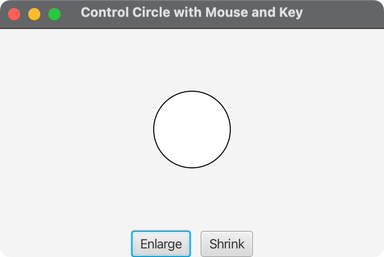

# ControlCircleWithMouseAndKey

A JavaFX application that demonstrates interactive circle control using multiple input methods: buttons, mouse clicks, and keyboard events.

## Features

- **Button Control**: Enlarge and Shrink buttons for manual control
- **Mouse Control**: Left-click to enlarge, right-click to shrink
- **Keyboard Control**: UP arrow to enlarge, DOWN arrow to shrink
- **Visual Feedback**: Real-time circle size changes
- **Size Constraints**: Circle size is constrained between minimum and maximum values
- **Cross-Platform**: Runs on Windows, macOS, and Linux

## Screenshots

The application displays a circle in the center of the window with control buttons at the bottom. Users can interact with the circle using:

- **Buttons**: Click "Enlarge" or "Shrink" buttons
- **Mouse**: Left-click to enlarge, right-click to shrink
- **Keyboard**: Press UP arrow to enlarge, DOWN arrow to shrink

## Prerequisites

- **Java**: OpenJDK 24 or later
- **Maven**: 3.9.x or later
- **JavaFX**: 21 (included in dependencies)

## Quick Start

### Using Build Scripts

#### On macOS/Linux:
```bash
./run.sh
```

#### On Windows:
```cmd
run.bat
```

### Using Maven Directly

```bash
# Clean and compile
mvn clean compile

# Run the application
mvn javafx:run

# Create executable JAR
mvn clean package
```

### Using Java Directly

```bash
# Compile
mvn compile

# Run with module path
java --module-path target/classes --module com.acu.javafx.controlcirclewithmouseandkey/com.acu.javafx.controlcirclewithmouseandkey.ControlCircleWithMouseAndKey
```

## Project Structure

```
02-08-ControlCircleWithMouseAndKey/
├── src/
│   ├── main/
│   │   ├── java/
│   │   │   ├── module-info.java
│   │   │   └── com/acu/javafx/controlcirclewithmouseandkey/
│   │   │       ├── ControlCircleWithMouseAndKey.java
│   │   │       ├── CirclePane.java
│   │   │       └── Launcher.java
│   │   └── resources/
│   └── test/
│       └── java/
│           └── com/acu/javafx/controlcirclewithmouseandkey/
├── docs/
│   ├── concepts.md
│   └── architecture.md
├── pom.xml
├── run.sh
├── run.bat
└── README.md
```

## Key Components

### ControlCircleWithMouseAndKey.java
Main application class that:
- Sets up the JavaFX application
- Creates the user interface
- Registers event handlers for buttons, mouse, and keyboard
- Manages the application lifecycle

### CirclePane.java
Custom pane component that:
- Manages a circle with size constraints
- Provides `enlarge()` and `shrink()` methods
- Handles circle positioning and centering
- Enforces minimum and maximum radius limits

### Launcher.java
Alternative entry point for IDEs with limited JavaFX support.

## Event Handling

The application demonstrates three types of event handling:

### 1. Button Events
```java
btEnlarge.setOnAction(e -> circlePane.enlarge());
btShrink.setOnAction(e -> circlePane.shrink());
```

### 2. Mouse Events
```java
circlePane.setOnMouseClicked(e -> {
    if (e.getButton() == MouseButton.PRIMARY) {
        circlePane.enlarge();
    } else if (e.getButton() == MouseButton.SECONDARY) {
        circlePane.shrink();
    }
});
```

### 3. Keyboard Events
```java
circlePane.setOnKeyPressed(e -> {
    if (e.getCode() == KeyCode.UP) {
        circlePane.enlarge();
    } else if (e.getCode() == KeyCode.DOWN) {
        circlePane.shrink();
    }
});
```

## Configuration

### Circle Properties
- **Initial Radius**: 20 pixels
- **Minimum Radius**: 5 pixels
- **Maximum Radius**: 50 pixels
- **Radius Change**: 2 pixels per action

### Window Properties
- **Width**: 400 pixels
- **Height**: 300 pixels
- **Title**: "Control Circle with Mouse and Key"

## Cross-Platform Compatibility

The project is configured for cross-platform compatibility:

### Supported Platforms
- **macOS**: Intel (x86_64) and Apple Silicon (ARM64)
- **Windows**: x86_64 and ARM64
- **Linux**: x86_64 and ARM64

### Platform Detection
The Maven configuration automatically detects the platform and includes appropriate JavaFX dependencies.

## Build Configuration

### Maven Dependencies
- **JavaFX Controls**: UI components
- **JavaFX FXML**: FXML support
- **JavaFX Graphics**: Platform-specific graphics
- **JUnit Jupiter**: Testing framework

### Maven Plugins
- **Compiler Plugin**: Java 24 configuration
- **JavaFX Plugin**: Application execution
- **Shade Plugin**: Executable JAR creation
- **OS Plugin**: Platform detection

## Development

### Adding New Features

1. **New Input Methods**: Add event handlers in `setupEventHandlers()`
2. **Visual Enhancements**: Modify `CirclePane` for new visual effects
3. **Additional Controls**: Add new buttons or controls in `setupUI()`

### Testing

```bash
# Run unit tests
mvn test

# Run with coverage
mvn jacoco:report
```

## Troubleshooting

### Common Issues

1. **JavaFX Not Found**
   - Ensure Java 24+ is installed
   - Check that JavaFX dependencies are resolved

2. **Module Path Issues**
   - Verify `module-info.java` is correct
   - Check that all required modules are declared

3. **Platform-Specific Issues**
   - Ensure platform-specific JavaFX dependencies are included
   - Check that OS detection is working correctly

### Debug Mode

```bash
# Run with debug output
mvn javafx:run -Djavafx.debug=true
```

## Documentation

- **Concepts**: See `docs/concepts.md` for design decisions and key concepts
- **Architecture**: See `docs/architecture.md` for detailed architecture documentation


## Screenshots

