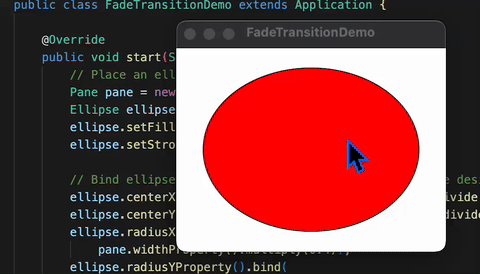

# JavaFX FadeTransition Demo

A JavaFX application that demonstrates fade transitions with interactive controls. The application creates a responsive ellipse that continuously fades in and out, with user interaction capabilities.

## Features

- **Fade Animation**: Smooth opacity transitions with 3-second duration
- **Interactive Controls**: Pause/resume animation with mouse clicks
- **Responsive Design**: Ellipse automatically adjusts to window resizing
- **Cross-Platform**: Works on macOS, Windows, and Linux
- **Modern UI**: Clean, minimal interface design

## Screenshots

The application displays a red ellipse that continuously fades in and out. Users can click and hold the mouse button to pause the animation, and release to resume.

## Prerequisites

- **Java**: OpenJDK 24 or later
- **Maven**: 3.9.x or later
- **JavaFX**: 21 (automatically managed by Maven)

## Quick Start

### Using Maven (Recommended)

```bash
# Clone or navigate to the project directory
cd 02-12-FadeTransitionDemo

# Run the application
mvn javafx:run
```

### Using Build Scripts

**macOS/Linux:**
```bash
./run.sh
```

**Windows:**
```cmd
run.bat
```

### Direct Java Execution

```bash
# Compile and run
mvn clean compile
java --module-path "$(mvn dependency:build-classpath -Dmdep.outputFile=/dev/stdout -q)" --add-modules javafx.controls,javafx.animation -cp target/classes com.acu.javafx.fadetransitiondemo.FadeTransitionDemo
```

## Project Structure

```
02-12-FadeTransitionDemo/
├── src/
│   ├── main/
│   │   ├── java/
│   │   │   ├── com/acu/javafx/fadetransitiondemo/
│   │   │   │   └── FadeTransitionDemo.java
│   │   │   └── module-info.java
│   │   └── resources/
│   └── test/
│       └── java/
│           └── com/acu/javafx/fadetransitiondemo/
├── docs/
│   ├── architecture.md
│   └── concepts.md
├── pom.xml
├── run.sh
├── run.bat
└── README.md
```

## How It Works

### Animation Setup
The application creates a `FadeTransition` that:
- Runs for 3 seconds per cycle
- Fades from fully opaque (1.0) to nearly transparent (0.1)
- Reverses automatically and runs indefinitely
- Can be paused/resumed with mouse interaction

### Responsive Design
The ellipse uses property binding to:
- Center itself in the window
- Scale with window size (40% of pane dimensions)
- Automatically adjust when the window is resized

### User Interaction
- **Mouse Press**: Pauses the animation
- **Mouse Release**: Resumes the animation
- **Window Resize**: Ellipse automatically adjusts size and position

## Technical Details

### Dependencies
- **javafx-controls**: Basic UI components
- **javafx-animation**: Animation framework
- **javafx-graphics**: Graphics and rendering
- **javafx-base**: Core JavaFX functionality

### Build Configuration
- **Java Version**: 24
- **JavaFX Version**: 21
- **Maven Compiler**: 3.11.0
- **JavaFX Maven Plugin**: 0.0.8

### Platform Support
- **macOS**: Intel (x86_64) and Apple Silicon (ARM64)
- **Windows**: x86_64 and ARM64
- **Linux**: x86_64 and ARM64

## Development

### Building from Source

```bash
# Clean and compile
mvn clean compile

# Run tests
mvn test

# Package as JAR
mvn package

# Run packaged JAR
java -jar target/javafx-fadetransitiondemo-1.0.0.jar
```

### IDE Setup

1. **IntelliJ IDEA**:
   - Open the project as a Maven project
   - Ensure JavaFX SDK is configured
   - Run `FadeTransitionDemo` class

2. **Eclipse**:
   - Import as Maven project
   - Add JavaFX libraries to module path
   - Run `FadeTransitionDemo` class

3. **VS Code**:
   - Install Java Extension Pack
   - Open the project folder
   - Use Maven extension for building

### Code Structure

#### Main Application Class
```java
public class FadeTransitionDemo extends Application {
    @Override
    public void start(Stage primaryStage) {
        // UI setup and animation configuration
    }
}
```

#### Animation Configuration
```java
FadeTransition ft = new FadeTransition(Duration.millis(3000), ellipse);
ft.setFromValue(1.0);
ft.setToValue(0.1);
ft.setCycleCount(Timeline.INDEFINITE);
ft.setAutoReverse(true);
```

#### Responsive Binding
```java
ellipse.centerXProperty().bind(pane.widthProperty().divide(2));
ellipse.centerYProperty().bind(pane.heightProperty().divide(2));
ellipse.radiusXProperty().bind(pane.widthProperty().multiply(0.4));
ellipse.radiusYProperty().bind(pane.heightProperty().multiply(0.4));
```

## Troubleshooting

### Common Issues

1. **JavaFX Not Found**:
   ```bash
   # Ensure JavaFX dependencies are downloaded
   mvn dependency:resolve
   ```

2. **Module Path Issues**:
   ```bash
   # Check module configuration
   mvn clean compile
   ```

3. **Platform-Specific Issues**:
   ```bash
   # Force platform detection
   mvn clean compile -Dos.detected.classifier=mac-aarch64
   ```

### Debug Mode

```bash
# Run with debug output
mvn javafx:run -X
```


## Screenshots

