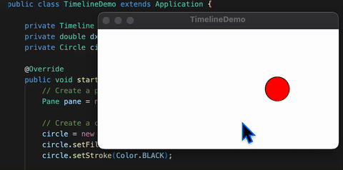

# JavaFX Timeline Demo

A JavaFX application that demonstrates Timeline animations using the `Timeline` class with `KeyFrame` objects to create smooth, controlled animations.

## Overview

This application creates a simple animation where a red circle moves horizontally across the screen, bouncing back and forth when it reaches the boundaries. Users can interact with the animation by pressing the mouse to pause and releasing to resume.

## Features

- **Timeline Animation**: Demonstrates JavaFX Timeline with KeyFrame animations
- **Interactive Controls**: Mouse press/release to pause/resume animation
- **Responsive Design**: Circle adapts to different window sizes
- **Boundary Detection**: Circle bounces off screen edges
- **Cross-Platform**: Runs on macOS, Windows, and Linux

## Prerequisites

- **Java**: OpenJDK 24 or later
- **Maven**: 3.9.x or later
- **JavaFX**: 21 (included in dependencies)

## Quick Start

### Using Maven

```bash
# Clone the repository
git clone <repository-url>
cd 02-13-TimelineDemo

# Run the application
./run.sh          # On Unix/Linux/macOS
run.bat           # On Windows
```

### Using Maven Directly

```bash
# Clean and compile
mvn clean compile

# Run the application
mvn javafx:run
```

### Building Executable JAR

```bash
# Build the JAR
mvn clean package

# Run the JAR
java -jar target/javafx-timelinedemo-1.0.0.jar
```

## Project Structure

```
02-13-TimelineDemo/
├── src/
│   └── main/
│       ├── java/
│       │   ├── module-info.java
│       │   └── com/acu/javafx/timelinedemo/
│       │       └── TimelineDemo.java
│       └── resources/
├── docs/
│   ├── concepts.md
│   └── architecture.md
├── pom.xml
├── run.sh
├── run.bat
├── .gitignore
└── README.md
```

## How It Works

### Animation System

The application uses a `Timeline` with a `KeyFrame` that executes every 50 milliseconds:

```java
Timeline animation = new Timeline(new KeyFrame(Duration.millis(50), e -> {
    double x = circle.getCenterX();
    
    // Check boundaries and reverse direction
    if (x <= 20 || x >= pane.getWidth() - 20) {
        dx = -dx;
    }
    
    // Update position
    circle.setCenterX(x + dx);
}));
```

### User Interaction

The animation can be controlled with mouse events:

```java
pane.setOnMousePressed(e -> animation.pause());
pane.setOnMouseReleased(e -> animation.play());
```

### Responsive Design

The circle is positioned using property binding to adapt to window size:

```java
circle.centerXProperty().bind(pane.widthProperty().divide(2));
circle.centerYProperty().bind(pane.heightProperty().divide(2));
```

## Key Concepts

### Timeline Animation

- **Timeline**: Controls animation timing and execution
- **KeyFrame**: Defines what happens at specific time intervals
- **Duration**: Specifies the time interval between key frames
- **Cycle Count**: Determines how many times the animation repeats

### Animation Control

- **play()**: Starts or resumes the animation
- **pause()**: Pauses the animation
- **stop()**: Stops and resets the animation
- **setCycleCount()**: Sets the number of animation cycles

### Event Handling

- **Mouse Events**: Handle user interactions
- **Property Binding**: Create responsive layouts
- **Animation Events**: Control animation state

## Cross-Platform Support

This project is designed to run on multiple platforms:

- **macOS**: Intel (x86_64) and Apple Silicon (ARM64)
- **Windows**: x86_64 and ARM64
- **Linux**: x86_64 and ARM64

### Platform Detection

The Maven configuration automatically detects the platform and includes the appropriate JavaFX dependencies:

```xml
<extensions>
    <extension>
        <groupId>kr.motd.maven</groupId>
        <artifactId>os-maven-plugin</artifactId>
        <version>1.7.1</version>
    </extension>
</extensions>
```

## Development

### Building from Source

```bash
# Clone the repository
git clone <repository-url>
cd 02-13-TimelineDemo

# Build the project
mvn clean compile

# Run tests (if any)
mvn test

# Package the application
mvn package
```

### IDE Setup

1. **IntelliJ IDEA**:
   - Open the project as a Maven project
   - Ensure JavaFX SDK is configured
   - Run `TimelineDemo.java`

2. **Eclipse**:
   - Import as Maven project
   - Configure JavaFX libraries
   - Run as JavaFX application

3. **VS Code**:
   - Install Java and Maven extensions
   - Open the project folder
   - Use Maven commands or run scripts

## Configuration

### Maven Configuration

The `pom.xml` includes:

- Java 24 compiler settings
- JavaFX 21 dependencies
- Maven plugins for compilation and execution
- Cross-platform dependency management

### Module Configuration

The `module-info.java` declares:

```java
module com.acu.javafx.timelinedemo {
    requires javafx.controls;
    requires javafx.graphics;
    exports com.acu.javafx.timelinedemo;
}
```

## Troubleshooting

### Common Issues

1. **JavaFX not found**:
   - Ensure JavaFX dependencies are included
   - Check that JavaFX modules are added to VM options

2. **Compilation errors**:
   - Verify Java 24 is installed
   - Check Maven version (3.9.x or later)
   - Ensure all dependencies are resolved

3. **Runtime errors**:
   - Check platform-specific JavaFX libraries
   - Verify module path configuration
   - Ensure proper classpath setup

### Platform-Specific Issues

- **macOS**: May require additional security permissions
- **Windows**: Ensure PATH includes Java and Maven
- **Linux**: May need additional system dependencies

## Performance

### Animation Performance

- **Frame Rate**: 50ms intervals provide smooth 20 FPS animation
- **Memory Usage**: Minimal object creation and efficient updates
- **CPU Usage**: Lightweight animation with boundary checking

### Optimization Tips

- Use property binding for responsive layouts
- Minimize object creation in animation loops
- Implement proper boundary detection
- Use efficient event handling

## Extensions

This demo can be extended with:

- **Multiple Objects**: Animate multiple circles or shapes
- **Complex Paths**: Implement curved or circular movement
- **Color Transitions**: Animate color changes over time
- **Size Changes**: Animate object scaling
- **User Controls**: Add speed and direction controls

## Screenshots

