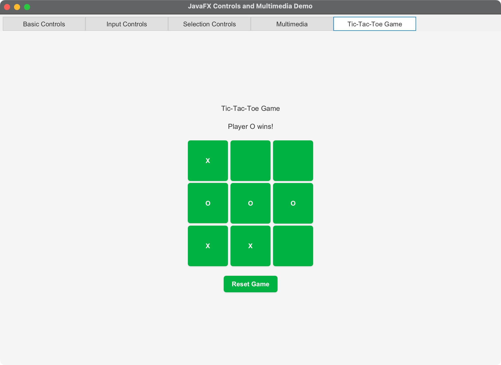

# JavaFX Controls and Multimedia Demo

A comprehensive JavaFX application demonstrating various UI controls, multimedia features, and a complete Tic-Tac-Toe game implementation.

## Overview

This application showcases all the major JavaFX UI controls and multimedia capabilities as outlined in Chapter 16 objectives, including:

- **Basic Controls**: Labels with graphics, Buttons with event handling, CheckBoxes, and RadioButtons
- **Input Controls**: TextFields, PasswordFields, and TextAreas for data entry
- **Selection Controls**: ComboBoxes, ListViews, ScrollBars, and Sliders
- **Multimedia**: Media playback with controls (with fallback animation demo)
- **Interactive Game**: Complete Tic-Tac-Toe implementation

## Original Objectives

Understand the JavaFX framework and its components to create graphical user interfaces (GUIs) in Java applications. This chapter covers the following objectives:

• To create graphical user interfaces with various user-interface controls (§§16.2–16.11).
• To create a label with text and graphic using the Label class and explore properties in the abstract Labeled class (§16.2).
• To create a button with text and graphic using the Button class and set a handler using the setOnAction method in the abstract ButtonBase class (§16.3).
• To create a check box using the CheckBox class (§16.4).
• To create a radio button using the RadioButton class and group radio buttons using a ToggleGroup (§16.5).
• To enter data using the TextField class and password using the PasswordField class (§16.6).
• To enter data in multiple lines using the TextArea class (§16.7).
• To select a single item using ComboBox (§16.8).
• To select a single or multiple items using ListView (§16.9).
• To select a range of values using ScrollBar (§16.10).
• To select a range of values using Slider and explore differences between ScrollBar and Slider (§16.11).
• To develop a tic-tac-toe game (§16.12).
• To view and play video and audio using the Media, MediaPlayer, and MediaView (§16.13).
• To develop a case study for showing the national flag and play anthem (§16.14).

Examples
- https://liveexample.pearsoncmg.com/html/LabelWithGraphic.html
- https://liveexample.pearsoncmg.com/html/ButtonDemo.html
- https://liveexample.pearsoncmg.com/html/CheckBoxDemo.html
- https://liveexample.pearsoncmg.com/html/RadioButtonDemo.html
- https://liveexample.pearsoncmg.com/html/TextFieldDemo.html
- https://liveexample.pearsoncmg.com/html/DescriptionPane.html
- https://liveexample.pearsoncmg.com/html/TextAreaDemo.html
- https://liveexample.pearsoncmg.com/html/ComboBoxDemo.html
- https://liveexample.pearsoncmg.com/html/ListViewDemo.html
- https://liveexample.pearsoncmg.com/html/ScrollBarDemo.html
- https://liveexample.pearsoncmg.com/html/SliderDemo.html
- https://liveexample.pearsoncmg.com/html/MediaDemo.html

## Features

### 📋 Basic Controls Tab
- **Labels with Graphics**: Demonstrates labels with different graphic positioning using shapes
- **Interactive Text Display**: Text that responds to various controls
- **Radio Buttons**: Change text color (Black, Red, Blue, Green)
- **Check Boxes**: Apply text styling (Bold, Italic)
- **Movement Buttons**: Move text around the display area

### ⌨️ Input Controls Tab
- **TextField**: Single-line text input with prompt text
- **PasswordField**: Secure password input with masked display
- **TextArea**: Multi-line text input with word wrapping
- **Live Updates**: Real-time text display updates

### 🎛️ Selection Controls Tab
- **ComboBox**: Font family selection
- **ListView**: Multi-selection color picker
- **ScrollBars**: Horizontal and vertical text positioning
- **Sliders**: Font size and text rotation controls
- **Interactive Display**: Text responds to all control changes

### 🎵 Multimedia Tab
- **Media Player**: Video/audio playback with controls
- **Playback Controls**: Play, Pause, Stop, Rewind buttons
- **Volume Control**: Slider for audio level adjustment
- **Animation Fallback**: Color animation demo if media unavailable

### 🎮 Tic-Tac-Toe Game Tab
- **Two-Player Game**: Alternating X and O players
- **Win Detection**: Automatic win condition checking
- **Tie Detection**: Handles tied game scenarios
- **Game Reset**: Start new games without restarting application
- **Visual Feedback**: Color-coded player moves and status updates

## Technical Specifications

### Development Environment

- **Java Version**: OpenJDK 24 with preview features enabled
- **JavaFX Version**: 21.0.2
- **Maven Version**: 3.9.x or later
- **Build System**: Maven with JavaFX plugin

### Cross-Platform Support

The application is designed to run on:

- **macOS**: Intel (x86_64) and Apple Silicon (ARM64)
- **Windows**: x86_64 and ARM64  
- **Linux**: x86_64 and ARM64

Platform detection is automatic through Maven profiles.

### Architecture

- **Launcher Pattern**: Separate launcher class to avoid JavaFX module issues
- **Tabbed Interface**: Organized UI with logical grouping of controls
- **Event-Driven**: Comprehensive event handling for all interactions
- **Responsive Design**: Clean, modern UI with CSS styling
- **Modular Code**: Separate classes for different game components

## Getting Started

### Prerequisites

1. **Java 24**: Install OpenJDK 24 or later
2. **Maven**: Install Maven 3.9.x or later
3. **JavaFX**: Automatically downloaded by Maven

### Building and Running

#### Option 1: Using Maven (Recommended)

```bash
# On macOS/Linux
./run.sh

# On Windows
run.bat
```

#### Option 2: Using Maven Commands

```bash
# Compile the project
mvn clean compile

# Run the application
mvn javafx:run
```

#### Option 3: Direct Java Execution

```bash
# On macOS/Linux (after compiling with Maven)
./run_direct.sh
```

### Quick Start Commands

```bash
# Clone or navigate to project directory
cd JavaFX-Controls-Demo

# Make scripts executable (macOS/Linux)
chmod +x run.sh run_direct.sh

# Build and run
./run.sh
```

## Project Structure

```
├── src/
│   ├── main/
│   │   ├── java/com/example/
│   │   │   ├── Launcher.java              # Application entry point
│   │   │   ├── JavaFXControlsDemo.java    # Main application class
│   │   │   └── TicTacToeGame.java         # Game implementation
│   │   └── resources/
│   │       └── styles.css                 # Application styling
│   └── test/java/                         # Unit tests (future)
├── docs/
│   ├── concepts.md                        # Design concepts
│   └── architecture.md                    # Architecture details
├── pom.xml                                # Maven configuration
├── run.sh                                 # Unix/Linux/macOS run script
├── run.bat                                # Windows run script
├── run_direct.sh                          # Direct Java execution
├── .gitignore                             # Git ignore rules
└── README.md                              # This file
```

## Usage Guide

### Basic Controls
1. **Text Movement**: Use arrow buttons to move the display text
2. **Color Selection**: Click radio buttons to change text color
3. **Text Styling**: Use checkboxes to apply bold/italic formatting
4. **Graphics**: Observe labels with different graphic arrangements

### Input Controls
1. **Text Input**: Type in the text field and press Enter to update display
2. **Password Input**: Enter password to see masked character count
3. **Multi-line Input**: Use text area for longer text, click "Update Display Text"

### Selection Controls
1. **Font Selection**: Choose fonts from the combo box dropdown
2. **Color Selection**: Select multiple colors from the list view
3. **Text Positioning**: Use scroll bars to move text around
4. **Text Transformation**: Adjust font size and rotation with sliders

### Multimedia
1. **Media Playback**: Use transport controls for video/audio
2. **Volume Control**: Adjust playback volume with slider
3. **Animation Demo**: If media unavailable, enjoy color animation

### Tic-Tac-Toe Game
1. **Make Moves**: Click empty squares to place X or O
2. **Win Conditions**: Game detects three in a row (horizontal, vertical, diagonal)
3. **New Game**: Click "Reset Game" to start over
4. **Player Turns**: Status shows current player and game results

## Troubleshooting

### Common Issues

#### Build Errors
```bash
# Clean and rebuild
mvn clean compile

# Check Java version
java -version

# Check Maven version  
mvn -version
```

#### Platform Issues
- **macOS**: Ensure you have the correct architecture (Intel vs Apple Silicon)
- **Windows**: Run as Administrator if needed
- **Linux**: Install OpenJFX packages if using system Java

#### Media Playback Issues
- Media requires internet connection for sample video
- If media fails, animation demo provides fallback
- Check firewall settings if network issues occur

### Performance Tips

- **Memory**: Application uses minimal memory (~50MB)
- **CPU**: Efficient event handling with no unnecessary processing
- **Startup**: Initial load downloads JavaFX modules (one-time setup)

## License

This project is created for educational purposes as part of ITEC313 coursework.

## Screenshots

 
 
 
 


---

**Note**: This application demonstrates comprehensive JavaFX UI control usage and serves as a learning resource for GUI development with Java.