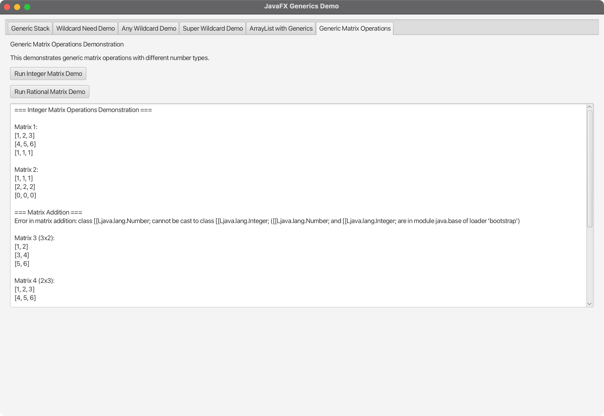

# JavaFX Generics Demo

A comprehensive JavaFX application demonstrating Java generics concepts through interactive examples and real-time demonstrations.

## Overview

This application showcases the fundamental concepts of Java generics as outlined in Chapter 19 objectives, including:

- **Generic Stack**: Type-safe stack implementation with various data types
- **Wildcard Demonstrations**: Understanding the need for and usage of wildcards
- **ArrayList with Generics**: Type-safe collection operations
- **Generic Matrix Operations**: Mathematical operations with different numeric types
- **Interactive Learning**: Tabbed interface with real-time code execution

## Original Objectives

Understand Java generics and their application in creating type-safe, reusable code. This chapter covers the following objectives:

• To understand the benefits of generics for type safety and code reusability (§19.1).
• To define and use generic classes and methods (§19.2).
• To understand generic type erasure and its implications (§19.3).
• To use wildcards in generic programming (§19.4).
• To understand bounded wildcards and their applications (§19.5).
• To implement generic matrices and understand inheritance with generics (§19.6).
• To develop practical applications using generics for robust software design (§19.7).

Examples
- https://liveexample.pearsoncmg.com/html/GenericStack.html
- https://liveexample.pearsoncmg.com/html/WildCardNeedDemo.html
- https://liveexample.pearsoncmg.com/html/AnyWildCardDemo.html
- https://liveexample.pearsoncmg.com/html/SuperWildCardDemo.html
- https://liveexample.pearsoncmg.com/html/TestArrayListNew.html
- https://liveexample.pearsoncmg.com/html/GenericMatrix.html
- https://liveexample.pearsoncmg.com/html/IntegerMatrix.html
- https://liveexample.pearsoncmg.com/html/TestIntegerMatrix.html
- https://liveexample.pearsoncmg.com/html/RationalMatrix.html
- https://liveexample.pearsoncmg.com/html/TestRationalMatrix.html

## Features

### 📚 Generic Stack Tab
- **Type-Safe Stack Operations**: Demonstrates generic stack with String, Integer, and Double types
- **No Casting Required**: Shows the benefits of generics in eliminating explicit casting
- **Performance Benefits**: Illustrates type safety without runtime overhead
- **Interactive Demo**: Live execution with real-time output display

### ❓ Wildcard Need Demo Tab
- **Type Invariance Issues**: Demonstrates why wildcards are necessary
- **Problem Illustration**: Shows limitations of strict type parameters
- **Solution Presentation**: How wildcards solve generic programming challenges
- **Practical Examples**: Real-world scenarios requiring wildcard usage

### 🔍 Any Wildcard Demo Tab
- **Unbounded Wildcards**: Usage of `?` wildcard in generic methods
- **Read-Only Operations**: Demonstrates safe operations with unknown types
- **Limitations and Benefits**: Shows what you can and cannot do with unbounded wildcards
- **Collection Processing**: Generic methods for processing any collection type

### ⬆️ Super Wildcard Demo Tab
- **Lower Bounded Wildcards**: Usage of `? super T` in generic programming
- **Write Operations**: Demonstrates safe writing to collections with super wildcards
- **Producer-Consumer Pattern**: Illustrates PECS (Producer Extends, Consumer Super) principle
- **Type Safety Maintenance**: How super wildcards maintain type safety while allowing flexibility

### 📋 ArrayList Demo Tab
- **Generic Collections**: Type-safe ArrayList operations
- **Compile-Time Safety**: Elimination of ClassCastException at runtime
- **Enhanced For-Each**: Improved iteration with generics
- **Collection Framework**: Integration with Java Collections Framework

### 🧮 Generic Matrix Tab
- **Abstract Generic Matrix**: Base class for mathematical matrix operations
- **Integer Matrix**: Concrete implementation for integer calculations
- **Rational Matrix**: Arithmetic operations with rational numbers
- **Polymorphic Operations**: Demonstrates inheritance and polymorphism with generics

## Technical Specifications

### Development Environment

- **Java Version**: OpenJDK 24 with preview features enabled
- **JavaFX Version**: 21.0.2
- **Maven Version**: 3.9.x or later
- **Build System**: Maven with JavaFX plugin

### Cross-Platform Support

The application is designed to run on:

- **macOS**: Intel (x86_64) and Apple Silicon (ARM64)
- **Windows**: x86_64 and ARM64  
- **Linux**: x86_64 and ARM64

Platform detection is automatic through Maven profiles.

## Project Structure

```
04-01-Generics/
├── src/main/java/com/acu/javafx/generics/
│   ├── GenericsDemoApp.java          # Main application class
│   ├── Launcher.java                 # Application launcher
│   ├── GenericStack.java             # Generic stack implementation
│   ├── GenericStackDemo.java         # Stack demonstration
│   ├── WildCardNeedDemo.java         # Wildcard necessity demo
│   ├── AnyWildCardDemo.java          # Unbounded wildcard demo
│   ├── SuperWildCardDemo.java        # Lower bounded wildcard demo
│   ├── TestArrayListNew.java         # ArrayList with generics demo
│   ├── GenericMatrix.java            # Abstract generic matrix
│   ├── IntegerMatrix.java            # Integer matrix implementation
│   ├── TestIntegerMatrix.java        # Integer matrix testing
│   ├── RationalMatrix.java           # Rational number matrix
│   ├── TestRationalMatrix.java       # Rational matrix testing
│   └── Rational.java                 # Rational number class
├── docs/                             # Documentation and guides
├── images/                           # Screenshots and diagrams
├── pom.xml                           # Maven configuration
└── README.md                         # This file
```

## Building and Running

### Prerequisites

- Java 24 or later
- Maven 3.9.x or later
- JavaFX 21 (handled automatically by Maven)

### Build Commands

```bash
# Clean and compile
mvn clean compile

# Run the application
mvn javafx:run

# Alternative run methods
./run.sh          # Unix/Linux/macOS
./run.bat         # Windows
```

### Platform-Specific Notes

- **macOS**: Automatically detects Apple Silicon vs Intel architecture
- **Windows**: Supports both x86_64 and ARM64 architectures
- **Linux**: Compatible with most distributions supporting Java 24

## Key Learning Concepts

### 1. Type Safety
- Compile-time type checking
- Elimination of ClassCastException
- No need for explicit casting

### 2. Code Reusability
- Single implementation for multiple types
- Parameterized classes and methods
- Generic algorithms

### 3. Wildcard Usage
- Unbounded wildcards (`?`)
- Upper bounded wildcards (`? extends T`)
- Lower bounded wildcards (`? super T`)

### 4. Type Erasure
- Runtime type information removal
- Backward compatibility with pre-generic code
- Bridge methods and type inference

### 5. Generic Inheritance
- Inheritance relationships with generic types
- Covariance and contravariance
- Type parameter bounds

## Educational Value

This demonstration provides hands-on experience with:

- **Generic Class Design**: Creating reusable, type-safe classes
- **Wildcard Patterns**: Understanding when and how to use wildcards
- **Collection Framework**: Leveraging generics in Java Collections
- **Mathematical Applications**: Applying generics to computational problems
- **Best Practices**: Following established patterns for generic programming

## Screenshots

