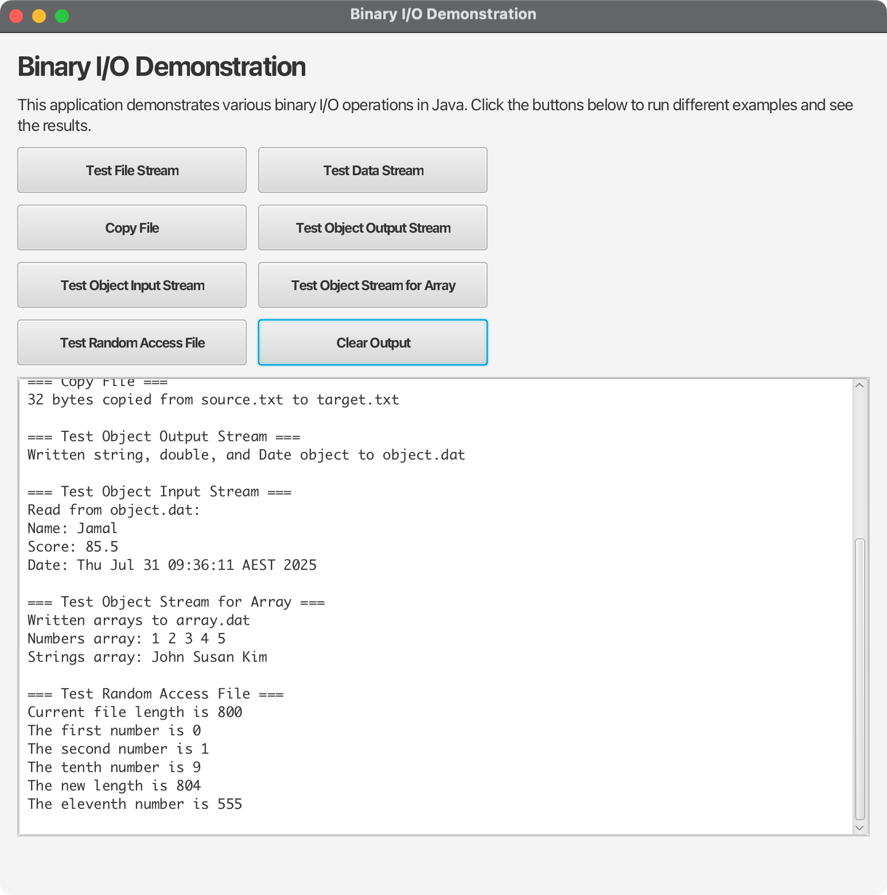

# Binary I/O Demonstration - JavaFX Application

## Overview

This JavaFX application demonstrates various Binary I/O operations in Java, providing an interactive way to explore and understand different I/O concepts. The application showcases file streams, data streams, object serialization, and random access files through a modern, user-friendly interface.

## Features

### 🎯 Core Demonstrations

1. **Test File Stream** - Basic FileInputStream/FileOutputStream operations
2. **Test Data Stream** - DataInputStream/DataOutputStream for primitive types
3. **Copy File** - File copying with buffered streams
4. **Test Object Output Stream** - ObjectOutputStream for serialization
5. **Test Object Input Stream** - ObjectInputStream for deserialization
6. **Test Object Stream for Array** - Array serialization/deserialization
7. **Test Random Access File** - RandomAccessFile operations

### 🚀 Key Features

- **Interactive GUI**: Modern JavaFX interface with intuitive controls
- **Real-time Output**: Live display of I/O operation results
- **Asynchronous Execution**: Non-blocking UI during I/O operations
- **Error Handling**: Comprehensive error reporting and recovery
- **Cross-platform**: Works on Windows, macOS, and Linux
- **Educational**: Perfect for learning Binary I/O concepts

## Project Structure

```
05-02-BinaryIO/
├── src/main/java/com/acu/javafx/binaryio/
│   ├── BinaryIODemo.java              # Main JavaFX application
│   ├── TestFileStream.java            # FileInputStream/FileOutputStream demo
│   ├── TestDataStream.java            # DataInputStream/DataOutputStream demo
│   ├── Copy.java                      # File copying demo
│   ├── TestObjectOutputStream.java    # ObjectOutputStream demo
│   ├── TestObjectInputStream.java     # ObjectInputStream demo
│   ├── TestObjectStreamForArray.java  # Array serialization demo
│   └── TestRandomAccessFile.java      # RandomAccessFile demo
├── docs/
│   ├── concepts.md                    # Binary I/O concepts
│   └── architecture.md                # Application architecture
├── pom.xml                           # Maven configuration
├── run.sh                            # Unix/Linux/macOS script
├── run.bat                           # Windows script
└── README.md                         # This file
```

## Quick Start

### Prerequisites

- **Java**: OpenJDK 24 or later
- **Maven**: 3.9.x or later
- **JavaFX**: 21 (included in dependencies)

### Running the Application

#### Option 1: Using Maven (Recommended)
```bash
# Unix/Linux/macOS
./run.sh

# Windows
run.bat
```

#### Option 2: Direct Maven Command
```bash
mvn clean javafx:run
```

#### Option 3: Build and Run
```bash
# Build the project
mvn clean package

# Run the application
java -jar target/binaryio-demo-1.0.jar
```

#### Option 4: Using Makefile (Alternative Build System)
```bash
# Build all Java files
make build

# Run all demos at once
make run

# Clean compiled files and generated files
make clean

# Show all available targets
make help
```

### Makefile Usage

The project includes a comprehensive Makefile for easy compilation and execution of individual Binary I/O demos.

#### Available Targets

| Target | Description |
|--------|-------------|
| `make build` | Compile all Java files |
| `make run` | Build and run all demos at once |
| `make clean` | Remove compiled files and generated files |
| `make help` | Show all available targets |

#### Individual Demo Targets

Run specific demos individually:
```bash
make run-copy                    # File copying demo
make run-testdatastream          # Data stream demo
make run-testfilestream          # File stream demo
make run-testobjectinputstream   # Object input stream demo
make run-testobjectoutputstream  # Object output stream demo
make run-testobjectstreamforarray # Array serialization demo
make run-testrandomaccessfile    # Random access file demo
```

#### Complete Workflow Example

```bash
# Clean everything and start fresh
make clean

# Build all files
make build

# Run all demos in sequence
make run
```

#### What Each Demo Does

- **Copy**: Copies `source.txt` to `copied-target.txt` using buffered streams
- **TestDataStream**: Demonstrates reading/writing primitive data types
- **TestFileStream**: Shows basic file input/output operations
- **TestObjectInputStream**: Reads serialized objects from files
- **TestObjectOutputStream**: Writes objects to files using serialization
- **TestObjectStreamForArray**: Demonstrates array serialization/deserialization
- **TestRandomAccessFile**: Shows random access file operations with positioning

#### Makefile Features

- **Automatic Cleanup**: Removes generated files to prevent conflicts
- **Batch Operations**: Run all demos with a single command
- **Individual Control**: Run specific demos as needed
- **Cross-platform**: Works on Unix/Linux/macOS and Windows (with Make)
- **Error Handling**: Proper error messages and exit codes

## Usage Guide

### Getting Started

1. **Launch the Application**: Run the application using one of the methods above
2. **Explore Demos**: Click any button to run the corresponding I/O demonstration
3. **View Results**: Watch the output area for real-time results and explanations
4. **Clear Output**: Use the "Clear Output" button to start fresh

### Understanding the Output

Each demonstration provides:
- **Operation Description**: What the demo is doing
- **File Operations**: Details about files being created/modified
- **Data Content**: The actual data being written/read
- **Error Messages**: Clear explanations if something goes wrong

### Demo Explanations

#### 1. Test File Stream
- Creates a binary file with integers 1-10
- Reads and displays the values
- Demonstrates basic byte-level I/O

#### 2. Test Data Stream
- Writes student names and scores using DataOutputStream
- Reads the data back using DataInputStream
- Shows primitive type I/O

#### 3. Copy File
- Creates a test file with text content
- Copies it to a new file using buffered streams
- Reports the number of bytes copied

#### 4. Test Object Output Stream
- Writes a string, double, and Date object
- Demonstrates object serialization
- Shows ObjectOutputStream usage

#### 5. Test Object Input Stream
- Reads the serialized data back
- Deserializes the objects
- Shows ObjectInputStream usage

#### 6. Test Object Stream for Array
- Serializes arrays of integers and strings
- Deserializes and displays the arrays
- Shows array serialization

#### 7. Test Random Access File
- Creates a file with 200 integers
- Demonstrates random access operations
- Shows file pointer manipulation

## Technical Details

### Binary I/O Concepts

#### What is Binary I/O?
- **Binary I/O** processes data in binary form (bytes)
- More efficient than text I/O for program consumption
- No character encoding/decoding required
- Exact byte values are preserved

#### Key Stream Classes
- **FileInputStream/FileOutputStream**: Basic file I/O
- **DataInputStream/DataOutputStream**: Primitive type I/O
- **ObjectInputStream/ObjectOutputStream**: Object serialization
- **BufferedInputStream/BufferedOutputStream**: Buffered I/O
- **RandomAccessFile**: Random access file operations

#### Object Serialization
- Objects must implement `Serializable` interface
- `transient` keyword excludes fields from serialization
- Arrays can be serialized if all elements are serializable

### Architecture

The application uses:
- **JavaFX**: Modern UI framework
- **Threading**: Background execution for I/O operations
- **Try-with-resources**: Automatic resource management
- **Exception Handling**: Comprehensive error handling
- **Design Patterns**: Builder, Command, and Observer patterns

## Development

### Building from Source

```bash
# Clone the repository
git clone <repository-url>
cd 05-02-BinaryIO

# Build the project
mvn clean package

# Run tests
mvn test

# Run the application
mvn javafx:run
```

### Adding New Demos

1. Create a new Java class in the `binaryio` package
2. Implement the demo logic
3. Add a button to the main application
4. Update documentation

### Project Configuration

The project uses Maven with:
- **Java 24**: Target version
- **JavaFX 21**: UI framework
- **Cross-platform support**: Automatic platform detection
- **Maven plugins**: JavaFX Maven plugin for running

## Troubleshooting

### Common Issues

#### 1. JavaFX Not Found
**Solution**: Ensure JavaFX dependencies are properly configured in `pom.xml`

#### 2. Permission Denied
**Solution**: Check file permissions and ensure write access to the current directory

#### 3. Out of Memory
**Solution**: Increase JVM heap size: `java -Xmx2g -jar target/binaryio-demo-1.0.jar`

#### 4. Platform-Specific Issues
**Solution**: Use the appropriate run script for your platform

### Debug Mode

Run with debug output:
```bash
mvn javafx:run -Djavafx.debug=true
```

## Screenshots

