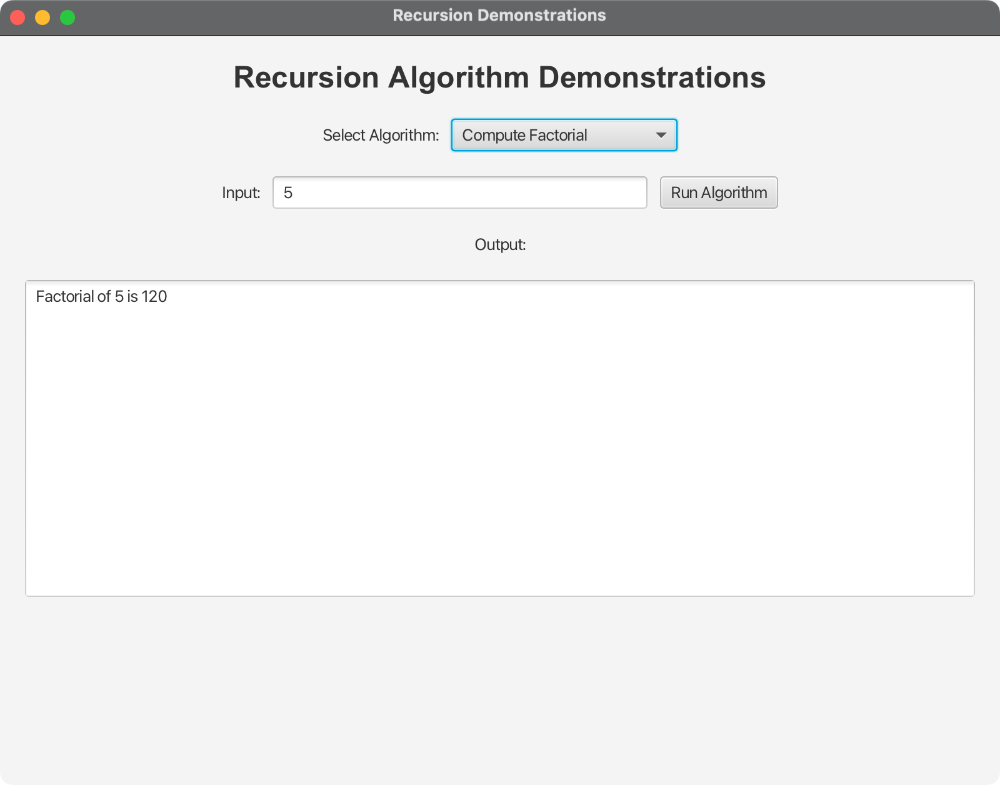

# JavaFX Recursion Demonstrations

A comprehensive JavaFX application that demonstrates various recursion algorithms and concepts. This project showcases different recursive implementations including factorial, Fibonacci, sorting, searching, and classic problems like Tower of Hanoi.

## Features

The application demonstrates the following recursion algorithms:

1. **Compute Factorial** - Classic recursive factorial implementation
2. **Compute Fibonacci** - Recursive Fibonacci number calculation
3. **Recursive Selection Sort** - Sorting algorithm using recursion
4. **Recursive Binary Search** - Efficient search algorithm
5. **Directory Size** - Recursive file system traversal
6. **Tower of Hanoi** - Classic recursive puzzle solution
7. **Factorial (Tail Recursion)** - Optimized tail-recursive factorial

## Technical Specifications

### Development Environment

- **Target Platform**: Cross-platform (macOS, Windows, Linux)
- **Java Version**: OpenJDK 24
- **Maven Version**: 3.9.x or later
- **JavaFX Version**: 21

### Cross-Platform Compatibility

The project is buildable and runnable on:

- **macOS**: Intel (x86_64) and Apple Silicon (ARM64)
- **Windows**: x86_64 and ARM64
- **Linux**: x86_64 and ARM64

## Project Structure

```
06-01-Recursion/
├── src/
│   ├── main/
│   │   ├── java/
│   │   │   └── com/acu/javafx/recursion/
│   │   │       ├── RecursionDemo.java          # Main JavaFX application
│   │   │       ├── ComputeFactorial.java       # Factorial implementation
│   │   │       ├── ComputeFibonacci.java       # Fibonacci implementation
│   │   │       ├── RecursiveSelectionSort.java # Selection sort
│   │   │       ├── RecursiveBinarySearch.java  # Binary search
│   │   │       ├── DirectorySize.java          # Directory size calculator
│   │   │       ├── TowerOfHanoi.java          # Tower of Hanoi solver
│   │   │       └── ComputeFactorialTailRecursion.java # Tail recursion
│   │   └── resources/                          # Application resources
│   └── test/
│       └── java/                              # Test files (empty)
├── docs/
│   ├── architecture.md                        # Architecture documentation
│   └── concepts.md                            # Concepts and design decisions
├── target/                                    # Maven build output
├── pom.xml                                    # Maven build configuration
├── Makefile                                   # CLI build and execution
├── run.sh                                     # Unix/Linux/macOS execution script
├── run.bat                                    # Windows execution script
├── README.md                                  # This file
├── README-Lecture-06.md                       # Lecture-specific documentation
├── PROJECT_SUMMARY.md                         # Project overview
├── Prompt.md                                  # Development prompt
└── .gitignore                                 # Git ignore rules
```

## Quick Start

### Prerequisites

1. **Java 24** (OpenJDK or Oracle JDK)
2. **Maven 3.9+** (for JavaFX GUI mode)
3. **Make** (for CLI mode)
4. **Git** (for cloning)

### Installation and Running

#### Option 1: Using Build Scripts (Recommended for GUI)

**On macOS/Linux:**
```bash
chmod +x run.sh
./run.sh
```

**On Windows:**
```cmd
run.bat
```

#### Option 2: Using Makefile (CLI Mode)

The project includes a comprehensive Makefile for command-line execution of individual recursion algorithms.

**Build all algorithms:**
```bash
make build
```

**Run all algorithms:**
```bash
make run
```

**Run individual algorithms:**
```bash
# Factorial
make run-factorial

# Tail-recursive factorial
make run-factorial-tail

# Fibonacci
make run-fibonacci

# Directory size calculator
make run-directory-size

# Binary search
make run-binary-search

# Selection sort
make run-selection-sort

# Tower of Hanoi
make run-tower-of-hanoi
```

**Clean compiled files:**
```bash
make clean
```

**Show available commands:**
```bash
make help
```

#### Option 3: Manual Maven Commands (GUI Mode)

```bash
# Clone the repository (if not already done)
git clone <repository-url>
cd 06-01-Recursion

# Build the project

mvn clean compile

# Run the application
mvn javafx:run
```

#### Option 4: Direct Java Execution (GUI Mode)

```bash
# Build the project
mvn clean package

# Run the JAR file
java -jar target/recursion-demo-1.0.0.jar
```

## Usage

### GUI Mode (JavaFX Application)

1. **Launch the Application**: Run the application using one of the GUI methods above
2. **Select Algorithm**: Choose an algorithm from the dropdown menu
3. **Enter Input**: Provide appropriate input based on the selected algorithm:
   - **Factorial**: Enter a non-negative integer (e.g., 5)
   - **Fibonacci**: Enter an index (e.g., 10)
   - **Selection Sort**: Enter numbers separated by spaces (e.g., 5 2 8 1 9)
   - **Binary Search**: Enter a number to search (e.g., 7)
   - **Directory Size**: Enter a directory path (e.g., .)
   - **Tower of Hanoi**: Enter number of disks (e.g., 3)
4. **Run Algorithm**: Click "Run Algorithm" to see the results
5. **View Output**: Results are displayed in the output area

### CLI Mode (Command Line)

Each algorithm can be run individually from the command line using the Makefile:

**Factorial:**
```bash
make run-factorial
# Enter a non-negative integer when prompted
```

**Fibonacci:**
```bash
make run-fibonacci
# Enter an index when prompted
```

**Directory Size:**
```bash
make run-directory-size
# Enter a directory path when prompted
```

**Binary Search:**
```bash
make run-binary-search
# Enter a number to search when prompted
```

**Selection Sort:**
```bash
make run-selection-sort
# Enter numbers separated by spaces when prompted
```

**Tower of Hanoi:**
```bash
make run-tower-of-hanoi
# Enter number of disks when prompted
```

**Tail-Recursive Factorial:**
```bash
make run-factorial-tail
# Enter a non-negative integer when prompted
```

**Run All Algorithms:**
```bash
make run
# This will execute all algorithms sequentially
```

## Algorithm Details

### 1. Compute Factorial
- **Input**: Non-negative integer n
- **Output**: n! (factorial of n)
- **Recursive Formula**: n! = n × (n-1)!
- **Base Case**: 0! = 1

### 2. Compute Fibonacci
- **Input**: Index n
- **Output**: Fibonacci number at index n
- **Recursive Formula**: F(n) = F(n-1) + F(n-2)
- **Base Cases**: F(0) = 0, F(1) = 1

### 3. Recursive Selection Sort
- **Input**: Array of numbers
- **Output**: Sorted array
- **Algorithm**: Find minimum, swap to front, recursively sort remainder

### 4. Recursive Binary Search
- **Input**: Sorted array and search key
- **Output**: Index of key or insertion point
- **Algorithm**: Compare middle element, recursively search left or right half

### 5. Directory Size
- **Input**: Directory path
- **Output**: Total size in bytes
- **Algorithm**: Recursively sum file sizes in directory tree

### 6. Tower of Hanoi
- **Input**: Number of disks
- **Output**: Sequence of moves to solve puzzle
- **Algorithm**: Move n-1 disks to auxiliary, move nth disk, move n-1 disks to destination

### 7. Factorial (Tail Recursion)
- **Input**: Non-negative integer n
- **Output**: n! (factorial of n)
- **Optimization**: Tail-recursive implementation for better performance

## Build Configuration

### Maven Configuration (GUI Mode)

The project uses Maven with the following key features:

- **Java 24** compilation target
- **JavaFX 21** dependencies
- **Cross-platform** dependency management
- **Platform detection** for native libraries
- **Executable JAR** creation with Maven Shade plugin

### Makefile Configuration (CLI Mode)

The project includes a comprehensive Makefile for command-line execution:

- **Individual algorithm execution** - Run each algorithm separately
- **Batch execution** - Run all algorithms sequentially
- **Clean build system** - Remove compiled files easily
- **Help system** - Show available commands
- **Cross-platform compatibility** - Works on Unix-like systems

### Platform-Specific Considerations

- **macOS**: Supports both Intel and Apple Silicon architectures
- **Windows**: Supports x86_64 and ARM64 architectures (GUI mode only)
- **Linux**: Supports x86_64 and ARM64 architectures

## Development

### Adding New Algorithms

1. Create a new Java class in `src/main/java/com/acu/javafx/recursion/`
2. Implement the algorithm with appropriate static methods
3. Add the algorithm to the `RecursionDemo.java` application
4. Update the Makefile to include the new algorithm
5. Update the documentation

### Testing

```bash
# Run tests
mvn test

# Run with coverage
mvn jacoco:prepare-agent test jacoco:report

# Test CLI mode
make run
```

### Makefile Integration

When adding new algorithms, update the Makefile:

1. Add the Java source file to `JAVA_SOURCES`
2. Add the class name to `CLASS_NAMES`
3. Create a new run target (e.g., `run-new-algorithm`)
4. Add the target to the `.PHONY` declaration
5. Update the help target with the new command

## Screenshots

