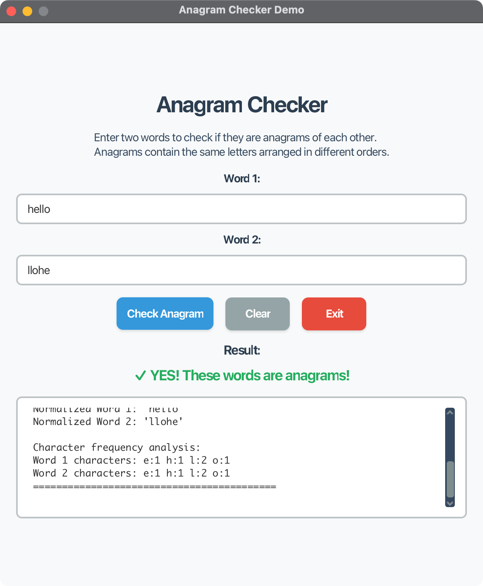

# Anagram Checker Demo - JavaFX Application

## Overview

This JavaFX application demonstrates recursive anagram checking using a modern, user-friendly interface. Two words are anagrams of each other if they contain the same letters that are arranged in different orders. The application showcases recursive programming concepts through an interactive GUI.

## Features

### 🎯 Core Functionality

1. **Text Input Fields** - Enter two words to compare
2. **Anagram Checking** - Recursive algorithm to determine if words are anagrams
3. **Real-time Results** - Immediate feedback with visual indicators
4. **Detailed Analysis** - Character frequency analysis and normalization details
5. **Clear Functionality** - Reset all fields and results
6. **Exit Application** - Clean application termination

### 🚀 Key Features

- **Recursive Algorithm**: Demonstrates recursive programming concepts
- **Interactive GUI**: Modern JavaFX interface with intuitive controls
- **Real-time Output**: Live display of analysis results
- **Case Insensitive**: Handles different letter cases automatically
- **Space Handling**: Ignores spaces in word comparison
- **Educational**: Perfect for learning recursion and anagram concepts
- **Cross-platform**: Works on Windows, macOS, and Linux

## Project Structure

```
06-02-Recursion-Check-Anagrams/
├── src/main/java/com/acu/javafx/anagram/
│   ├── AnagramCheckerDemo.java          # Main JavaFX application
│   ├── AnagramChecker.java              # Recursive anagram checking logic
│   └── module-info.java                 # Java module configuration
├── src/main/resources/
│   └── styles.css                       # Application styling
├── src/test/java/com/acu/javafx/anagram/
│   └── AnagramCheckerTest.java          # JUnit test suite
├── docs/
│   ├── concepts.md                      # Recursion and anagram concepts
│   └── architecture.md                  # Application architecture
├── images/                              # Screenshots and diagrams
├── pom.xml                              # Maven configuration
└── README.md                            # This file
```

## Quick Start

### Prerequisites

- **Java**: OpenJDK 24 or later
- **Maven**: 3.9.x or later
- **JavaFX**: 24 (included in dependencies)

### Running the Application

#### Option 1: Using Maven (Recommended)
```bash
# Compile and run
mvn clean javafx:run

# Or run tests first
mvn test
mvn javafx:run
```

#### Option 2: Build and Run
```bash
# Build the project
mvn clean package

# Run the application
java -jar target/anagram-checker-demo-1.0.0.jar
```

#### Option 3: Run Tests Only
```bash
# Run all tests
mvn test

# Run with verbose output
mvn test -X
```

## Usage Guide

### Getting Started

1. **Launch the Application**: Run using one of the methods above
2. **Enter Words**: Type two words in the input fields
3. **Check Anagram**: Click "Check Anagram" button or press Enter
4. **View Results**: See immediate feedback and detailed analysis
5. **Clear**: Use "Clear" button to reset all fields
6. **Exit**: Use "Exit" button to close the application

### Understanding the Results

The application provides:
- **Visual Feedback**: Green checkmark for anagrams, red X for non-anagrams
- **Detailed Analysis**: Character frequency breakdown
- **Normalization Info**: Shows how words are processed
- **Educational Output**: Step-by-step analysis in the output area

### Example Anagrams

Try these examples:
- `listen` and `silent`
- `evil` and `vile`
- `cinema` and `iceman`
- `debit card` and `bad credit`
- `eleven plus two` and `twelve plus one`

## Technical Details

### Recursive Algorithm

The anagram checking uses a recursive approach:

1. **Normalize**: Remove spaces and convert to lowercase
2. **Length Check**: If lengths differ, not anagrams
3. **Recursive Check**: 
   - Base case: If first word is empty, return true
   - Recursive case: Find first character in second word, remove both, recurse
   - If character not found, return false

### Algorithm Complexity

- **Time Complexity**: O(n²) where n is the length of the words
- **Space Complexity**: O(n) due to recursive call stack
- **Alternative**: Frequency counting method with O(n) time complexity

### Key Classes

#### AnagramCheckerDemo
- Main JavaFX application class
- Handles UI events and user interactions
- Manages application lifecycle

#### AnagramChecker
- Core anagram checking logic
- Recursive algorithm implementation
- Utility methods for word processing

## Development

### Building from Source

```bash
# Clone the repository
git clone <repository-url>
cd 06-02-Recursion-Check-Anagrams

# Build the project
mvn clean package

# Run tests
mvn test

# Run the application
mvn javafx:run
```

### Adding New Features

1. **New Algorithms**: Add methods to `AnagramChecker` class
2. **UI Enhancements**: Modify `AnagramCheckerDemo` class
3. **Tests**: Add test cases to `AnagramCheckerTest` class
4. **Documentation**: Update README and docs files

### Project Configuration

The project uses Maven with:
- **Java 24**: Target version
- **JavaFX 24**: UI framework
- **Cross-platform support**: Automatic platform detection
- **JUnit 5**: Testing framework

## Testing

### Test Coverage

The test suite covers:
- **Basic Anagrams**: Common anagram pairs
- **Non-Anagrams**: Words that are not anagrams
- **Edge Cases**: Empty strings, single characters, null inputs
- **Case Sensitivity**: Different letter cases
- **Spaces**: Words with spaces
- **Special Characters**: Words with punctuation
- **Performance**: Longer words and execution time
- **Alternative Methods**: Frequency-based checking

### Running Tests

```bash
# Run all tests
mvn test

# Run specific test class
mvn test -Dtest=AnagramCheckerTest

# Run with coverage (if plugin available)
mvn test jacoco:report
```

### Debug Mode

Run with debug output:
```bash
mvn javafx:run -Djavafx.debug=true
```

## Educational Value

### Learning Objectives

This project demonstrates:
- **Recursion**: Base cases, recursive cases, and call stack
- **String Processing**: Normalization, character manipulation
- **Algorithm Design**: Multiple approaches to the same problem
- **JavaFX Programming**: Event handling, UI components, styling
- **Testing**: Unit testing, edge cases, test-driven development

### Recursion Concepts

- **Base Case**: When to stop recursing
- **Recursive Case**: How to break down the problem
- **Call Stack**: Understanding recursive execution
- **Tail Recursion**: Optimizing recursive algorithms

## Screenshots



