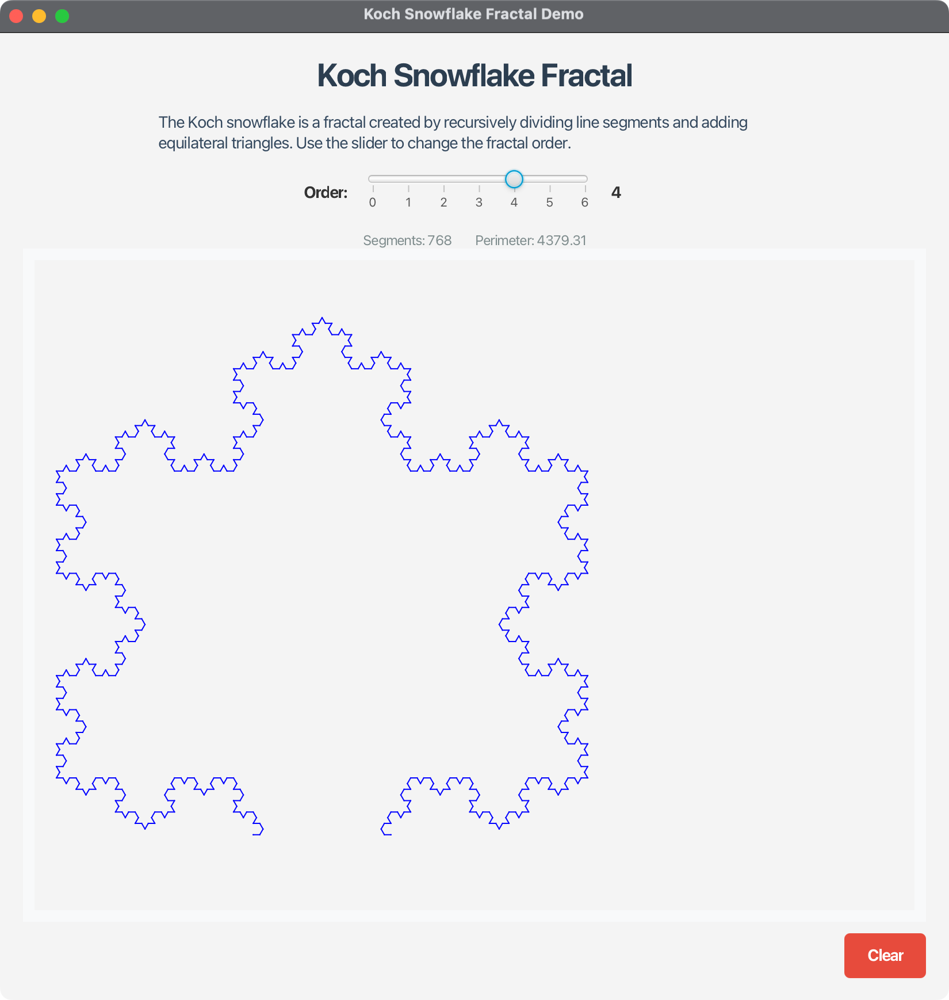

# Koch Snowflake Fractal Demo - JavaFX Application

## Overview

This JavaFX application demonstrates the Koch snowflake fractal, a famous mathematical fractal named after the Swedish mathematician Helge von Koch. The application provides an interactive way to explore and understand how fractals are generated through recursive geometric transformations.

## Features

### 🎯 Core Functionality

1. **Interactive Fractal Generation** - Real-time generation of Koch snowflake fractals
2. **Order Control** - Slider to adjust fractal order from 0 to 6
3. **Visual Display** - High-quality rendering of fractals on a 500x500 canvas
4. **Information Display** - Real-time segment count and perimeter calculations
5. **Clear Function** - Reset button to return to order 0

### 🚀 Key Features

- **Interactive GUI**: Modern JavaFX interface with intuitive controls
- **Real-time Updates**: Instant fractal regeneration when order changes
- **Educational**: Perfect for learning fractal concepts and recursion
- **Cross-platform**: Works on Windows, macOS, and Linux
- **Responsive Design**: Clean, professional interface with resizable window
- **Mathematical Accuracy**: Precise fractal generation with correct geometry
- **Scrollable Canvas**: Handles large fractals with scroll bars when needed
- **Optimized Layout**: Clear button positioned in bottom right, no overlap with fractal
- **Professional UI**: Clean, organized interface with proper component positioning

## Koch Snowflake Algorithm

The Koch snowflake is created through the following recursive process:

1. **Order 0**: Start with an equilateral triangle
2. **Order 1**: Divide each side into three equal parts and replace the middle third with two sides of an equilateral triangle pointing outward
3. **Higher Orders**: Repeat the transformation for each line segment

### Mathematical Properties

- **Perimeter**: Increases by a factor of 4/3 with each order
- **Segments**: Number of line segments = 3 × 4^order
- **Area**: Bounded (converges to a finite value)
- **Dimension**: Fractal dimension ≈ 1.2619

## Project Structure

```
06-04-KochSnowflake/
├── src/main/java/com/acu/javafx/kochsnowflake/
│   ├── KochSnowflake.java              # Core fractal generation logic
│   └── KochSnowflakeDemo.java          # Main JavaFX application
├── src/test/java/com/acu/javafx/kochsnowflake/
│   └── KochSnowflakeTest.java          # JUnit tests for fractal logic
├── docs/
│   ├── concepts.md                     # Fractal concepts and theory
│   └── implementation.md               # Technical implementation details
├── images/
│   └── koch-snowflake-demo.png         # Application screenshot
├── pom.xml                            # Maven configuration
├── run.sh                             # Unix/Linux/macOS run script
├── run.bat                            # Windows run script
├── run-jar.sh                         # JAR build and run script
└── README.md                          # This file
```

## Quick Start

### Prerequisites

- **Java**: OpenJDK 24 or later
- **Maven**: 3.9.x or later
- **JavaFX**: 24 (included in dependencies)

### Running the Application

#### Option 1: Using Run Scripts (Recommended)
```bash
# Unix/Linux/macOS
./run.sh

# Windows
run.bat
```

#### Option 2: Direct Maven Command
```bash
mvn clean javafx:run
```

#### Option 3: Build and Run JAR
```bash
# Build the JAR
mvn clean package

# Run the JAR
java -jar target/koch-snowflake-demo-1.0.0.jar
```

#### Option 4: Using JAR Script
```bash
# Unix/Linux/macOS
./run-jar.sh
```

## Usage Guide

### Getting Started

1. **Launch the Application**: Run the application using one of the methods above
2. **Adjust Order**: Use the slider to change the fractal order (0-6)
3. **Observe Changes**: Watch the fractal transform in real-time
4. **View Information**: Check the segment count and perimeter values
5. **Reset**: Use the "Clear" button to return to order 0

### Understanding the Interface

- **Order Slider**: Controls the fractal complexity (0 = triangle, 6 = highly detailed)
- **Information Panel**: Shows current segment count and calculated perimeter
- **Canvas**: Displays the fractal with blue lines on white background in a scrollable area
- **Clear Button**: Resets the fractal to order 0 (positioned in bottom right corner)
- **Resizable Window**: You can resize and maximize the window as needed
- **Scroll Bars**: Appear automatically when the fractal extends beyond the visible area
- **Optimized Layout**: Clear button positioned to avoid overlapping with fractal display

### Fractal Orders Explained

- **Order 0**: Simple equilateral triangle (3 segments)
- **Order 1**: Star-like shape with 6 points (12 segments)
- **Order 2**: More detailed star with smaller triangles (48 segments)
- **Order 3**: Highly detailed fractal pattern (192 segments)
- **Order 4+**: Extremely detailed patterns (768+ segments)

## Technical Details

### Fractal Generation Algorithm

The Koch snowflake is generated using a recursive transformation:

1. **Base Case**: Order 0 generates an equilateral triangle
2. **Recursive Case**: For each line segment:
   - Divide into three equal parts
   - Replace middle third with two sides of equilateral triangle
   - Apply transformation to all resulting segments

### Implementation Highlights

- **Efficient Rendering**: Uses JavaFX Canvas for smooth graphics
- **Mathematical Precision**: Accurate geometric calculations
- **Memory Management**: Efficient segment storage and processing
- **Real-time Updates**: Immediate response to user input
- **Error Handling**: Robust handling of edge cases

### Performance Considerations

- **Order Limits**: Maximum order of 6 to prevent performance issues
- **Memory Usage**: Segment count grows exponentially (3 × 4^order)
- **Rendering**: Optimized drawing with minimal redraws

## Development

### Building from Source

```bash
# Clone the repository
git clone <repository-url>
cd 06-04-KochSnowflake

# Build the project
mvn clean package

# Run tests
mvn test

# Run the application
mvn javafx:run
```

### Testing

The project includes comprehensive JUnit tests covering:

- Fractal generation for different orders
- Segment count calculations
- Perimeter calculations
- Edge cases and boundary conditions
- Line segment transformations

Run tests with:
```bash
mvn test
```

### Project Configuration

The project uses Maven with:
- **Java 24**: Target version
- **JavaFX 24**: UI framework
- **Cross-platform support**: Automatic platform detection
- **JUnit 5**: Testing framework

## Educational Value

This application is excellent for learning:

- **Recursion**: How recursive algorithms work
- **Fractals**: Mathematical concepts and properties
- **JavaFX**: Modern Java GUI development
- **Mathematical Visualization**: Converting math to graphics
- **Algorithm Design**: Efficient recursive implementations

## Troubleshooting

### Common Issues

#### 1. JavaFX Not Found
**Solution**: Ensure JavaFX dependencies are properly configured in `pom.xml`

#### 2. Application Won't Start
**Solution**: Check Java version compatibility (requires Java 24+)

#### 3. Performance Issues
**Solution**: Lower the maximum order or increase JVM memory

#### 4. Platform-Specific Issues
**Solution**: Use the appropriate run script for your platform

### Debug Mode

Run with debug output:
```bash
mvn javafx:run -Djavafx.debug=true
```

## Mathematical Background

### Koch Snowflake Properties

- **Self-Similarity**: Each part resembles the whole
- **Infinite Perimeter**: Perimeter approaches infinity as order increases
- **Finite Area**: Area converges to 8/5 times the original triangle area
- **Fractal Dimension**: log(4)/log(3) ≈ 1.2619

### Applications

- **Mathematics Education**: Teaching recursion and fractals
- **Computer Graphics**: Procedural generation techniques
- **Art and Design**: Aesthetic patterns and visualizations
- **Research**: Fractal geometry and chaos theory

## Screenshots





