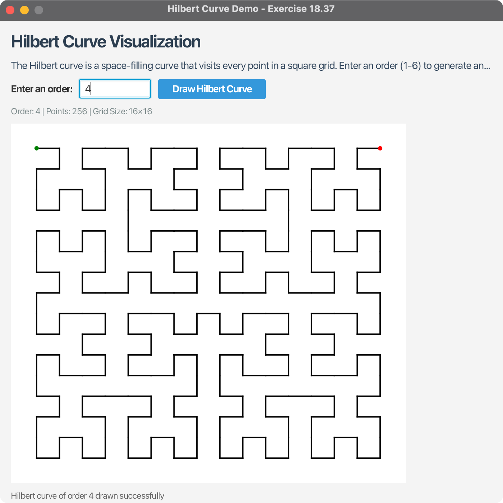

# Hilbert Curve Demo - JavaFX Application

## Overview

This JavaFX application demonstrates the generation and visualization of Hilbert curves, a fascinating space-filling curve first described by German mathematician David Hilbert in 1891. The Hilbert curve visits every point in a square grid with a size of 2^n × 2^n, where n is the order of the curve.

## Features

### 🎯 Core Functionality

1. **Interactive Input** - Enter the order of the Hilbert curve (1-6)
2. **Visual Display** - Draw and display Hilbert curves in real-time
3. **Order Validation** - Input validation ensures orders are between 1 and 6
4. **Curve Information** - Display point count and grid size for each curve
5. **Responsive UI** - Resizable window with adaptive curve drawing

### 🚀 Key Features

- **Modern JavaFX Interface**: Clean, intuitive user interface
- **Real-time Visualization**: Instant curve generation and display
- **Educational Value**: Perfect for understanding space-filling curves
- **Cross-platform**: Works on Windows, macOS, and Linux
- **Comprehensive Testing**: Full JUnit test coverage
- **Performance Optimized**: Efficient recursive algorithm implementation

## Project Structure

```
06-06-Hilbert-Curve/
├── src/main/java/com/acu/javafx/hilbertcurve/
│   ├── HilbertCurveDemo.java              # Main JavaFX application
│   ├── HilbertCurvePane.java              # Canvas for drawing curves
│   └── HilbertCurveGenerator.java         # Core algorithm implementation
├── src/test/java/com/acu/javafx/hilbertcurve/
│   └── HilbertCurveGeneratorTest.java     # JUnit tests
├── docs/
│   ├── algorithm.md                       # Algorithm explanation
│   └── usage.md                          # Usage guide
├── images/                               # Screenshots and examples
├── pom.xml                              # Maven configuration
├── run.sh                               # Unix/Linux/macOS run script
├── run.bat                              # Windows run script
├── run-jar.sh                           # JAR build and run script
└── README.md                            # This file
```

## Quick Start

### Prerequisites

- **Java**: OpenJDK 24 or later
- **Maven**: 3.9.x or later
- **JavaFX**: 24 (included in dependencies)

### Running the Application

#### Option 1: Using Run Scripts (Recommended)
```bash
# Unix/Linux/macOS
./run.sh

# Windows
run.bat
```

#### Option 2: Direct Maven Command
```bash
mvn clean javafx:run
```

#### Option 3: Build and Run JAR
```bash
# Unix/Linux/macOS
./run-jar.sh

# Or manually:
mvn clean package
java -jar target/hilbert-curve-demo-1.0.0.jar
```

## Usage Guide

### Getting Started

1. **Launch the Application**: Run the application using one of the methods above
2. **Enter Order**: Type a number between 1 and 6 in the "Enter an order:" field
3. **Draw Curve**: Click "Draw Hilbert Curve" or press Enter
4. **View Results**: The curve will be displayed in the main area
5. **Try Different Orders**: Experiment with different orders to see the complexity increase

### Understanding the Output

- **Green Dot**: Starting point of the curve
- **Red Dot**: Ending point of the curve
- **Black Lines**: The Hilbert curve path
- **Info Panel**: Shows order, point count, and grid size

### Curve Orders Explained

| Order | Points | Grid Size | Description |
|-------|--------|-----------|-------------|
| 1 | 4 | 2×2 | Simple U-shaped curve |
| 2 | 16 | 4×4 | More complex H-shaped pattern |
| 3 | 64 | 8×8 | Intricate space-filling pattern |
| 4 | 256 | 16×16 | Dense, complex curve |
| 5 | 1,024 | 32×32 | Very detailed pattern |
| 6 | 4,096 | 64×64 | Extremely complex curve |

## Technical Details

### Hilbert Curve Algorithm

The Hilbert curve is generated using a recursive algorithm that:

1. **Divides Space**: Splits the drawing area into four quadrants
2. **Recursive Generation**: Recursively generates curves for each quadrant
3. **Pattern Connection**: Connects quadrants with specific patterns
4. **Space Filling**: Ensures every point in the grid is visited exactly once

### Implementation Details

- **Recursive Algorithm**: Uses divide-and-conquer approach
- **Point Generation**: Creates ordered list of curve points
- **Canvas Drawing**: JavaFX Canvas for smooth rendering
- **Coordinate Mapping**: Maps grid coordinates to screen coordinates
- **Validation**: Ensures curve properties are maintained

### Architecture

The application uses:
- **JavaFX**: Modern UI framework for cross-platform GUI
- **Maven**: Build automation and dependency management
- **JUnit 5**: Comprehensive testing framework
- **Design Patterns**: Separation of concerns with dedicated classes

## Development

### Building from Source

```bash
# Clone the repository
git clone <repository-url>
cd 06-06-Hilbert-Curve

# Build the project
mvn clean package

# Run tests
mvn test

# Run the application
mvn javafx:run
```

### Testing

Run the comprehensive test suite:
```bash
mvn test
```

The test suite includes:
- **Algorithm Validation**: Tests for all orders (1-6)
- **Point Count Verification**: Ensures correct number of points
- **Curve Validation**: Verifies curve properties
- **Edge Case Testing**: Invalid inputs and boundary conditions
- **Performance Testing**: Different canvas sizes and orders

### Project Configuration

The project uses Maven with:
- **Java 24**: Target version
- **JavaFX 24**: UI framework
- **Cross-platform support**: Automatic platform detection
- **Maven plugins**: JavaFX Maven plugin for running


## Mathematical Background

### What is a Hilbert Curve?

The Hilbert curve is a continuous fractal space-filling curve that:
- **Visits Every Point**: Passes through every point in a 2^n × 2^n grid
- **Maintains Locality**: Nearby points in the curve are close in space
- **Self-Similar**: Higher orders contain patterns from lower orders
- **Space-Filling**: As order increases, the curve fills more of the space

### Properties

- **Fractal Dimension**: Approximately 2 (fills 2D space)
- **Recursive Structure**: Each order contains 4 copies of the previous order
- **Deterministic**: Same input always produces the same curve
- **Continuous**: No gaps or overlaps in the curve

## Screenshots

