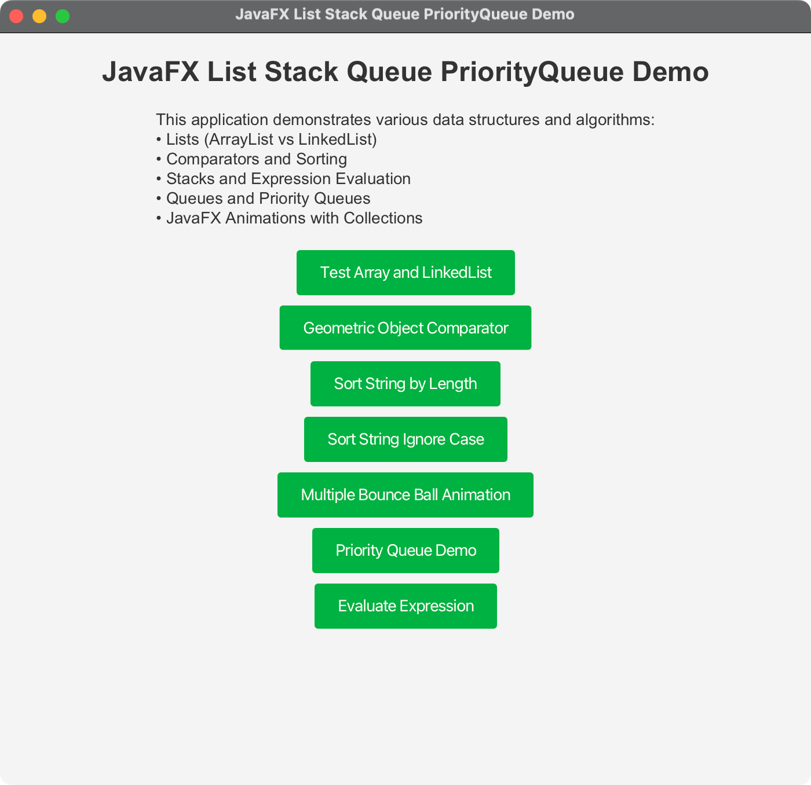

# JavaFX List Stack Queue PriorityQueue Demo - Project Summary

## Project Overview

This JavaFX application demonstrates various data structures and algorithms from the Java Collections Framework, including Lists, Stacks, Queues, and Priority Queues. The project provides a comprehensive GUI interface to run different examples from the lecture.

## Project Structure

```
07-01-List-Stack-Queue-PriorityQueue/
├── src/
│   └── main/
│       ├── java/
│       │   └── com/acu/javafx/liststackqueuepriorityqueue/
│       │       ├── ListStackQueuePriorityQueueApp.java    # Main application
│       │       ├── TestArrayAndLinkedList.java            # List comparison demo
│       │       ├── GeometricObject.java                   # Abstract base class
│       │       ├── Circle.java                           # Concrete geometric object
│       │       ├── Rectangle.java                        # Concrete geometric object
│       │       ├── GeometricObjectComparator.java        # Custom comparator
│       │       ├── GeometricObjectComparatorDemo.java    # Comparator demo
│       │       ├── SortStringByLength.java               # String sorting demo
│       │       ├── SortStringIgnoreCase.java             # Case-insensitive sorting
│       │       ├── MultipleBounceBall.java               # JavaFX animation demo
│       │       ├── PriorityQueueDemo.java                # Priority queue demo
│       │       └── EvaluateExpression.java               # Stack-based evaluation
│       └── resources/
├── docs/
│   ├── concepts.md                                       # Core concepts documentation
│   └── architecture.md                                   # Architecture documentation
├── pom.xml                                              # Maven configuration
├── run.sh                                               # Unix/Linux/macOS script
├── run.bat                                              # Windows script
├── .gitignore                                           # Git ignore rules
├── README.md                                            # Project documentation
└── PROJECT_SUMMARY.md                                   # This file
```

## Features Implemented

### 1. Main Application (ListStackQueuePriorityQueueApp)
- **Modern JavaFX UI** with clean, responsive design
- **Button-based navigation** to different demos
- **Alert dialogs** for user feedback
- **Cross-platform compatibility** with proper styling

### 2. Data Structure Demonstrations

#### TestArrayAndLinkedList
- Demonstrates ArrayList vs LinkedList differences
- Shows forward and backward iteration
- Illustrates performance characteristics

#### GeometricObjectComparator
- Custom comparator implementation
- Area-based sorting of geometric objects
- Strategy pattern usage

#### SortStringByLength
- Length-based string sorting
- Anonymous comparator implementation
- Array sorting with custom comparator

#### SortStringIgnoreCase
- Case-insensitive string sorting
- Lambda expression usage
- Functional programming concepts

#### MultipleBounceBall
- JavaFX animation with collections
- Real-time data structure manipulation
- Interactive user experience with controls

#### PriorityQueueDemo
- Priority queue operations
- Natural vs custom ordering
- Queue-based algorithms

#### EvaluateExpression
- Stack-based expression evaluation
- Two-stack algorithm implementation
- Operator precedence handling

## Technical Specifications

### Development Environment
- **Java Version**: OpenJDK 24
- **JavaFX Version**: 21
- **Maven Version**: 3.9.x
- **Target Platform**: Cross-platform (macOS, Windows, Linux)

### Build Configuration
- **Maven-based build** with proper dependency management
- **JavaFX Maven Plugin** for running the application
- **Cross-platform scripts** for easy execution
- **Proper packaging** for distribution

### Code Quality
- **Clean, well-documented code** with JavaDoc comments
- **Proper separation of concerns** with modular design
- **Error handling** for user interactions
- **Responsive UI design** principles

## Key Design Patterns

### 1. MVC (Model-View-Controller)
- **Model**: Data structures (Lists, Stacks, Queues)
- **View**: JavaFX UI components
- **Controller**: Demo classes coordinating between model and view

### 2. Strategy Pattern
- Different sorting strategies with comparators
- Runtime selection of comparison logic

### 3. Observer Pattern
- JavaFX property bindings for reactive UI updates
- Automatic UI updates based on data changes

### 4. Factory Pattern
- Collection creation and management
- Polymorphic object creation

## Performance Considerations

### Time Complexity
- **ArrayList**: O(1) access, O(n) insertion/deletion
- **LinkedList**: O(n) access, O(1) insertion/deletion
- **Stack/Queue**: O(1) push/pop/offer/poll
- **PriorityQueue**: O(log n) insertion, O(1) peek, O(log n) removal

### Memory Management
- Proper cleanup of JavaFX resources
- Collection size monitoring
- Garbage collection considerations

## Cross-Platform Compatibility

### Build Scripts
- **run.sh**: Unix/Linux/macOS execution script
- **run.bat**: Windows batch execution script
- **Platform detection** and automatic configuration

### Dependencies
- **JavaFX 21** with platform-specific modules
- **Maven 3.9.x** for build management
- **Java 24** compatibility

## Usage Instructions

### Prerequisites
1. **Java 24** or later installed
2. **Maven 3.9.x** or later installed
3. **JavaFX 21** runtime

### Running the Application

#### On Unix/Linux/macOS:
```bash
./run.sh
```

#### On Windows:
```cmd
run.bat
```

#### Using Maven directly:
```bash
mvn clean compile
mvn javafx:run
```

## Screenshots

