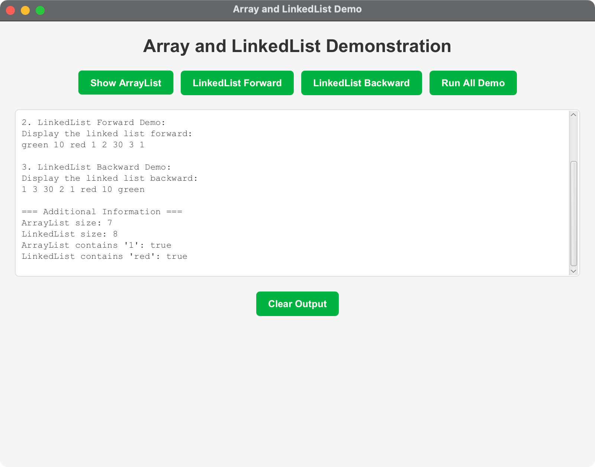

# Array and LinkedList Demo

A JavaFX application that demonstrates the functionality of ArrayList and LinkedList data structures from the Java Collections Framework.

## Overview

This project demonstrates the key differences and operations of ArrayList and LinkedList through an interactive JavaFX interface. The application shows:

- ArrayList operations (add, remove, contains)
- LinkedList operations (addFirst, addLast, removeLast)
- Forward and backward iteration using ListIterator
- Visual comparison of the data structures

## Features

- **Interactive UI**: Modern JavaFX interface with buttons to trigger different operations
- **Real-time Output**: Text area displaying the results of operations
- **Educational**: Shows the step-by-step process of building and manipulating lists
- **Cross-platform**: Works on Windows, macOS, and Linux

## Technical Specifications

- **Java Version**: OpenJDK 24
- **JavaFX Version**: 21
- **Maven Version**: 3.9.x or later
- **Target Platforms**: macOS (Intel/ARM64), Windows (x86_64/ARM64), Linux (x86_64/ARM64)

## Project Structure

```
07-04-ArrayLinkedList/
├── src/
│   ├── main/
│   │   ├── java/
│   │   │   └── com/acu/javafx/arraylinkedlist/
│   │   │       ├── ArrayLinkedListDemo.java    # Main JavaFX application
│   │   │       ├── Launcher.java               # Application launcher
│   │   │       └── TestArrayAndLinkedList.java # Original demo class
│   │   └── resources/
│   │       └── styles.css                      # CSS styling
├── pom.xml                                     # Maven configuration
├── run.sh                                      # Unix/Linux/macOS runner
├── run.bat                                     # Windows runner
├── run_direct.sh                               # Direct Java execution
└── README.md                                   # This file
```

## Quick Start

### Prerequisites

1. **Java 24**: Install OpenJDK 24 or later
2. **Maven 3.9+**: Install Apache Maven
3. **JavaFX**: The project includes JavaFX dependencies

### Running the Application

#### Option 1: Using Maven (Recommended)

**On macOS/Linux:**
```bash
chmod +x run.sh
./run.sh
```

**On Windows:**
```cmd
run.bat
```

#### Option 2: Direct Maven Commands

```bash
# Clean and compile
mvn clean compile

# Run the application
mvn javafx:run
```

#### Option 3: Direct Java Execution

```bash
chmod +x run_direct.sh
./run_direct.sh
```

### Building the Project

```bash
# Compile and package
mvn clean package

# Run the packaged JAR
java -jar target/arraylinkedlist-1.0.0.jar
```

## Application Features

### Main Interface

The application provides a clean, modern interface with:

- **Title**: Clear identification of the demo
- **Control Buttons**: 
  - "Show ArrayList" - Displays the ArrayList contents
  - "LinkedList Forward" - Shows forward iteration
  - "LinkedList Backward" - Shows backward iteration
  - "Run All Demo" - Executes the complete demonstration
- **Output Area**: Large text area showing operation results
- **Clear Button**: Clears the output area

### Demo Operations

1. **ArrayList Demo**:
   - Creates an ArrayList with integers
   - Demonstrates add operations at different positions
   - Shows the final ArrayList contents

2. **LinkedList Forward Demo**:
   - Creates a LinkedList from the ArrayList
   - Adds elements at specific positions
   - Demonstrates forward iteration using ListIterator

3. **LinkedList Backward Demo**:
   - Shows backward iteration through the LinkedList
   - Demonstrates the bidirectional nature of ListIterator

4. **Additional Information**:
   - Shows sizes of both data structures
   - Demonstrates contains() method usage

## Code Examples

### ArrayList Operations

```java
List<Integer> arrayList = new ArrayList<>();
arrayList.add(1); // 1 is autoboxed to an Integer object
arrayList.add(2);
arrayList.add(3);
arrayList.add(1);
arrayList.add(4);
arrayList.add(0, 10);
arrayList.add(3, 30);
```

### LinkedList Operations

```java
LinkedList<Object> linkedList = new LinkedList<>(arrayList);
linkedList.add(1, "red");
linkedList.removeLast();
linkedList.addFirst("green");
```

### ListIterator Usage

```java
// Forward iteration
ListIterator<Object> listIterator = linkedList.listIterator();
while (listIterator.hasNext()) {
    System.out.print(listIterator.next() + " ");
}

// Backward iteration
listIterator = linkedList.listIterator(linkedList.size());
while (listIterator.hasPrevious()) {
    System.out.print(listIterator.previous() + " ");
}
```

## Key Concepts Demonstrated

### ArrayList vs LinkedList

- **ArrayList**: Dynamic array implementation, good for random access
- **LinkedList**: Doubly-linked list implementation, good for frequent insertions/deletions

### ListIterator Features

- **Bidirectional**: Can traverse in both directions
- **Position-based**: Can start from any position
- **Modification**: Can add/remove elements during iteration

### Autoboxing

- Automatic conversion between primitive types and their wrapper classes
- Example: `int` to `Integer` conversion

## Cross-Platform Compatibility

The project is designed to work across different platforms:

- **macOS**: Apple Silicon (ARM64) and Intel (x86_64)
- **Windows**: x86_64 and ARM64
- **Linux**: x86_64 and ARM64

The Maven configuration includes platform-specific profiles that automatically detect the operating system and include the appropriate JavaFX dependencies.

## Troubleshooting

### Common Issues

1. **JavaFX not found**: Ensure JavaFX is properly installed or use the Maven approach
2. **Compilation errors**: Make sure you're using Java 24 or later
3. **Runtime errors**: Check that all dependencies are properly resolved

### Platform-Specific Notes

- **macOS**: JavaFX is included with recent JDK distributions
- **Windows**: May need to install JavaFX separately
- **Linux**: Use package manager or download JavaFX manually

## Development

### Adding New Features

1. Modify `ArrayLinkedListDemo.java` for UI changes
2. Update `styles.css` for styling changes
3. Add new test classes in the same package

### Building for Distribution

```bash
# Create executable JAR
mvn clean package

# The JAR will be in target/arraylinkedlist-1.0.0.jar
```

## Screenshots

