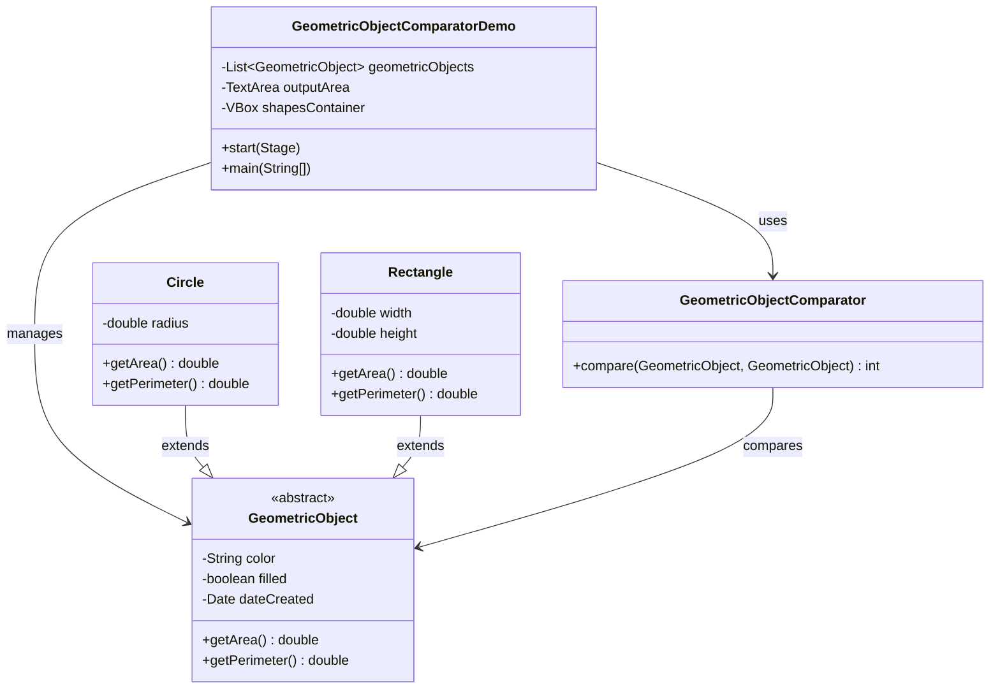

# Geometric Object Comparator - Architecture

## System Architecture

The application follows a layered architecture pattern with clear separation of concerns:

```
┌─────────────────────────────────────┐
│           Presentation Layer        │
│        (JavaFX UI Components)      │
├─────────────────────────────────────┤
│           Business Logic Layer      │
│      (Geometric Objects & Logic)   │
├─────────────────────────────────────┤
│           Data Layer                │
│        (Collections & Sorting)      │
└─────────────────────────────────────┘
```

## Component Architecture

### 1. Presentation Layer

**GeometricObjectComparatorDemo.java**
- Main JavaFX application class
- Extends `javafx.application.Application`
- Manages UI components and user interactions
- Coordinates between UI and business logic

**Key Responsibilities:**
- UI initialization and layout management
- Event handling for user interactions
- Visual representation of geometric objects
- Display updates and synchronization

**UI Components:**
```
GeometricObjectComparatorDemo
├── VBox (root container)
│   ├── Label (title)
│   ├── Label (description)
│   ├── HBox (button container)
│   │   ├── Button (add circle)
│   │   ├── Button (add rectangle)
│   │   ├── Button (sort)
│   │   └── Button (clear)
│   ├── VBox (shapes container)
│   └── TextArea (output)
```

### 2. Business Logic Layer

**GeometricObject.java (Abstract Class)**
- Base class for all geometric objects
- Defines common properties and behavior
- Provides abstract methods for area and perimeter calculation

**Properties:**
- `color`: String representation of object color
- `filled`: Boolean indicating if object is filled
- `dateCreated`: Creation timestamp

**Methods:**
- `getArea()`: Abstract method for area calculation
- `getPerimeter()`: Abstract method for perimeter calculation
- `toString()`: String representation of object

**Circle.java**
- Concrete implementation of `GeometricObject`
- Represents circular geometric objects
- Implements area and perimeter calculations for circles

**Rectangle.java**
- Concrete implementation of `GeometricObject`
- Represents rectangular geometric objects
- Implements area and perimeter calculations for rectangles

### 3. Data Layer

**GeometricObjectComparator.java**
- Implements `Comparator<GeometricObject>`
- Defines comparison logic for sorting
- Uses area-based comparison strategy

**Collections Management:**
- `ArrayList<GeometricObject>`: Stores geometric objects
- `Collections.sort()`: Applies sorting algorithm
- Dynamic object creation and management

## Class Relationships



## Design Patterns

### 1. Template Method Pattern
`GeometricObject` defines the template with abstract methods that subclasses must implement.

### 2. Strategy Pattern
`GeometricObjectComparator` implements a sorting strategy that can be applied to collections.

### 3. Observer Pattern
JavaFX uses this pattern for event handling and UI updates.

### 4. Factory Pattern
The application creates objects dynamically based on user input.

## Data Flow

### 1. Object Creation Flow
```
User clicks "Add Circle/Rectangle"
    ↓
Random properties generated
    ↓
New GeometricObject created
    ↓
Object added to collection
    ↓
UI updated to reflect changes
```

### 2. Sorting Flow
```
User clicks "Sort by Area"
    ↓
GeometricObjectComparator created
    ↓
Collections.sort() called with comparator
    ↓
Collection reordered
    ↓
UI updated to show new order
```

### 3. Display Update Flow
```
Data changes
    ↓
updateDisplay() called
    ↓
Shapes container cleared
    ↓
Visual shapes created for each object
    ↓
Information labels created
    ↓
Output area updated with details
```

## Cross-Platform Architecture

### Maven Configuration
- **Platform Detection**: Uses `os-maven-plugin` for automatic platform detection
- **Dependency Management**: Platform-specific JavaFX dependencies
- **Build Process**: Standardized build across platforms

### Platform Support
```
Platform Detection
├── macOS (x86_64, ARM64)
├── Windows (x86_64, ARM64)
└── Linux (x86_64, ARM64)
```

## Error Handling

### 1. Compilation Errors
- Maven build validation
- Java version compatibility checks
- Dependency resolution

### 2. Runtime Errors
- Null pointer protection
- Array bounds checking
- Exception handling for UI operations

### 3. User Input Validation
- Range checking for geometric properties
- Color validation
- Object creation validation

## Performance Considerations

### 1. Memory Management
- Efficient object creation and disposal
- Minimal object retention
- Proper collection management

### 2. UI Responsiveness
- Non-blocking UI operations
- Efficient visual updates
- Minimal UI thread blocking

### 3. Sorting Performance
- O(n log n) sorting complexity
- Efficient comparator implementation
- Minimal object copying

## Security Considerations

### 1. Input Validation
- Range checking for geometric properties
- Color string validation
- Object creation limits

### 2. Resource Management
- Proper file handle management
- Memory leak prevention
- Clean shutdown procedures

## Testing Strategy

### 1. Unit Testing
- Individual class testing
- Method-level validation
- Edge case handling

### 2. Integration Testing
- Component interaction testing
- UI integration validation
- End-to-end workflow testing

### 3. Cross-Platform Testing
- Platform-specific validation
- Dependency compatibility testing
- Build process verification

## Deployment Architecture

### 1. Development Environment
- Maven-based build system
- Cross-platform compatibility
- Standardized project structure

### 2. Distribution
- Executable JAR creation
- Platform-specific packaging
- Dependency bundling

### 3. Runtime Requirements
- Java 24 runtime
- JavaFX modules
- Platform-specific native libraries 