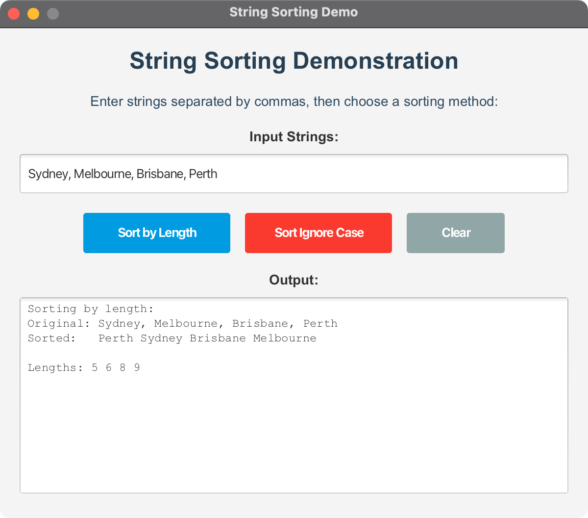

# JavaFX String Sorting Demo

A JavaFX application that demonstrates string sorting by length and case-insensitive sorting. This project includes both the original console-based examples from Pearson's Java Programming textbook and an interactive JavaFX interface.

## Features

- **Sort by Length**: Demonstrates sorting strings based on their character length
- **Case-Insensitive Sort**: Demonstrates sorting strings ignoring case differences
- **Interactive UI**: Modern JavaFX interface with input validation and error handling
- **Cross-Platform**: Works on macOS, Windows, and Linux

## Original Source Code

This project includes the original classes from Pearson's Java Programming textbook:

- **SortStringByLength**: Demonstrates sorting strings by length using a custom Comparator
- **SortStringIgnoreCase**: Demonstrates case-insensitive sorting using lambda expressions

## Project Structure

```
07-06-SortString/
├── src/
│   └── main/
│       └── java/
│           └── com/
│               └── acu/
│                   └── javafx/
│                       └── sortstring/
│                           ├── Launcher.java              # Application entry point
│                           ├── SortStringDemo.java        # Main JavaFX application
│                           ├── SortStringByLength.java    # Original length-based sorting
│                           └── SortStringIgnoreCase.java  # Original case-insensitive sorting
├── docs/
│   ├── architecture.md    # Architecture documentation
│   └── concepts.md        # Concepts and design decisions
├── pom.xml               # Maven configuration
├── run.sh               # Unix/Linux/macOS execution script
├── run.bat              # Windows execution script
└── README.md            # This file
```

## Requirements

- **Java**: OpenJDK 24 or later
- **Maven**: 3.9.x or later
- **JavaFX**: 21 (automatically managed by Maven)

## Quick Start

### Using Maven (Recommended)

1. **Clone or download the project**
2. **Navigate to the project directory**:
   ```bash
   cd 07-06-SortString
   ```

3. **Run the application**:
   - **On macOS/Linux**: `./run.sh`
   - **On Windows**: `run.bat`
   - **Using Maven directly**: `mvn javafx:run`

### Manual Execution

1. **Build the project**:
   ```bash
   mvn clean compile
   ```

2. **Run the application**:
   ```bash
   mvn javafx:run
   ```

## Usage

1. **Launch the application** using one of the methods above
2. **Enter strings** in the input field, separated by commas (e.g., "Atlanta, Savannah, New York, Dallas")
3. **Choose a sorting method**:
   - **Sort by Length**: Sorts strings based on their character count
   - **Sort Ignore Case**: Sorts strings alphabetically, ignoring case differences
4. **View the results** in the output area
5. **Clear** the output and reset to default values using the Clear button

## Examples

### Sort by Length
- **Input**: "Atlanta, Savannah, New York, Dallas"
- **Output**: "Dallas Atlanta Savannah New York"
- **Lengths**: 6 7 8 8

### Sort Ignore Case
- **Input**: "Atlanta, Savannah, new York, dallas"
- **Output**: "Atlanta dallas new York Savannah"

## Technical Details

### Architecture

The application follows the Model-View-Controller (MVC) pattern:
- **Model**: Sorting algorithms from the original classes
- **View**: JavaFX UI components
- **Controller**: Event handlers and business logic

### Cross-Platform Compatibility

The project is configured to work across different platforms:
- **macOS**: Intel (x86_64) and Apple Silicon (ARM64)
- **Windows**: x86_64 and ARM64
- **Linux**: x86_64 and ARM64

### Build Configuration

- **Java Version**: 24
- **JavaFX Version**: 21
- **Maven Compiler**: Configured for Java 24
- **Platform Detection**: Automatic architecture detection for JavaFX dependencies

## Development

### Building from Source

1. **Clone the repository**
2. **Install dependencies**: `mvn dependency:resolve`
3. **Compile**: `mvn compile`
4. **Run tests**: `mvn test`
5. **Package**: `mvn package`

### Running Individual Classes

You can also run the original console-based classes directly:

```bash
# Sort by length
mvn exec:java -Dexec.mainClass="com.acu.javafx.sortstring.SortStringByLength"

# Sort ignore case
mvn exec:java -Dexec.mainClass="com.acu.javafx.sortstring.SortStringIgnoreCase"
```

## Screenshots

