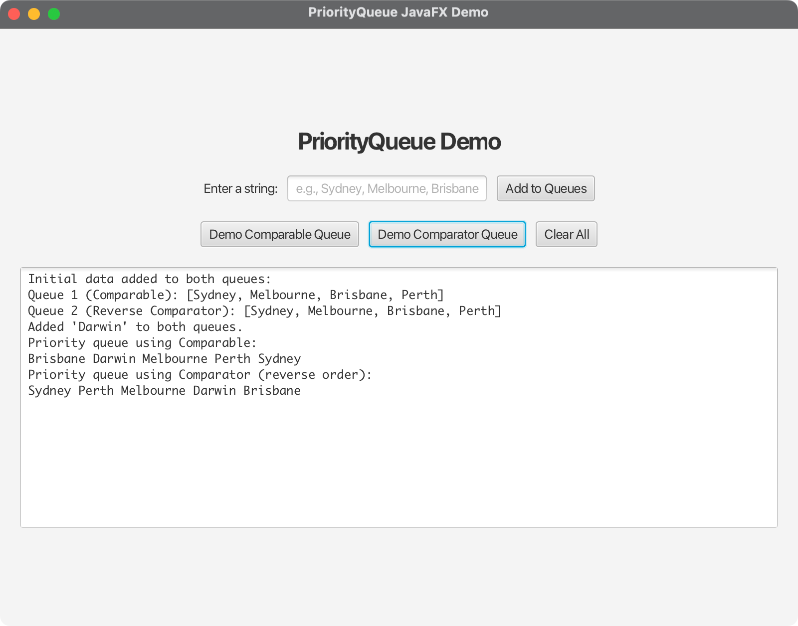

# PriorityQueue JavaFX Demo

A JavaFX application that demonstrates the functionality of Java's `PriorityQueue` class with both Comparable and Comparator implementations.

## Overview

This project demonstrates:
- **PriorityQueue with Comparable**: Natural ordering of elements
- **PriorityQueue with Comparator**: Custom ordering (reverse order in this demo)
- **Interactive JavaFX Interface**: Add elements and see the queue behavior in real-time
- **Cross-platform compatibility**: Works on macOS, Windows, and Linux

## Features

- **Interactive GUI**: Add strings to both queues and observe their behavior
- **Real-time demonstration**: See how elements are ordered differently in each queue
- **Visual feedback**: Clear output showing the queue operations
- **Educational**: Perfect for learning PriorityQueue concepts

## Project Structure

```
07-07-PriorityQueue/
├── src/
│   └── main/
│       └── java/
│           └── com/
│               └── acu/
│                   └── javafx/
│                       └── priorityqueue/
│                           ├── PriorityQueueDemo.java          # Original console demo
│                           ├── PriorityQueueJavaFXApp.java     # Main JavaFX application
│                           └── Launcher.java                   # Application launcher
├── pom.xml                    # Maven configuration
├── run.sh                     # Unix/Linux/macOS execution script
├── run.bat                    # Windows execution script
├── run_direct.sh              # Direct Java execution (optional)
└── README.md                  # This file
```

## Technical Specifications

### Development Environment
- **Java Version**: OpenJDK 24
- **JavaFX Version**: 21
- **Maven Version**: 3.9.x or later
- **Target Platform**: Cross-platform (macOS, Windows, Linux)

### Supported Architectures
- **macOS**: Intel (x86_64) and Apple Silicon (ARM64)
- **Windows**: x86_64 and ARM64
- **Linux**: x86_64 and ARM64

## Quick Start

### Prerequisites
1. **Java 24**: Install OpenJDK 24 or later
2. **Maven**: Install Maven 3.9.x or later
3. **JavaFX**: Automatically handled by Maven dependencies

### Running the Application

#### Option 1: Using Maven (Recommended)
```bash
# On Unix/Linux/macOS
./run.sh

# On Windows
run.bat
```

#### Option 2: Manual Maven Commands
```bash
# Clean and compile
mvn clean compile

# Run the application
mvn javafx:run
```

#### Option 3: Direct Java Execution
```bash
# First compile with Maven
mvn clean compile

# Then run directly (Unix/Linux/macOS only)
./run_direct.sh
```

## How to Use

1. **Launch the Application**: Run one of the execution scripts
2. **Add Elements**: Type strings in the input field and click "Add to Queues"
3. **Demo Queues**: Click the demo buttons to see how elements are ordered:
   - **Demo Comparable Queue**: Shows natural alphabetical ordering
   - **Demo Comparator Queue**: Shows reverse alphabetical ordering
4. **Clear Queues**: Use the "Clear All" button to reset both queues

## Example Output

When you add the strings "Oklahoma", "Indiana", "Georgia", "Texas":

**Comparable Queue (natural order):**
```
Georgia Indiana Oklahoma Texas
```

**Comparator Queue (reverse order):**
```
Texas Oklahoma Indiana Georgia
```

## Implementation Details

### PriorityQueue with Comparable
```java
PriorityQueue<String> queue1 = new PriorityQueue<>();
```
- Uses natural ordering of String (alphabetical)
- Elements are ordered from smallest to largest

### PriorityQueue with Comparator
```java
PriorityQueue<String> queue2 = new PriorityQueue<>(4, Collections.reverseOrder());
```
- Uses custom comparator for reverse ordering
- Elements are ordered from largest to smallest

## Screenshots

