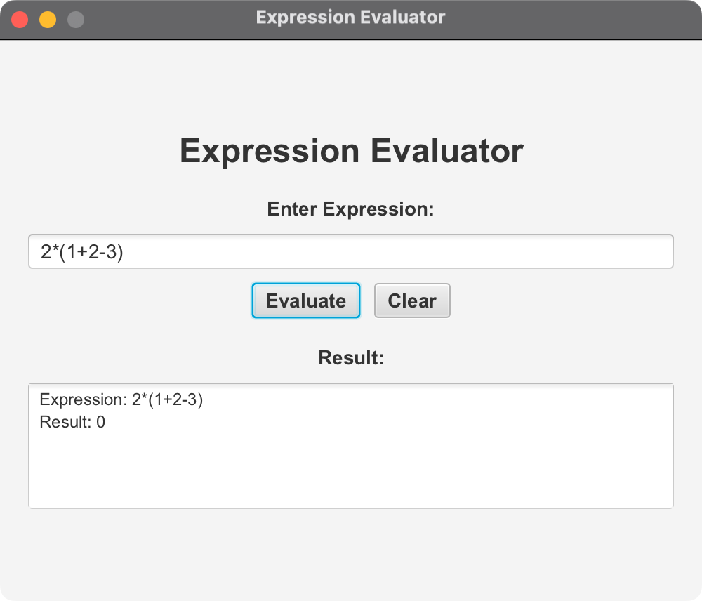

# EvaluateExpression JavaFX Application

A JavaFX application that demonstrates mathematical expression evaluation using stack-based algorithms. This application provides a graphical user interface for evaluating mathematical expressions with support for parentheses, basic arithmetic operations, and operator precedence.

## Features

- **Graphical User Interface**: Modern JavaFX interface for easy expression input
- **Mathematical Expression Evaluation**: Supports addition, subtraction, multiplication, division, and parentheses
- **Error Handling**: Comprehensive error handling for invalid expressions
- **Cross-Platform**: Runs on macOS, Windows, and Linux
- **Keyboard Shortcuts**: Enter to evaluate, Escape to clear

## Technical Specifications

### Development Environment

- **Target Platform**: macOS Silicon (ARM64) - primary development environment
- **Java Version**: OpenJDK 24
- **Maven Version**: 3.9.x or later
- **JavaFX Version**: 21

### Cross-Platform Compatibility

The project is buildable and runnable on:

- **macOS**: Intel (x86_64) and Apple Silicon (ARM64)
- **Windows**: x86_64 and ARM64
- **Linux**: x86_64 and ARM64

## Project Structure

```
src/
├── main/
│   ├── java/
│   │   └── com/acu/javafx/evaluateexpression/
│   │       ├── EvaluateExpression.java    # Core expression evaluation logic
│   │       ├── EvaluateExpressionApp.java # JavaFX application
│   │       └── Launcher.java             # Application entry point
│   └── resources/
├── test/
│   └── java/
docs/
├── architecture.md                        # Architecture documentation
└── concepts.md                           # Concepts and design decisions
pom.xml                                   # Maven build configuration
run.sh                                    # Unix/Linux/macOS execution script
run.bat                                   # Windows batch execution script
run_direct.sh                             # Direct Java execution script
```

## Quick Start

### Prerequisites

1. **Java 24 or later** - [Download OpenJDK 24](https://adoptium.net/)
2. **Maven 3.9.x or later** - [Download Maven](https://maven.apache.org/download.cgi)

### Building and Running

#### Using Maven (Recommended)

**On macOS/Linux:**
```bash
chmod +x run.sh
./run.sh
```

**On Windows:**
```cmd
run.bat
```

#### Manual Build and Run

```bash
# Clean and compile
mvn clean compile

# Run the application
mvn javafx:run
```

#### Direct Java Execution (Alternative)

```bash
chmod +x run_direct.sh
./run_direct.sh
```

## Usage

1. **Launch the Application**: Run one of the build scripts above
2. **Enter Expression**: Type a mathematical expression in the input field
   - Examples: `(3+4)*2-1`, `10/2+3*4`, `(5+3)*(2-1)`
3. **Evaluate**: Click "Evaluate" button or press Enter
4. **View Result**: The result will be displayed in the result area
5. **Clear**: Click "Clear" button or press Escape to clear all fields

### Supported Operations

- **Addition**: `+`
- **Subtraction**: `-`
- **Multiplication**: `*`
- **Division**: `/`
- **Parentheses**: `()` for grouping and precedence

### Expression Examples

- `3+4*2` → Result: 11 (multiplication has higher precedence)
- `(3+4)*2` → Result: 14 (parentheses override precedence)
- `10/2+3*4` → Result: 17
- `(5+3)*(2-1)` → Result: 8

## Architecture

### Core Components

1. **EvaluateExpression**: Contains the core expression evaluation logic using stack-based algorithms
2. **EvaluateExpressionApp**: JavaFX application providing the graphical user interface
3. **Launcher**: Application entry point for JavaFX

### Algorithm Overview

The expression evaluation uses a two-stack approach:

1. **Operand Stack**: Stores numerical values
2. **Operator Stack**: Stores operators and parentheses

The algorithm processes the expression in two phases:
- **Phase 1**: Scan tokens and handle operator precedence
- **Phase 2**: Process remaining operators in the stack

## Error Handling

The application provides comprehensive error handling for:

- Invalid mathematical expressions
- Division by zero
- Malformed parentheses
- Invalid characters in expressions

Error messages are displayed in user-friendly dialog boxes.

## Build Configuration

### Maven Configuration

The `pom.xml` includes:

- JavaFX dependencies with platform-specific classifiers
- Maven compiler plugin configured for Java 24
- JavaFX Maven plugin for running the application
- Cross-platform dependency management
- Platform detection properties

### Platform-Specific Profiles

- **macOS**: Automatic detection and configuration
- **Windows**: Windows-specific settings
- **Linux**: Unix/Linux configuration

## Development

### Adding New Features

1. **Extend EvaluateExpression**: Add new operators or functions to the core evaluation logic
2. **Update UI**: Modify EvaluateExpressionApp to support new features
3. **Add Tests**: Create unit tests for new functionality

### Testing

```bash
# Run tests
mvn test

# Run with specific profile
mvn test -P mac
```

## Screenshots

