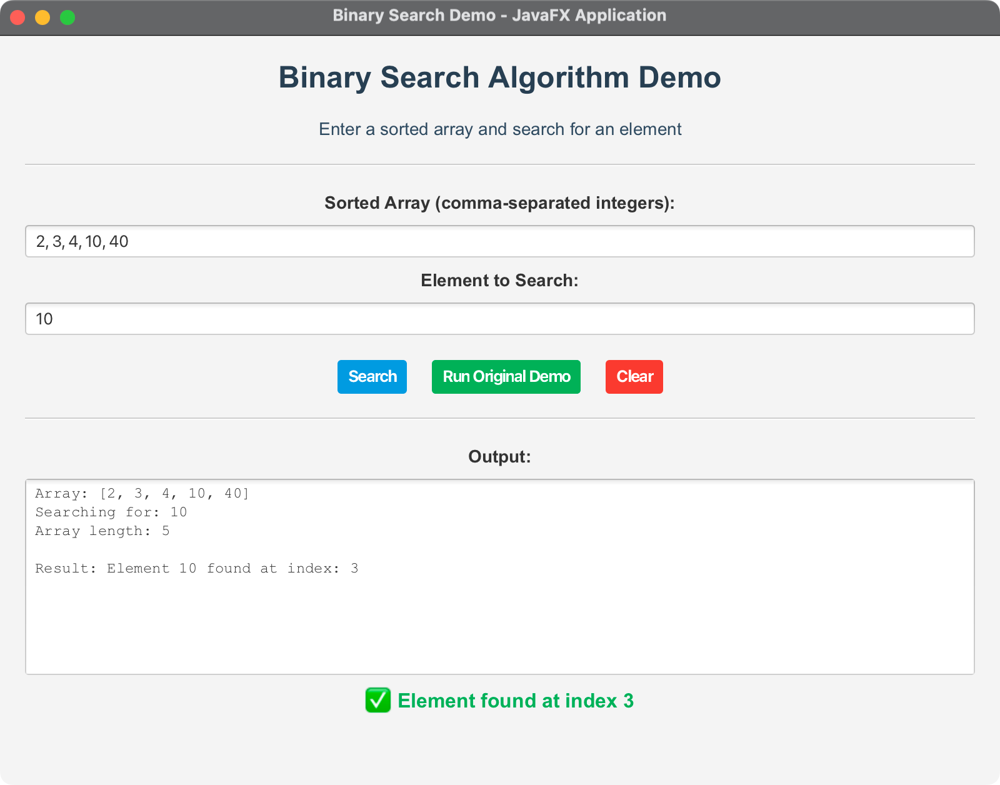

# JavaFX Binary Search Demo

A JavaFX application that demonstrates the binary search algorithm with an interactive graphical interface. This project implements the iterative binary search algorithm from GeeksforGeeks and provides a modern UI for testing and learning.

## 🎯 Project Overview

This application showcases:
- **Binary Search Algorithm**: Efficient O(log n) search in sorted arrays
- **JavaFX UI**: Modern, responsive graphical interface
- **Cross-Platform Support**: Works on macOS, Windows, and Linux
- **Educational Focus**: Interactive learning tool for algorithm understanding

## 🚀 Quick Start

### Prerequisites

- **Java**: OpenJDK 24 or later
- **Maven**: 3.9.x or later
- **JavaFX**: Included via Maven dependencies
- **Make**: For using the Makefile (optional)

### Running the Application

#### Using Maven (Recommended):
```bash
mvn clean javafx:run
```

#### Using Makefile:
```bash
# Show all available commands
make help

# Run the JavaFX application
make run-app

# Run console-based demos
make run-all
```

#### Using Scripts:
**On macOS/Linux:**
```bash
chmod +x run.sh
./run.sh
```

**On Windows:**
```cmd
run.bat
```

## 📁 Project Structure

```
08-02-BinarySearch/
├── src/main/java/com/acu/javafx/binarysearch/
│   ├── BinarySearchApp.java    # Main JavaFX application
│   └── Geeks.java             # Binary search implementation
├── docs/
│   ├── architecture.md         # Architecture documentation
│   └── concepts.md            # Algorithm concepts
├── pom.xml                    # Maven configuration
├── Makefile                   # Build automation and testing
├── run.sh                     # Unix/Linux/macOS run script
├── run.bat                    # Windows run script
└── README.md                  # This file
```

## 🔧 Makefile Overview

The project includes a comprehensive Makefile that provides multiple ways to build, test, and run the binary search implementations. This makes it easy to experiment with different approaches and run various demos.

### Makefile Features

#### **Build Targets**
- `make build` - Compile console Java applications (excludes JavaFX)
- `make build-all` - Compile all Java applications (including JavaFX)

#### **Console Application Demos**
- `make run-geeks` - Original Geeks binary search demo
- `make run-iterative` - Iterative binary search implementation
- `make run-recursive` - Recursive binary search implementation
- `make run-inbuild` - Java's built-in `Arrays.binarySearch()` demo
- `make run-collections` - Java Collections `binarySearch()` demo
- `make run-test` - Comprehensive test suite

#### **JavaFX Application**
- `make run-app` - Run the JavaFX binary search application

#### **Utility Targets**
- `make run-all` - Run all console applications sequentially
- `make clean` - Remove all compiled class files
- `make help` - Show all available commands

### Key Variables

```makefile
# Source directories and files
JAVA_SRC_DIR = src/main/java/com/acu/javafx/binarysearch
JAVA_SRC_FILES = $(shell find $(JAVA_SRC_DIR) -name "*.java")

# Main class names
GEEKS_CLASS = com.acu.javafx.binarysearch.Geeks
BINARY_SEARCH_APP_CLASS = com.acu.javafx.binarysearch.BinarySearchApp

# JavaFX module path (requires JavaFX SDK)
JAVAFX_MODULE_PATH = --module-path /path/to/javafx-sdk/lib --add-modules javafx.controls,javafx.fxml
```

### Usage Examples

```bash
# Show all available commands
make help

# Build and run the JavaFX application
make run-app

# Run all console demos to compare implementations
make run-all

# Clean compiled files
make clean

# Build only console applications
make build

# Build everything including JavaFX
make build-all
```

### JavaFX Configuration

The Makefile includes support for JavaFX applications but requires the JavaFX SDK to be installed. To use the JavaFX features:

1. **Install JavaFX SDK** from [OpenJFX](https://openjfx.io/)
2. **Update the `JAVAFX_MODULE_PATH`** variable in the Makefile to point to your JavaFX installation
3. **Run `make run-app`** to launch the JavaFX application

### Benefits of Using Makefile

1. **Multiple Implementations**: Test different binary search approaches
2. **Educational Value**: Compare iterative vs recursive implementations
3. **Built-in Testing**: Comprehensive test suite included
4. **Cross-Platform**: Works on macOS, Linux, and Windows
5. **Easy Experimentation**: Quick commands for different demos
6. **Development Workflow**: Streamlined build and test process

## 🔧 Features

### Core Algorithm
- **Iterative Binary Search**: O(log n) time complexity
- **Sorted Array Requirement**: Automatic validation
- **Error Handling**: Comprehensive input validation
- **Original Implementation**: Based on GeeksforGeeks code

### User Interface
- **Input Fields**: Array and search element input
- **Control Buttons**: Search, demo, and clear functions
- **Output Display**: Real-time results with visual feedback
- **Error Messages**: User-friendly alert dialogs

### Cross-Platform Support
- **macOS**: ARM64 and x86_64 architectures
- **Windows**: x86_64 and ARM64 architectures
- **Linux**: x86_64 and ARM64 architectures

## 🎮 How to Use

### Basic Usage

1. **Enter Array**: Input a sorted array of integers (comma-separated)
   - Example: `2, 3, 4, 10, 40`

2. **Enter Search Element**: Specify the element to find
   - Example: `10`

3. **Click Search**: View results in the output area

### Example Scenarios

#### Successful Search
- **Array**: `1, 3, 5, 7, 9, 11, 13, 15`
- **Search**: `7`
- **Result**: ✅ Element found at index 3

#### Element Not Found
- **Array**: `2, 4, 6, 8, 10`
- **Search**: `5`
- **Result**: ❌ Element not found

#### Original Demo
- Click "Run Original Demo" to see the original GeeksforGeeks example
- Demonstrates the algorithm with array `[2, 3, 4, 10, 40]` searching for `10`

## 🏗️ Technical Details

### Algorithm Implementation

The binary search algorithm is implemented in the `Geeks` class:

```java
static int binarySearch(int a[], int l, int r, int x) {
    while (l <= r) {
        int m = (l + r) / 2;
        
        if (a[m] == x) {
            return m;
        } else if (a[m] > x) {
            r = m - 1;
        } else {
            l = m + 1;
        }
    }
    return -1;
}
```

### Time Complexity
- **Best Case**: O(1) - Element found at middle
- **Average Case**: O(log n) - Element found after log₂(n) comparisons
- **Worst Case**: O(log n) - Element not found

### Space Complexity
- **Iterative Implementation**: O(1) - Constant space

## 🛠️ Development

### Building from Source

```bash
# Clone the repository
git clone <repository-url>
cd 08-02-BinarySearch

# Build the project
mvn clean compile

# Run the application
mvn javafx:run
```

### JavaFX Features Used
- **Layout Management**: VBox, HBox for component organization
- **Event Handling**: Button clicks and input validation
- **Styling**: CSS-like inline styles for visual feedback
- **Alert Dialogs**: Error message display

## 🔍 Testing

### Manual Testing Scenarios

1. **Valid Inputs**:
   - Sorted arrays with various sizes
   - Elements present and not present
   - Boundary conditions (first/last elements)

2. **Invalid Inputs**:
   - Non-sorted arrays
   - Non-integer values
   - Empty arrays
   - Invalid number formats

3. **Edge Cases**:
   - Single element arrays
   - Duplicate elements
   - Very large arrays

### Automated Testing

```bash
# Run unit tests (if implemented)
mvn test

# Run with specific test cases
mvn test -Dtest=BinarySearchTest
```


## Screenshots

