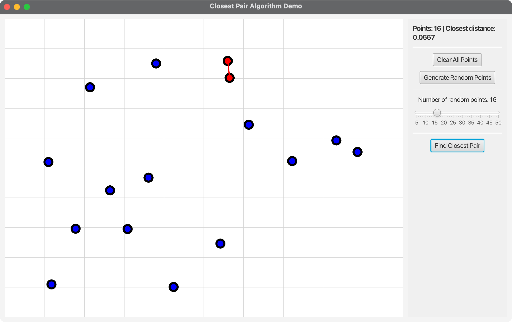

# JavaFX Closest Pair Algorithm Demo

A JavaFX application that demonstrates the closest pair algorithm with an interactive graphical interface. This project implements the divide-and-conquer closest pair algorithm from Princeton's Algorithms 4th Edition and provides a modern UI for testing and learning.

## 🎯 Project Overview

This application showcases:
- **Closest Pair Algorithm**: Efficient O(n log n) divide-and-conquer algorithm
- **JavaFX UI**: Modern, responsive graphical interface with interactive point placement
- **Cross-Platform Support**: Works on macOS, Windows, and Linux
- **Educational Focus**: Interactive learning tool for algorithm understanding
- **Visualization**: Real-time visualization of points and closest pair connections

## 🚀 Quick Start

### Prerequisites

- **Java**: OpenJDK 24 or later
- **Maven**: 3.9.x or later
- **JavaFX**: Included via Maven dependencies
- **Make**: For using the Makefile (optional)

### Running the Application

#### Using Maven (Recommended):
```bash
mvn clean javafx:run
```

#### Using Scripts:
**On macOS/Linux:**
```bash
chmod +x run.sh
./run.sh
```

**On Windows:**
```cmd
run.bat
```

#### Using Direct Execution:
```bash
./run_direct.sh
```

## 📁 Project Structure

```
08-03-ClosestPair/
├── src/main/java/com/acu/javafx/closestpair/
│   ├── ClosestPairDemo.java    # Main JavaFX application
│   ├── Launcher.java           # Application entry point
│   ├── ClosestPair.java        # Core algorithm implementation
│   ├── Point2D.java            # 2D point data type
│   ├── StdDraw.java            # Drawing utilities
│   └── StdRandom.java          # Random number utilities
├── docs/
│   ├── architecture.md         # Architecture documentation
│   └── concepts.md            # Algorithm concepts
├── pom.xml                    # Maven configuration
├── run.sh                     # Unix/Linux/macOS run script
├── run.bat                    # Windows run script
├── run_direct.sh              # Direct Java execution script
└── README.md                  # This file
```

## 🔧 Features

### Core Algorithm
- **Divide-and-Conquer**: O(n log n) time complexity
- **Euclidean Distance**: Computes actual geometric distances
- **Optimized Implementation**: Based on Princeton's Algorithms 4th Edition
- **Error Handling**: Comprehensive input validation

### User Interface
- **Interactive Canvas**: Click to add points dynamically
- **Random Point Generation**: Generate test cases with configurable point count
- **Visual Feedback**: Real-time display of points and closest pair
- **Control Panel**: Clear, generate, and find closest pair buttons
- **Status Updates**: Real-time information about current state

### Cross-Platform Support
- **macOS**: ARM64 and x86_64 architectures
- **Windows**: x86_64 and ARM64 architectures
- **Linux**: x86_64 and ARM64 architectures

## 🎮 How to Use

### Basic Usage

1. **Add Points**: Click anywhere on the canvas to add points
   - Points are displayed as colored circles
   - Grid lines help with positioning

2. **Generate Random Points**: Use the slider and "Generate Random Points" button
   - Adjust the slider (5-50 points)
   - Click to generate random test cases

3. **Find Closest Pair**: Click "Find Closest Pair" to run the algorithm
   - The closest pair is highlighted with a red line
   - Distance is displayed in the status area

4. **Clear and Reset**: Use "Clear All Points" to start over

### Example Scenarios

#### Manual Point Placement
- Click on canvas to place points manually
- Add at least 2 points to enable closest pair calculation
- Points are automatically numbered and colored

#### Random Test Cases
- Use slider to set number of points (5-50)
- Click "Generate Random Points" for automated testing
- Algorithm handles various point distributions

#### Algorithm Visualization
- Watch as the algorithm processes the points
- See the closest pair highlighted in red
- Distance calculation shown in real-time

## 🏗️ Technical Details

### Algorithm Implementation

The closest pair algorithm uses a divide-and-conquer approach:

```java
public ClosestPair(Point2D[] points) {
    // Sort points by x-coordinate
    Arrays.sort(pointsByX, Point2D.X_ORDER);
    
    // Check for coincident points
    for (int i = 0; i < n-1; i++) {
        if (pointsByX[i].equals(pointsByX[i+1])) {
            bestDistance = 0.0;
            return;
        }
    }
    
    // Recursive divide-and-conquer
    closest(pointsByX, pointsByY, aux, 0, n-1);
}
```

### Time Complexity
- **Best Case**: O(n log n) - Even with optimal distribution
- **Average Case**: O(n log n) - Typical performance
- **Worst Case**: O(n log n) - Guaranteed performance

### Space Complexity
- **Algorithm**: O(n) - Additional space for sorting and recursion
- **UI**: O(n) - Storage of points and visual elements

## 🎓 Educational Content

### Algorithm Concepts

**Divide-and-Conquer Strategy:**
1. **Divide**: Split points into left and right halves by x-coordinate
2. **Conquer**: Recursively find closest pairs in each half
3. **Combine**: Check for closest pairs that span the dividing line

**Key Optimizations:**
- **Sorting**: Points sorted by x and y coordinates for efficiency
- **Strip Search**: Only check points within δ distance of dividing line
- **Early Termination**: Return immediately if coincident points found

**Mathematical Foundation:**
- **Euclidean Distance**: √((x₂-x₁)² + (y₂-y₁)²)
- **Geometric Properties**: Exploits spatial relationships
- **Divide-and-Conquer**: Reduces problem size exponentially

### Performance Analysis

**Why O(n log n)?**
- **Sorting**: O(n log n) for initial coordinate sorting
- **Recursion**: O(log n) levels of recursion
- **Strip Search**: O(n) work per level
- **Total**: O(n log n) + O(n log n) = O(n log n)

**Comparison with Brute Force:**
- **Brute Force**: O(n²) - Check all pairs
- **Divide-and-Conquer**: O(n log n) - Significant improvement
- **Practical Impact**: 1000 points: 500,000 vs 10,000 operations

## 🛠️ Development

### Building from Source

```bash
# Clone the repository
git clone <repository-url>
cd 08-03-ClosestPair

# Build the project
mvn clean compile

# Run the application
mvn javafx:run
```

### JavaFX Features Used
- **Canvas Graphics**: Custom drawing for points and lines
- **Event Handling**: Mouse clicks and button interactions
- **Layout Management**: VBox, HBox for component organization
- **Styling**: CSS-like inline styles for visual feedback
- **Animation**: Smooth transitions and visual updates

## 🔍 Testing

### Manual Testing Scenarios

1. **Valid Inputs**:
   - Various point distributions (clustered, scattered, uniform)
   - Different point counts (2 to 50+ points)
   - Edge cases (coincident points, collinear points)

2. **Algorithm Verification**:
   - Compare with brute force results
   - Test with known closest pairs
   - Verify distance calculations

3. **UI Testing**:
   - Point placement accuracy
   - Random generation quality
   - Visual feedback correctness

### Performance Testing

```bash
# Run with different point counts
# Test algorithm efficiency
# Verify O(n log n) complexity
```

## 📊 Algorithm Analysis

### Complexity Comparison

| Algorithm | Time Complexity | Space Complexity | Use Case |
|-----------|----------------|------------------|----------|
| Brute Force | O(n²) | O(1) | Small datasets |
| Divide-and-Conquer | O(n log n) | O(n) | Large datasets |
| Sweep Line | O(n log n) | O(n) | Alternative approach |

### Real-World Applications

- **Computer Graphics**: Finding closest objects
- **Geographic Information Systems**: Nearest neighbor queries
- **Robotics**: Path planning and obstacle avoidance
- **Data Mining**: Clustering and classification
- **Computational Geometry**: Fundamental geometric problems

## 🚀 Advanced Features

### Future Enhancements

1. **Animation**: Step-by-step algorithm visualization
2. **Multiple Algorithms**: Compare different approaches
3. **Performance Metrics**: Real-time complexity analysis
4. **Export/Import**: Save and load point configurations
5. **3D Extension**: Closest pair in 3D space

### Educational Extensions

- **Interactive Tutorial**: Guided learning experience
- **Algorithm Comparison**: Side-by-side performance analysis
- **Mathematical Proofs**: Visual representation of correctness
- **Historical Context**: Development of geometric algorithms

## Screenshots



