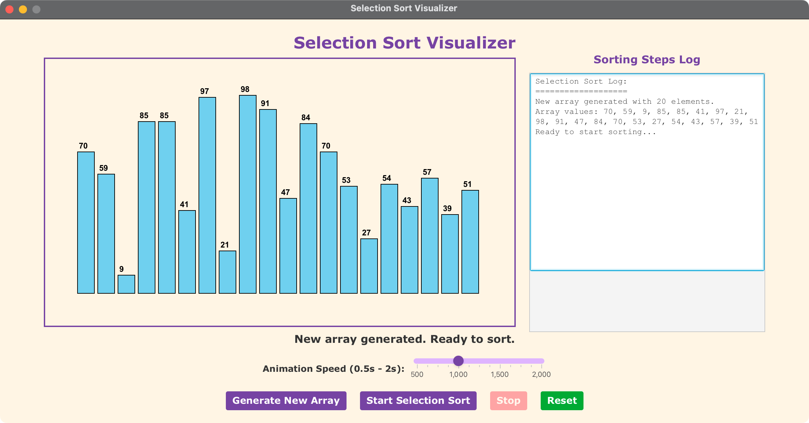

# Selection Sort Visualizer - JavaFX Application

A JavaFX application that provides a visual demonstration of the Selection Sort algorithm. This application shows how the selection sort algorithm works by displaying array elements as bars and animating the sorting process step by step.

Based on the GeeksforGeeks Selection Sort Visualizer: https://www.geeksforgeeks.org/javascript/selection-sort-visualizer-in-javascript/

## Features

- **Visual Representation**: Array elements are displayed as colored bars with values
- **Step-by-Step Animation**: Watch the algorithm in action with highlighted comparisons
- **Interactive Controls**: Generate new random arrays and control animation speed
- **Color Coding**: 
  - Blue: Current element being sorted
  - Red: Element being compared
  - Orange: Current minimum element found
  - Light Green: Sorted elements
  - Sky Blue: Unsorted elements
- **Speed Control**: Adjustable animation speed from 100ms to 1000ms per step

## Algorithm Overview

Selection Sort works by:
1. Finding the minimum element in the unsorted portion of the array
2. Swapping it with the first element of the unsorted portion
3. Moving the boundary between sorted and unsorted portions one position to the right
4. Repeating until the entire array is sorted

**Time Complexity**: O(n²)
**Space Complexity**: O(1)

## Prerequisites

- Java 11 or higher
- Maven 3.6 or higher
- JavaFX 21 (included as Maven dependency)

## Running the Application

### Option 1: Using Maven JavaFX Plugin (Recommended)

```bash
# On macOS/Linux
./run.sh

# On Windows
run.bat
```

### Option 2: Direct Execution

```bash
# On macOS/Linux
./run_direct.sh
```

### Option 3: Manual Maven Commands

```bash
# Compile and run
mvn clean javafx:run

# Or compile and package
mvn clean compile
mvn javafx:run
```

## Project Structure

```
08-04-SelectionSortNew/
├── src/main/java/com/acu/javafx/selectionsort/
│   ├── Launcher.java              # Application launcher
│   └── SelectionSortApp.java      # Main application class
├── src/main/resources/
│   └── styles.css                 # Application styling
├── docs/                          # Documentation files
├── pom.xml                        # Maven configuration
├── run.sh                         # Unix/Linux run script
├── run.bat                        # Windows run script
├── run_direct.sh                  # Direct execution script
└── README.md                      # This file
```

## How to Use

1. **Start the Application**: Run using one of the methods above
2. **Generate Array**: Click "Generate New Array" to create a new random array
3. **Start Sorting**: Click "Start Selection Sort" to begin the visualization
4. **Adjust Speed**: Use the speed slider to control animation timing
5. **Watch the Process**: Observe how the algorithm finds minimum elements and swaps them

## Educational Value

This visualization helps students understand:
- How selection sort systematically finds minimum elements
- The nested loop structure of the algorithm
- Why the algorithm has O(n²) time complexity
- The in-place nature of the sorting (constant space usage)
- How the sorted portion grows with each iteration

## Technical Implementation

- **JavaFX Controls**: Uses Rectangle and Text nodes for visual elements
- **Animation**: Implements PauseTransition for timed animations
- **Color Coding**: Dynamic color changes show algorithm state
- **Responsive UI**: Buttons are disabled during sorting to prevent interference
- **Cross-Platform**: Works on Windows, macOS, and Linux

## Troubleshooting

### Common Issues

1. **JavaFX Module Errors**: 
   - Ensure Java 11+ is installed
   - Use the provided run scripts which handle module paths

2. **Maven Not Found**:
   - Install Maven from https://maven.apache.org/
   - Ensure Maven is in your system PATH

3. **Compilation Errors**:
   - Verify Java version: `java -version`
   - Clean and rebuild: `mvn clean compile`

### Platform-Specific Notes

- **macOS**: The application includes both Intel and Apple Silicon JavaFX dependencies
- **Windows**: Use the `.bat` files for proper execution
- **Linux**: Ensure JavaFX is available or use the provided Maven configuration

## Comparison with JavaScript Version

This JavaFX implementation provides similar functionality to the original JavaScript version with these enhancements:
- Better performance and smoother animations
- Native desktop application experience
- More robust error handling and state management
- Professional UI with JavaFX styling
- Easier deployment as a standalone application

## Screenshots




