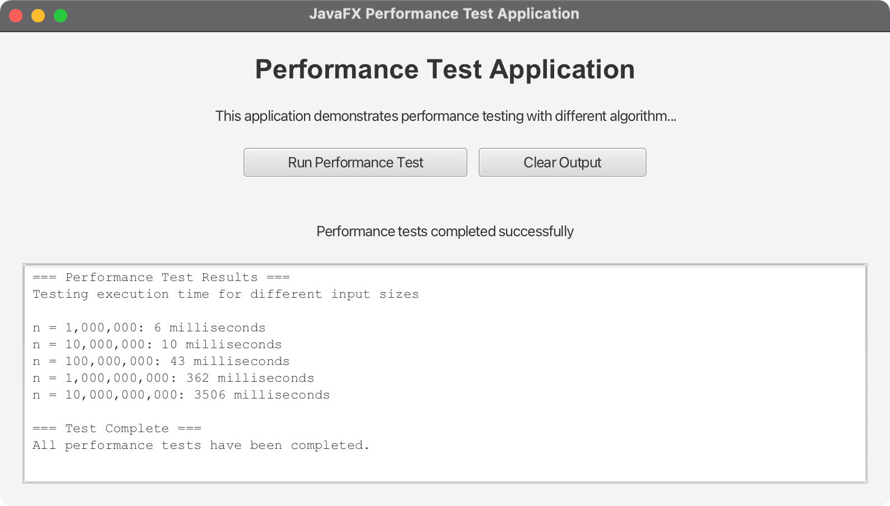

# JavaFX Performance Test Application

A comprehensive JavaFX application that demonstrates performance testing concepts with both simple loop testing and algorithm comparison. The application provides a graphical interface for running performance tests and visualizing results.

## Features

### 🚀 Core Functionality
- **Simple Performance Testing**: Original loop-based performance measurement
- **Algorithm Comparison**: Compare different algorithms (linear search vs binary search, bubble sort vs quick sort)
- **Real-time Visualization**: Line charts showing performance characteristics
- **Cross-platform Support**: Runs on macOS, Windows, and Linux

### 📊 Performance Testing
- **Multiple Test Types**: Simple loops, search algorithms, sorting algorithms
- **Progress Tracking**: Visual progress bars and status updates
- **Background Processing**: Non-blocking UI during test execution
- **Detailed Results**: Comprehensive output with timing information

### 🎨 User Interface
- **Modern JavaFX UI**: Clean, responsive interface
- **Interactive Charts**: Line charts for algorithm comparison
- **Real-time Updates**: Live result display during testing
- **Split-pane Layout**: Chart and output area side by side

## Project Structure

```
08-05-PerformanceTest/
├── src/
│   ├── main/
│   │   ├── java/
│   │   │   └── com/acu/javafx/performancetest/
│   │   │       ├── PerformanceTest.java              # Original simple test
│   │   │       ├── AlgorithmPerformanceTest.java     # Enhanced algorithm tests
│   │   │       ├── PerformanceTestApp.java           # Basic JavaFX app
│   │   │       └── EnhancedPerformanceTestApp.java   # Advanced app with charts
│   │   └── resources/
│   └── test/
│       └── java/
├── docs/
│   ├── concepts.md                                    # Main concepts and design
│   └── architecture.md                                # Detailed architecture
├── pom.xml                                           # Maven configuration
├── run.sh                                            # Unix/Linux/macOS runner
├── run.bat                                           # Windows runner
├── run_direct.sh                                     # Direct Java execution
└── README.md                                         # This file
```

## Prerequisites

### System Requirements
- **Java**: OpenJDK 24 or later
- **Maven**: 3.9.x or later
- **Memory**: At least 2GB RAM (for large tests)
- **Platform**: macOS, Windows, or Linux

### Supported Platforms
- **macOS**: Intel (x86_64) and Apple Silicon (ARM64)
- **Windows**: x86_64 and ARM64
- **Linux**: x86_64 and ARM64

## Quick Start

### 1. Clone and Navigate
```bash
cd 08-05-PerformanceTest
```

### 2. Run the Application

#### On Unix/Linux/macOS:
```bash
chmod +x run.sh
./run.sh
```

#### On Windows:
```cmd
run.bat
```

#### Direct Java Execution (Unix/Linux/macOS):
```bash
chmod +x run_direct.sh
./run_direct.sh
```

### 3. Using Maven Directly
```bash
# Compile
mvn compile

# Run basic application
mvn javafx:run -Djavafx.mainClass=com.acu.javafx.performancetest.PerformanceTestApp

# Run enhanced application
mvn javafx:run -Djavafx.mainClass=com.acu.javafx.performancetest.EnhancedPerformanceTestApp
```

## Application Components

### 1. PerformanceTest.java
Original simple performance test class extracted from the provided HTML source.

**Features:**
- Basic loop performance testing
- Console output formatting
- Multiple test iterations

**Usage:**
```java
public static void main(String[] args) {
    getTime(1000000);
    getTime(10000000);
    getTime(100000000);
    getTime(1000000000);
    getTime(10000000000L);
}
```

### 2. AlgorithmPerformanceTest.java
Enhanced performance test class with multiple algorithm implementations.

**Algorithms Included:**
- **Linear Search**: O(n) time complexity
- **Binary Search**: O(log n) time complexity
- **Bubble Sort**: O(n²) time complexity
- **Quick Sort**: O(n log n) average time complexity

**Usage:**
```java
long linearTime = AlgorithmPerformanceTest.testLinearSearch(10000);
long binaryTime = AlgorithmPerformanceTest.testBinarySearch(10000);
long bubbleTime = AlgorithmPerformanceTest.testBubbleSort(10000);
long quickTime = AlgorithmPerformanceTest.testQuickSort(10000);
```

### 3. PerformanceTestApp.java
Basic JavaFX application with simple performance testing interface.

**Features:**
- Text output area
- Progress bar
- Simple button controls
- Background thread execution

### 4. EnhancedPerformanceTestApp.java
Advanced JavaFX application with algorithm comparison and visualization.

**Features:**
- Line chart for performance visualization
- Split pane layout
- Multiple test types
- Real-time chart updates

## Algorithm Analysis

### Search Algorithms

#### Linear Search
- **Time Complexity**: O(n)
- **Space Complexity**: O(1)
- **Best Case**: O(1) - element found at first position
- **Worst Case**: O(n) - element not found or at last position

#### Binary Search
- **Time Complexity**: O(log n)
- **Space Complexity**: O(1)
- **Requirements**: Sorted array
- **Best Case**: O(1) - element found at middle
- **Worst Case**: O(log n) - element not found

### Sorting Algorithms

#### Bubble Sort
- **Time Complexity**: O(n²)
- **Space Complexity**: O(1)
- **Stability**: Stable
- **In-place**: Yes

#### Quick Sort
- **Time Complexity**: O(n log n) average, O(n²) worst case
- **Space Complexity**: O(log n) average
- **Stability**: Not stable
- **In-place**: Yes

## Performance Testing Methodology

### Test Parameters
- **Simple Loop Tests**: 1M, 10M, 100M, 1B, 10B iterations
- **Algorithm Tests**: 1K, 5K, 10K, 50K, 100K elements

### Measurement Techniques
- **System.currentTimeMillis()**: For simple loop tests (millisecond precision)
- **System.nanoTime()**: For algorithm tests (nanosecond precision)

### Statistical Considerations
- **Single Run**: For demonstration purposes
- **Real-world**: Production testing would use multiple runs and statistical analysis

## Build Configuration

### Maven Configuration
The `pom.xml` includes:
- Cross-platform JavaFX dependencies
- Platform detection with os-maven-plugin
- JavaFX Maven plugin for running applications
- Maven Shade plugin for executable JARs

### Platform Detection
```xml
<profiles>
    <profile>
        <id>mac</id>
        <activation>
            <os><family>mac</family></os>
        </activation>
        <properties>
            <os.detected.classifier>mac</os.detected.classifier>
        </properties>
    </profile>
    <!-- Windows and Linux profiles... -->
</profiles>
```

## Development

### Building from Source
```bash
# Clean and compile
mvn clean compile

# Run tests
mvn test

# Package
mvn package

# Create executable JAR
mvn clean package shade:shade
```

### Adding New Algorithms
1. Add algorithm implementation to `AlgorithmPerformanceTest.java`
2. Create test method following the existing pattern
3. Update UI to include new algorithm in comparison

### Customizing Test Parameters
Modify the test arrays in the application classes:
```java
// For simple tests
long[] testValues = {1000000, 10000000, 100000000, 1000000000, 10000000000L};

// For algorithm tests
int[] testSizes = {1000, 5000, 10000, 50000, 100000};
```

## Troubleshooting

### Common Issues

#### JavaFX Runtime Not Found
**Error**: `Error: JavaFX runtime components are missing`
**Solution**: Ensure JavaFX dependencies are properly configured in pom.xml

#### Memory Issues
**Error**: `OutOfMemoryError`
**Solution**: Increase JVM heap size:
```bash
mvn javafx:run -Djavafx.options="-Xmx4g"
```

#### Platform Detection Issues
**Error**: `Could not resolve dependencies`
**Solution**: Ensure os-maven-plugin is properly configured

### Performance Tips
- **Large Tests**: Use smaller test sizes on slower machines
- **Memory**: Monitor memory usage during large algorithm tests
- **UI Responsiveness**: Tests run in background threads to prevent UI blocking

## Screenshots



