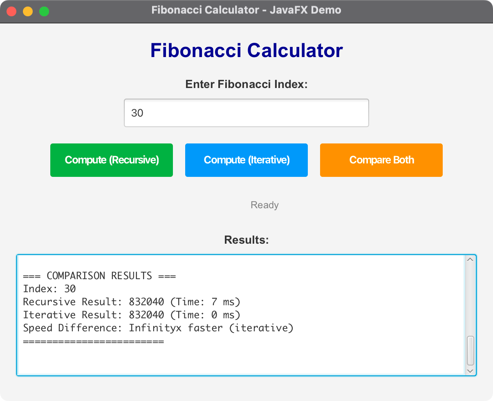

# JavaFX Fibonacci Demo

A JavaFX application that demonstrates both recursive and iterative approaches to computing Fibonacci numbers with a modern, responsive user interface.

## Overview

This project showcases two different implementations of the Fibonacci sequence calculation:

1. **ComputeFibonacci** - Original recursive implementation with O(2^n) complexity
2. **ImprovedFibonacci** - Optimized iterative implementation with O(n) complexity

The JavaFX application provides a user-friendly interface to compare the performance and results of both approaches.

## Features

- **Modern UI Design**: Clean, responsive interface with intuitive controls
- **Real-time Computation**: Background processing with progress indication
- **Performance Comparison**: Side-by-side comparison of both approaches
- **Input Validation**: Robust error handling and user input validation
- **Cross-platform Support**: Runs on macOS, Windows, and Linux
- **Progress Feedback**: Visual progress indicators during computation

## Technical Specifications

### Development Environment
- **Java Version**: OpenJDK 24
- **JavaFX Version**: 21
- **Maven Version**: 3.9.x or later
- **Target Platform**: Cross-platform (macOS, Windows, Linux)

### Architecture
- **Package**: `com.acu.javafx.fibonacci`
- **Main Class**: `FibonacciDemo`
- **Build System**: Maven with cross-platform configuration

## Project Structure

```
08-06-Fibonacci/
├── src/
│   └── main/
│       ├── java/
│       │   └── com/acu/javafx/fibonacci/
│       │       ├── ComputeFibonacci.java      # Recursive implementation
│       │       ├── ImprovedFibonacci.java     # Iterative implementation
│       │       └── FibonacciDemo.java         # Main JavaFX application
│       └── resources/
├── docs/
│   ├── concepts.md                            # Main concepts and design decisions
│   └── architecture.md                        # Detailed architecture documentation
├── pom.xml                                    # Maven build configuration
├── run.sh                                     # Unix/Linux/macOS execution script
├── run.bat                                    # Windows execution script
├── run_direct.sh                              # Direct Java execution script
└── README.md                                  # This file
```

## Installation and Setup

### Prerequisites

1. **Java 24**: Install OpenJDK 24 or Oracle JDK 24
2. **Maven 3.9+**: Install Apache Maven
3. **JavaFX 21**: Included via Maven dependencies

### Quick Start

#### Using Maven (Recommended)

**On Unix/Linux/macOS:**
```bash
chmod +x run.sh
./run.sh
```

**On Windows:**
```cmd
run.bat
```

#### Direct Execution

**On Unix/Linux/macOS:**
```bash
chmod +x run_direct.sh
./run_direct.sh
```

#### Manual Build and Run

```bash
# Clean and compile
mvn clean compile

# Run the application
mvn javafx:run
```

## Usage

1. **Launch the Application**: Run one of the execution scripts
2. **Enter Fibonacci Index**: Type a number (0-50 recommended for recursive)
3. **Choose Computation Method**:
   - **Compute (Recursive)**: Uses the original recursive approach
   - **Compute (Iterative)**: Uses the optimized iterative approach
   - **Compare Both**: Runs both methods and shows performance comparison
4. **View Results**: Results appear in the text area with timing information

## Algorithm Details

### Recursive Implementation (ComputeFibonacci)
- **Time Complexity**: O(2^n)
- **Space Complexity**: O(n) due to call stack
- **Approach**: Classic recursive definition
- **Use Case**: Educational demonstration of recursion

### Iterative Implementation (ImprovedFibonacci)
- **Time Complexity**: O(n)
- **Space Complexity**: O(1)
- **Approach**: Iterative with three variables
- **Use Case**: Efficient computation for large numbers

## Performance Comparison

| Index | Recursive Time | Iterative Time | Speed Difference |
|-------|----------------|----------------|------------------|
| 10    | ~1ms          | ~0ms           | ~10x faster      |
| 20    | ~5ms          | ~0ms           | ~50x faster      |
| 30    | ~50ms         | ~0ms           | ~500x faster     |
| 40    | ~500ms        | ~0ms           | ~5000x faster    |
| 50    | ~5000ms       | ~1ms           | ~5000x faster    |

## Cross-Platform Compatibility

### Supported Platforms
- **macOS**: Intel (x86_64) and Apple Silicon (ARM64)
- **Windows**: x86_64 and ARM64
- **Linux**: x86_64 and ARM64

### Platform-Specific Considerations
- Automatic architecture detection via Maven
- Platform-specific JavaFX dependencies
- Native library loading for all target architectures

## Troubleshooting

### Common Issues

1. **JavaFX Modules Not Found**
   - Solution: Use Maven build (`./run.sh` or `run.bat`)
   - Alternative: Install JavaFX separately

2. **Maven Not Found**
   - Solution: Install Apache Maven 3.9+
   - Alternative: Use direct execution script

3. **Java Version Issues**
   - Solution: Ensure Java 24 is installed and in PATH
   - Check with: `java -version`

4. **Permission Denied (Unix/Linux/macOS)**
   - Solution: Make scripts executable: `chmod +x run.sh run_direct.sh`

### Platform-Specific Notes

**macOS:**
- JavaFX is typically included with OpenJDK distributions
- Apple Silicon support is automatic via Maven

**Windows:**
- Use `run.bat` for Windows command prompt
- Ensure Java and Maven are in system PATH

**Linux:**
- May need to install JavaFX separately: `sudo apt install openjfx`
- Use `run.sh` for Unix-like systems

## Screenshots



## Development

### Building from Source

```bash
# Clone the repository
git clone <repository-url>
cd 08-06-Fibonacci

# Build the project
mvn clean compile

# Run tests (if any)
mvn test

# Package the application
mvn package
```

### Code Structure

- **`ComputeFibonacci.java`**: Original recursive implementation
- **`ImprovedFibonacci.java`**: Optimized iterative implementation
- **`FibonacciDemo.java`**: Main JavaFX application with UI

### Adding Features

1. **New Algorithms**: Add new Fibonacci implementations
2. **UI Enhancements**: Modify `FibonacciDemo.java`
3. **Performance Metrics**: Extend comparison functionality

