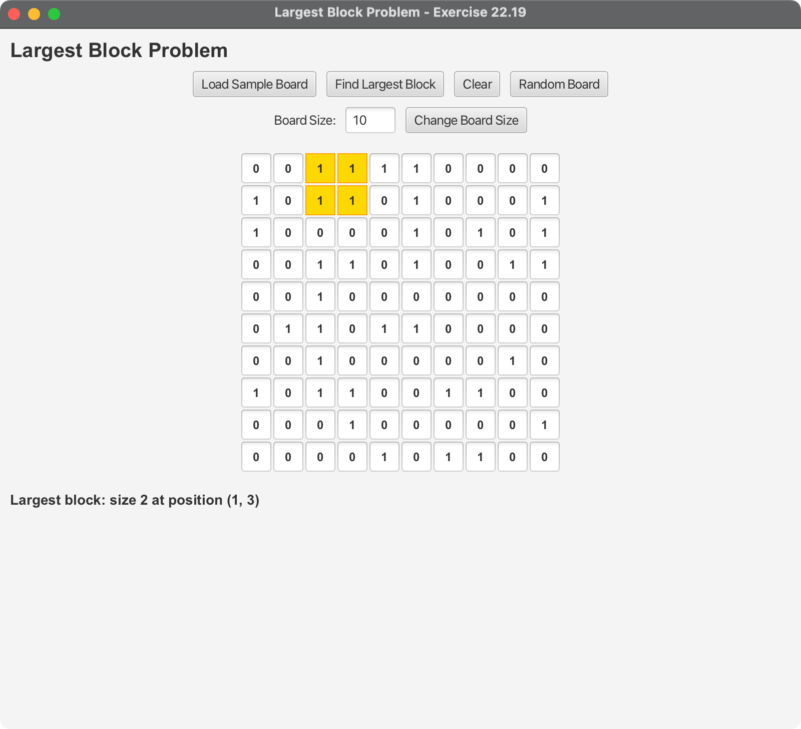

# Largest Block Problem - JavaFX Application

## Overview

This JavaFX application solves the **Largest Block Problem** (Exercise 22.19), which involves finding the largest square submatrix consisting entirely of 1s in a binary matrix. The application provides an interactive interface for exploring this classic dynamic programming problem.



## Algorithm Explanation

### Problem Statement
Given a binary matrix containing only 0s and 1s, find the largest square submatrix that consists entirely of 1s.

### Dynamic Programming Solution

The algorithm uses dynamic programming with the following approach:

1. **DP Table**: `dp[i][j]` represents the size of the largest square with bottom-right corner at position `(i,j)`

2. **Base Cases**:
   - If `matrix[i][j] = 0`, then `dp[i][j] = 0`
   - If `matrix[i][j] = 1` and we're at the first row or column, then `dp[i][j] = 1`

3. **Recurrence Relation**:
   ```
   dp[i][j] = min(dp[i-1][j], dp[i][j-1], dp[i-1][j-1]) + 1
   ```
   This ensures that we can only extend a square if all three neighboring cells can form a valid square.

4. **Result**: The maximum value in the DP table gives us the size of the largest square, and its position gives us the bottom-right corner.

### Time and Space Complexity

- **Time Complexity**: O(n²) where n is the dimension of the matrix
- **Space Complexity**: O(n²) for the DP table

### Why This Works

The key insight is that for a cell `(i,j)` to be part of a square of size `k`, the three cells `(i-1,j)`, `(i,j-1)`, and `(i-1,j-1)` must all be part of squares of size at least `k-1`. By taking the minimum of these three values and adding 1, we ensure that we can only extend the square if all three directions support it.

## Features

### 🎯 Core Functionality

1. **Interactive Board**: Click cells to toggle between 0 and 1
2. **Dynamic Sizing**: Change board size from 3x3 to 20x20
3. **Sample Data**: Load predefined test cases
4. **Random Generation**: Create random binary matrices
5. **Visual Highlighting**: Highlight the largest block in gold
6. **Real-time Validation**: Ensure only valid binary values

### 🚀 Key Features

- **Modern JavaFX UI**: Clean, intuitive interface
- **Educational Focus**: Perfect for learning dynamic programming
- **Interactive Learning**: Visual feedback and step-by-step exploration
- **Comprehensive Testing**: Full JUnit test suite
- **Cross-platform**: Works on Windows, macOS, and Linux

## Project Structure

```
08-11-LargestBlock/
├── src/main/java/com/acu/javafx/largestblock/
│   ├── LargestBlockDemo.java          # Main JavaFX application
│   └── LargestBlockSolver.java        # Core algorithm implementation
├── src/test/java/com/acu/javafx/largestblock/
│   └── LargestBlockSolverTest.java    # Comprehensive test suite
├── docs/
│   └── algorithm.md                   # Detailed algorithm explanation
├── images/                            # Screenshots and diagrams
├── pom.xml                           # Maven configuration
└── README.md                         # This file
```

## Quick Start

### Prerequisites

- **Java**: OpenJDK 24 or later
- **Maven**: 3.9.x or later
- **JavaFX**: 24 (included in dependencies)

### Running the Application

#### Option 1: Using Maven (Recommended)
```bash
# Navigate to the project directory
cd 08-11-LargestBlock

# Run the application
mvn javafx:run
```

#### Option 2: Build and Run
```bash
# Build the project
mvn clean package

# Run the application
java -jar target/largest-block-demo-1.0.jar
```

#### Option 3: Using Scripts
```bash
# Unix/Linux/macOS
./run.sh

# Windows
run.bat
```

### Running Tests

```bash
# Run all tests
mvn test

# Run with verbose output
mvn test -Dtest=LargestBlockSolverTest
```

## Usage Guide

### Getting Started

1. **Launch the Application**: Run using one of the methods above
2. **Load Sample Data**: Click "Load Sample Board" to see a predefined example
3. **Explore the Board**: Click on cells to toggle between 0 and 1
4. **Find Solution**: Click "Find Largest Block" to solve the puzzle
5. **View Results**: The largest block will be highlighted in gold

### Understanding the Interface

#### Control Buttons
- **Load Sample Board**: Loads a predefined 10x10 matrix with a known solution
- **Find Largest Block**: Solves the current puzzle
- **Clear**: Resets all cells to 0
- **Random Board**: Generates a random binary matrix

#### Board Controls
- **Board Size**: Change the size from 3x3 to 20x20
- **Cell Interaction**: Click any cell to toggle between 0 and 1
- **Visual Feedback**: Invalid inputs are automatically corrected

#### Result Display
- **Size**: The dimension of the largest square (e.g., 3x3 square has size 3)
- **Position**: Bottom-right corner coordinates of the largest block
- **Highlighting**: Gold background shows the solution

### Example Workflow

1. **Start with Sample Data**:
   - Click "Load Sample Board"
   - Observe the 10x10 matrix with mixed 0s and 1s

2. **Find the Solution**:
   - Click "Find Largest Block"
   - Notice the 3x3 block highlighted in gold at position (7,1)

3. **Experiment with Changes**:
   - Click on some cells to modify the matrix
   - Click "Find Largest Block" again to see the new solution

4. **Try Different Sizes**:
   - Change board size to 5x5
   - Create a random board
   - Find the largest block in your custom matrix

## Algorithm Details

### Dynamic Programming Approach

The algorithm builds a DP table where each cell `dp[i][j]` represents the size of the largest square with bottom-right corner at `(i,j)`.

#### Step-by-Step Process

1. **Initialize**: Create a DP table of the same size as the input matrix
2. **Fill Base Cases**: Handle first row and column (can only be 1x1 squares)
3. **Apply Recurrence**: For each cell, use the minimum of three neighbors
4. **Track Maximum**: Keep track of the largest square found
5. **Return Result**: Size and position of the largest square

#### Example Walkthrough

Consider this 4x4 matrix:
```
1 1 0 0
1 1 1 0
0 1 1 1
0 0 1 1
```

The DP table would be:
```
1 1 0 0
1 2 1 0
0 1 2 1
0 0 1 2
```

The maximum value is 2, indicating a 2x2 square at position (3,3).

### Why Dynamic Programming?

- **Optimal Substructure**: The solution to a larger problem depends on solutions to smaller subproblems
- **Overlapping Subproblems**: The same subproblems are solved multiple times
- **Efficiency**: O(n²) time complexity vs O(n³) for naive approach

## Technical Implementation

### Core Classes

#### `LargestBlockSolver`
- Contains the main algorithm implementation
- Provides utility methods for matrix validation
- Includes sample data generation

#### `LargestBlockDemo`
- JavaFX application with interactive UI
- Handles user input and display
- Manages board state and visualization

### Key Methods

```java
// Find the largest block in a matrix
public static BlockResult findLargestBlock(int[][] matrix)

// Validate if a matrix contains only 0s and 1s
public static boolean isValidMatrix(int[][] matrix)

// Create random binary matrix
public static int[][] createRandomMatrix(int size, double probability)
```

### Testing Strategy

The test suite covers:
- **Edge Cases**: Empty matrices, single cells, all zeros
- **Normal Cases**: Various matrix sizes and patterns
- **Boundary Conditions**: Maximum and minimum sizes
- **Algorithm Correctness**: Known solutions and complex patterns
- **Input Validation**: Invalid matrices and error handling

## Development

### Building from Source

```bash
# Clone the repository
git clone <repository-url>
cd 08-11-LargestBlock

# Build the project
mvn clean package

# Run tests
mvn test

# Run the application
mvn javafx:run
```

### Adding New Features

1. **New Algorithm Variants**: Extend `LargestBlockSolver` with different approaches
2. **UI Enhancements**: Add new controls or visualizations
3. **Performance Metrics**: Add timing and complexity analysis
4. **Export Functionality**: Save/load matrices to/from files

### Project Configuration

The project uses Maven with:
- **Java 24**: Target version
- **JavaFX 24**: UI framework
- **JUnit 5**: Testing framework
- **Cross-platform support**: Automatic platform detection

## Troubleshooting

### Common Issues

#### 1. JavaFX Not Found
**Solution**: Ensure JavaFX dependencies are properly configured in `pom.xml`

#### 2. Out of Memory for Large Matrices
**Solution**: Increase JVM heap size: `java -Xmx2g -jar target/largest-block-demo-1.0.jar``

#### 3. Platform-Specific Issues
**Solution**: Use the appropriate run script for your platform

### Debug Mode

Run with debug output:
```bash
mvn javafx:run -Djavafx.debug=true
```

## Educational Value

This application is perfect for learning:

- **Dynamic Programming**: Understanding the core DP concepts
- **Algorithm Analysis**: Time and space complexity analysis
- **JavaFX Development**: Modern Java UI programming
- **Testing**: Comprehensive unit testing strategies
- **Problem Solving**: Breaking down complex problems into manageable parts

## Future Enhancements

- **Animation**: Show the DP table filling process
- **Multiple Algorithms**: Compare different approaches
- **Performance Analysis**: Benchmark different matrix sizes
- **Export/Import**: Save and load matrices
- **3D Visualization**: Show the DP table in 3D
- **Step-by-Step Mode**: Walk through the algorithm step by step

## Contributing

1. Fork the repository
2. Create a feature branch
3. Add tests for new functionality
4. Ensure all tests pass
5. Submit a pull request

## License

This project is part of the ACU JavaFX educational series and is available under the MIT License.
