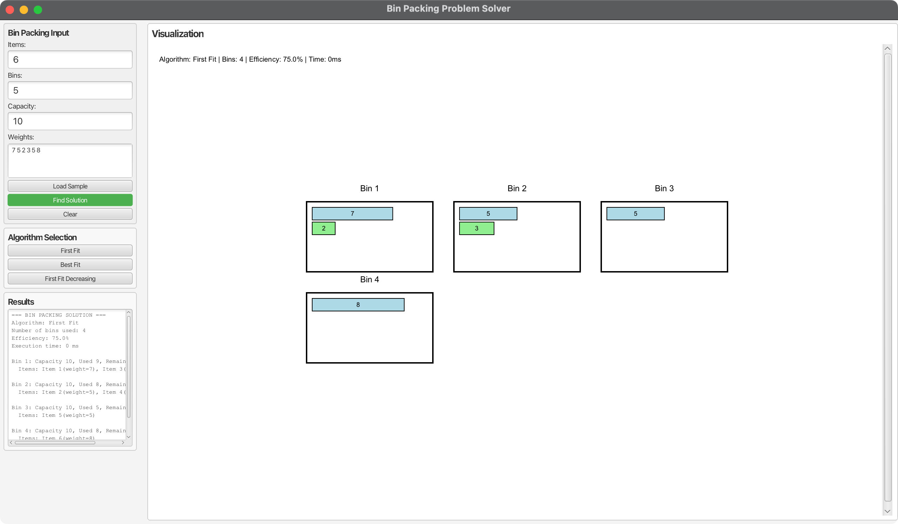

# Bin Packing Problem Solver - JavaFX Application

## Overview

This JavaFX application demonstrates various bin packing algorithms with interactive visualization. The bin packing problem involves placing items of different weights into bins with limited capacity, aiming to minimize the number of bins used.

## Features

### 🎯 Core Algorithms

1. **First Fit Algorithm** - Places each item into the first bin that has enough capacity
2. **Best Fit Algorithm** - Places each item into the bin with the least remaining capacity
3. **First Fit Decreasing Algorithm** - Sorts items by weight (decreasing), then applies First Fit

### 🚀 Key Features

- **Interactive GUI**: Modern JavaFX interface with intuitive controls
- **Real-time Visualization**: Canvas-based visualization of bin packing solutions (max 3 bins per row)
- **Algorithm Comparison**: Side-by-side comparison of different algorithms
- **Performance Metrics**: Execution time and efficiency calculations
- **Sample Data**: Pre-loaded sample data for quick testing
- **Bin Constraint**: Users can specify the maximum number of bins available
- **Educational**: Perfect for learning bin packing algorithms

## Project Structure

```
08-12-BinPacking/
├── src/main/java/com/acu/javafx/binpacking/
│   ├── BinPackingDemo.java                    # Main JavaFX application
│   ├── BinPackingAlgorithm.java               # Abstract base class for algorithms
│   ├── FirstFitAlgorithm.java                 # First Fit implementation
│   ├── BestFitAlgorithm.java                  # Best Fit implementation
│   ├── FirstFitDecreasingAlgorithm.java       # First Fit Decreasing implementation
│   └── BinPackingVisualizer.java              # Canvas visualization
├── src/test/java/com/acu/javafx/binpacking/
│   ├── BinPackingAlgorithmTest.java           # Algorithm tests
│   └── BinPackingDemoTest.java                 # Integration tests
├── docs/
│   ├── algorithms.md                           # Algorithm documentation
│   └── complexity.md                          # Time complexity analysis
├── images/
│   └── bin-packing-demo.png                   # Application screenshot
├── pom.xml                                    # Maven configuration
└── README.md                                  # This file
```

## Quick Start

### Prerequisites

- **Java**: OpenJDK 24 or later
- **Maven**: 3.9.x or later
- **JavaFX**: 24 (included in dependencies)

### Running the Application

#### Option 1: Using Maven (Recommended)
```bash
# Navigate to the project directory
cd 08-12-BinPacking

# Run the application
mvn javafx:run
```

#### Option 2: Build and Run
```bash
# Build the project
mvn clean package

# Run the application
java -jar target/bin-packing-demo-1.0.jar
```

#### Option 3: Run Tests
```bash
# Run all tests
mvn test

# Compile the project
mvn clean compile
```

## Usage Guide

### Getting Started

1. **Launch the Application**: Run the application using one of the methods above
2. **Enter Data**: Input the number of items, number of bins, bin capacity, and item weights
3. **Load Sample Data**: Click "Load Sample Settings" for quick testing
4. **Select Algorithm**: Choose between First Fit, Best Fit, or First Fit Decreasing
5. **Find Solution**: Click "Find Solution" to solve the bin packing problem
6. **View Results**: See the solution in both text and visual formats

### Understanding the Output

Each algorithm provides:
- **Number of bins used**: Total bins required for the solution
- **Efficiency**: Percentage of bin capacity utilized
- **Execution time**: Time taken to solve the problem
- **Visual representation**: Canvas showing bins and items
- **Detailed breakdown**: Text output with item placement details

### Algorithm Explanations

#### 1. First Fit Algorithm
- **Strategy**: Places each item into the first bin that has enough capacity
- **Time Complexity**: O(n × m) where n = number of items, m = number of bins
- **Guarantee**: Uses at most 2 × OPT bins (where OPT is optimal)
- **Best for**: Simple implementation, reasonable performance

#### 2. Best Fit Algorithm
- **Strategy**: Places each item into the bin with the least remaining capacity
- **Time Complexity**: O(n × m) where n = number of items, m = number of bins
- **Guarantee**: Uses at most 1.7 × OPT bins
- **Best for**: Better space utilization than First Fit

#### 3. First Fit Decreasing Algorithm
- **Strategy**: Sorts items by weight (decreasing), then applies First Fit
- **Time Complexity**: O(n log n + n × m) where n = number of items, m = number of bins
- **Guarantee**: Uses at most (11/9) × OPT + 6/9 bins
- **Best for**: Often produces the best results among the three algorithms

## Technical Details

### Bin Packing Problem

The bin packing problem is a combinatorial optimization problem where:
- **Input**: Set of items with weights and bin capacity
- **Goal**: Pack all items into the minimum number of bins
- **Constraint**: Total weight in each bin cannot exceed bin capacity

### Algorithm Complexity

| Algorithm | Time Complexity | Space Complexity | Approximation Ratio |
|-----------|----------------|------------------|-------------------|
| First Fit | O(n × m) | O(n + m) | 2 × OPT |
| Best Fit | O(n × m) | O(n + m) | 1.7 × OPT |
| First Fit Decreasing | O(n log n + n × m) | O(n + m) | (11/9) × OPT + 6/9 |

Where:
- n = number of items
- m = number of bins
- OPT = optimal number of bins

### Architecture

The application uses:
- **JavaFX**: Modern UI framework for visualization
- **MVC Pattern**: Separation of concerns between UI and algorithms
- **Strategy Pattern**: Different algorithms implement the same interface
- **Observer Pattern**: UI updates based on algorithm results

## Development

### Building from Source

```bash
# Clone the repository
git clone <repository-url>
cd 08-12-BinPacking

# Build the project
mvn clean package

# Run tests
mvn test

# Run the application
mvn javafx:run
```

### Adding New Algorithms

1. Create a new class extending `BinPackingAlgorithm`
2. Implement the `solve` method
3. Add the algorithm to the main application
4. Update documentation

### Project Configuration

The project uses Maven with:
- **Java 24**: Target version
- **JavaFX 24**: UI framework
- **Cross-platform support**: Automatic platform detection
- **Maven plugins**: JavaFX Maven plugin for running

## Troubleshooting

### Common Issues

#### 1. JavaFX Not Found
**Solution**: Ensure JavaFX dependencies are properly configured in `pom.xml`

#### 2. Out of Memory
**Solution**: Increase JVM heap size: `java -Xmx2g -jar target/bin-packing-demo-1.0.jar`

#### 3. Platform-Specific Issues
**Solution**: Use the appropriate JavaFX platform classifier for your system

### Debug Mode

Run with debug output:
```bash
mvn javafx:run -Djavafx.debug=true
```

## Screenshots



## Educational Value

This application is designed for educational purposes and demonstrates:

- **Algorithm Design**: Different approaches to the same problem
- **Complexity Analysis**: Time and space complexity considerations
- **Approximation Algorithms**: Trade-offs between optimality and efficiency
- **Visualization**: Making abstract algorithms concrete
- **JavaFX Programming**: Modern Java UI development

## References

- [Bin Packing Problem - Wikipedia](https://en.wikipedia.org/wiki/Bin_packing_problem)
- [Approximation Algorithms - Vazirani](https://www.springer.com/gp/book/9783540653677)
- [JavaFX Documentation](https://openjfx.io/)
