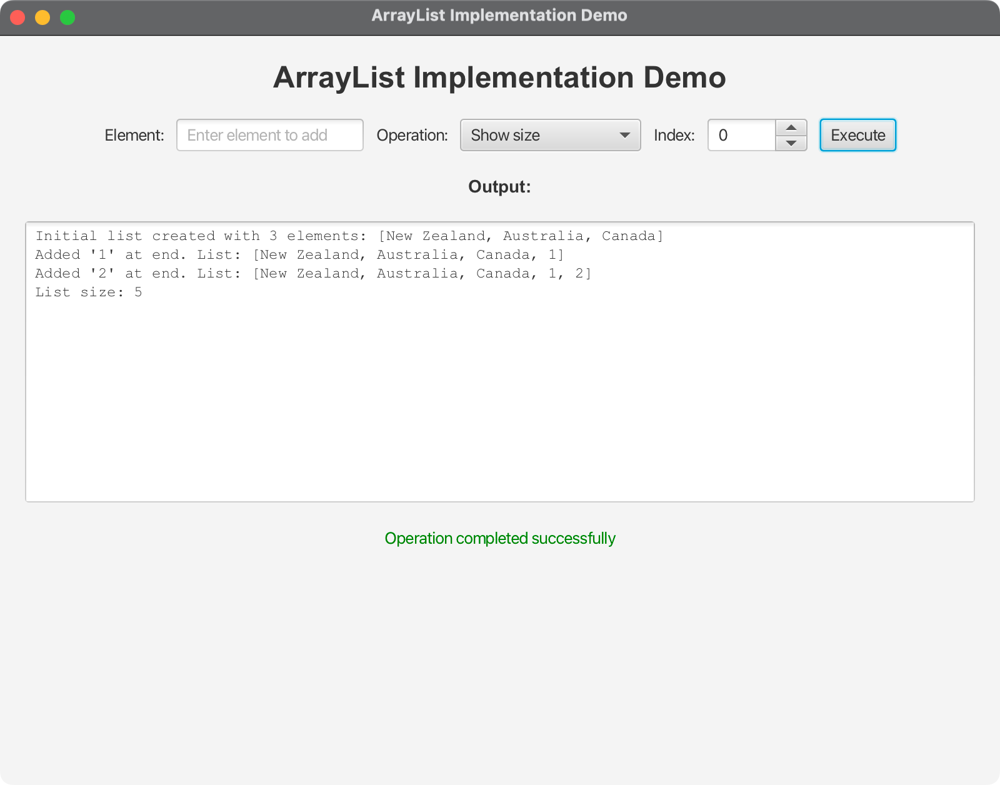

# ArrayList Implementation Demo

A JavaFX application demonstrating a custom ArrayList implementation with interactive visualization.

## Overview

This project provides a visual demonstration of ArrayList operations including:
- Adding elements
- Removing elements
- Searching elements
- Dynamic resizing
- Visual representation of the array structure

## Features

- **Interactive ArrayList Operations**: Add, remove, and search elements
- **Visual Array Representation**: See the array structure in real-time
- **Dynamic Resizing**: Watch the array grow and shrink
- **Cross-platform Support**: Runs on macOS, Windows, and Linux

## Screenshots



## Building and Running

### Prerequisites
- Java 24 or higher
- Maven 3.9.x or later

### Running the Application

#### On macOS/Linux:
```bash
chmod +x run.sh
./run.sh
```

#### On Windows:
```cmd
run.bat
```

### Manual Maven Commands
```bash
# Clean and compile
mvn clean compile

# Run the application
mvn javafx:run

# Package as executable JAR
mvn clean package
```

## Project Structure

```
10-01-ArrayList/
├── src/main/java/com/acu/javafx/arraylist/
│   ├── ArrayListDemo.java      # Main JavaFX application
│   ├── MyArrayList.java        # Custom ArrayList implementation
│   ├── MyList.java            # List interface
│   └── TestMyArrayList.java   # Test class
├── docs/
│   ├── architecture.md         # Architecture documentation
│   └── concepts.md            # Algorithm concepts
├── images/
│   └── 10-01-ArrayList.png   # Application screenshot
├── pom.xml                    # Maven configuration
├── run.sh                     # Unix/Linux/macOS script
├── run.bat                    # Windows script
└── README.md                  # This file
```

