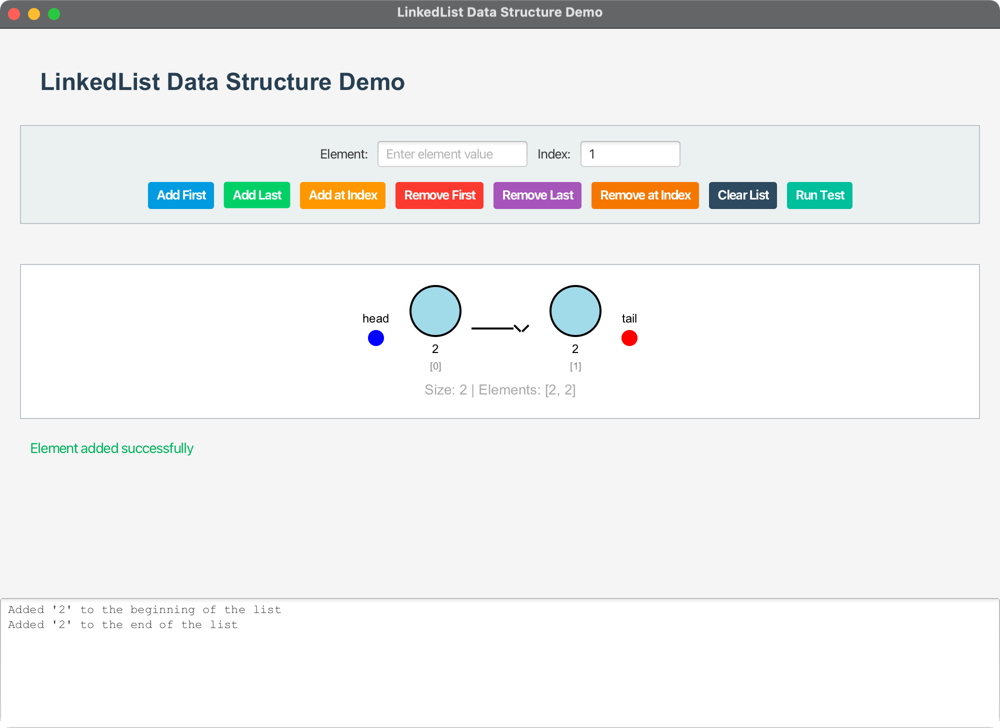

# LinkedList Data Structure Demo

A JavaFX application demonstrating the LinkedList data structure with interactive visualizations and comprehensive testing capabilities.

## Overview

This project implements a complete LinkedList data structure with a modern JavaFX interface that provides:

- **Visual LinkedList Representation**: Real-time visualization of the linked list structure
- **Interactive Operations**: Add, remove, and manipulate elements through a user-friendly interface
- **Comprehensive Testing**: Built-in test suite demonstrating all LinkedList operations
- **Cross-Platform Support**: Runs on macOS, Windows, and Linux with automatic platform detection

## Features

### Core LinkedList Implementation
- **MyLinkedList<E>**: Generic linked list implementation with full CRUD operations
- **MyList<E>**: Interface defining the contract for list operations
- **Node<E>**: Internal node class for linked list structure
- **Iterator Support**: Full iteration capabilities with custom LinkedListIterator

### JavaFX Interface
- **Visual Node Representation**: Circular nodes with element values and indices
- **Head/Tail Pointers**: Visual indicators for list boundaries
- **Arrow Connections**: Visual representation of node relationships
- **Real-time Updates**: Immediate visual feedback for all operations
- **Status Feedback**: Color-coded status messages for user actions

### Operations Supported
- **Add Operations**: addFirst(), addLast(), add(index, element)
- **Remove Operations**: removeFirst(), removeLast(), remove(index)
- **Utility Operations**: clear(), contains(), get(), indexOf(), lastIndexOf(), set()
- **Iteration**: Enhanced for-loop support and Iterator interface

## Technical Specifications

### Development Environment
- **Java Version**: OpenJDK 24
- **JavaFX Version**: 21
- **Maven Version**: 3.9.x or later
- **Target Platform**: Cross-platform (macOS, Windows, Linux)

### Architecture
- **Package Structure**: `com.acu.javafx.linkedlist`
- **Main Class**: `LinkedListDemo` (JavaFX Application)
- **Core Classes**: `MyLinkedList`, `MyList`, `TestMyLinkedList`
- **Build System**: Maven with platform-specific profiles

## Build and Run Instructions

### Prerequisites
- Java 24 or later
- Maven 3.9.x or later
- Git (for cloning)

### Building the Project

#### Using Maven
```bash
# Clone the repository (if not already done)
git clone <repository-url>
cd 10-02-LinkedList

# Clean and compile
mvn clean compile

# Run the application
mvn javafx:run
```

#### Using Build Scripts

**macOS/Linux:**
```bash
./run.sh
```

**Windows:**
```cmd
run.bat
```

### Platform-Specific Builds

The project automatically detects your platform and includes the appropriate JavaFX dependencies:

- **macOS ARM64 (Apple Silicon)**: `mac-aarch64` classifier
- **macOS x86_64 (Intel)**: `mac` classifier  
- **Windows x86_64**: `win` classifier
- **Linux x86_64**: `linux` classifier

## Usage Guide

### Starting the Application
1. Run the application using one of the methods above
2. The JavaFX window will open with the LinkedList demo interface

### Using the Interface

#### Adding Elements
1. **Add First**: Enter a value and click "Add First" to add to the beginning
2. **Add Last**: Enter a value and click "Add Last" to add to the end
3. **Add at Index**: Enter both value and index, then click "Add at Index"

#### Removing Elements
1. **Remove First**: Click "Remove First" to remove the first element
2. **Remove Last**: Click "Remove Last" to remove the last element
3. **Remove at Index**: Enter an index and click "Remove at Index"

#### Other Operations
- **Clear List**: Removes all elements from the list
- **Run Test**: Executes the comprehensive test suite demonstrating all operations

### Visual Elements
- **Blue Circle**: Head pointer
- **Red Circle**: Tail pointer
- **Light Blue Circles**: List nodes with element values
- **Black Arrows**: Node connections
- **Gray Text**: Element indices

### Output Area
The bottom text area shows:
- Operation results and confirmations
- List state changes
- Test execution output
- Error messages and validation feedback

## Project Structure

```
10-02-LinkedList/
├── src/
│   └── main/
│       └── java/
│           └── com/
│               └── acu/
│                   └── javafx/
│                       └── linkedlist/
│                           ├── LinkedListDemo.java      # Main JavaFX application
│                           ├── MyLinkedList.java        # LinkedList implementation
│                           ├── MyList.java              # List interface
│                           └── TestMyLinkedList.java    # Test demonstration
├── docs/
│   ├── concepts.md           # Main concepts and design decisions
│   └── architecture.md       # Detailed architecture documentation
├── pom.xml                   # Maven configuration
├── run.sh                    # Unix/Linux/macOS execution script
├── run.bat                   # Windows execution script
└── README.md                 # This file
```

## Implementation Details

### LinkedList Implementation
The `MyLinkedList<E>` class provides a complete implementation of a singly linked list with:

- **Generic Type Support**: Works with any data type
- **Efficient Operations**: O(1) for addFirst/addLast, O(n) for indexed operations
- **Memory Management**: Proper node creation and cleanup
- **Iterator Support**: Implements both Iterable and Iterator interfaces

### JavaFX Visualization
The `LinkedListDemo` class creates an interactive visualization featuring:

- **Dynamic Layout**: Responsive design that adapts to window size
- **Real-time Updates**: Immediate visual feedback for all operations
- **Error Handling**: Comprehensive input validation and user feedback
- **Modern UI**: Clean, professional interface with color-coded elements

### Cross-Platform Compatibility
The Maven configuration includes platform-specific profiles that automatically:

- **Detect Platform**: Uses OS and architecture detection
- **Include Dependencies**: Adds appropriate JavaFX native libraries
- **Handle Builds**: Ensures compatibility across all target platforms

## Testing

### Built-in Test Suite
The application includes a comprehensive test that demonstrates:

1. **Basic Operations**: Adding and removing elements
2. **Indexed Operations**: Inserting and removing at specific positions
3. **Edge Cases**: Empty list handling, boundary conditions
4. **Iteration**: Enhanced for-loop functionality
5. **Clear Operations**: Complete list cleanup

### Manual Testing
Users can perform manual testing through the interface:

- **Add Elements**: Test various add operations
- **Remove Elements**: Test removal at different positions
- **Visual Verification**: Confirm visual representation matches expected behavior
- **Error Conditions**: Test invalid inputs and edge cases

## Performance Characteristics

### Time Complexity
- **Add First/Last**: O(1)
- **Add at Index**: O(n) in worst case
- **Remove First**: O(1)
- **Remove Last**: O(n) (singly linked list limitation)
- **Remove at Index**: O(n)
- **Get/Set at Index**: O(n)
- **Contains/Search**: O(n)

### Space Complexity
- **Storage**: O(n) where n is the number of elements
- **Node Overhead**: Minimal per-node overhead
- **Memory Management**: Automatic garbage collection for removed nodes

## Screenshots




### Building for Development
```bash
# Clean and compile
mvn clean compile

# Run tests
mvn test

# Package application
mvn package

# Run with specific JavaFX module path (if needed)
java --module-path /path/to/javafx-sdk/lib --add-modules javafx.controls,javafx.fxml -jar target/linkedlist-demo-1.0.0.jar
```

