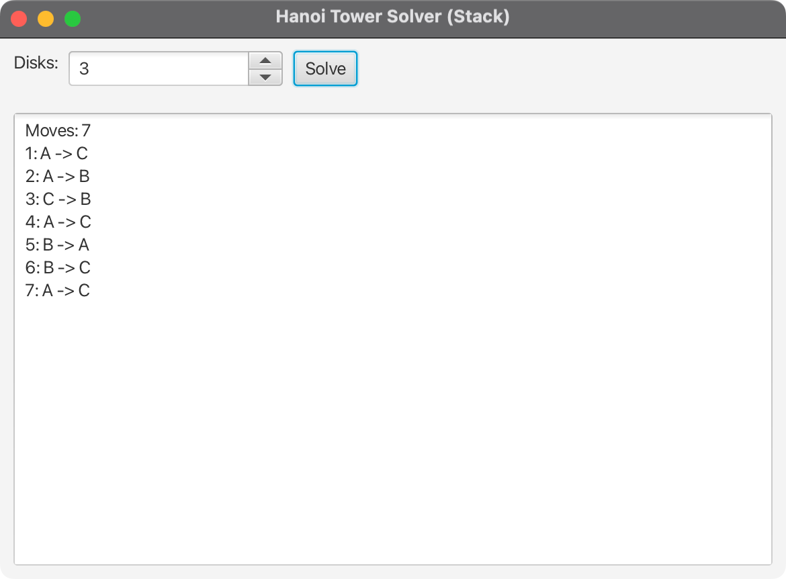

# 10-06 - Hanoi Tower Solver (Stack)

This app solves the Tower of Hanoi using a non-recursive stack simulation of the classic recursive algorithm.

- We push a frame for a call `(n, from, to, aux)` onto a stack.
- For each frame, we simulate: left `(n-1, from, aux, to)`, then move `(from -> to)`, then right `(n-1, aux, to, from)`.
- Base case `n == 0` does nothing.

Run:
- `mvn clean compile`
- `mvn test`
- `mvn javafx:run`

Main class: `com.acu.javafx.hanoi.HanoiTowerSolverApp`.
