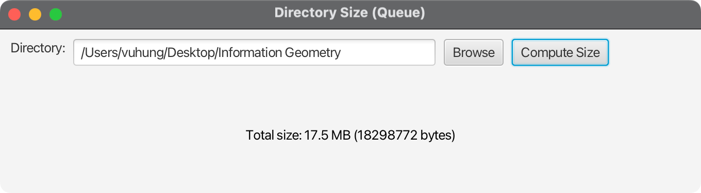

## Directory Size (Queue-based)

This app computes the total size of a directory using a non-recursive breadth-first traversal with a queue.

- Enter or choose a directory.
- The program enqueues the root directory, then repeatedly dequeues a folder, summing file sizes and enqueuing subfolders until the queue is empty.
- This avoids recursion and demonstrates iterative traversal of the filesystem.

Run:
- mvn test
- mvn clean compile
- mvn javafx:run

# Screenshot

