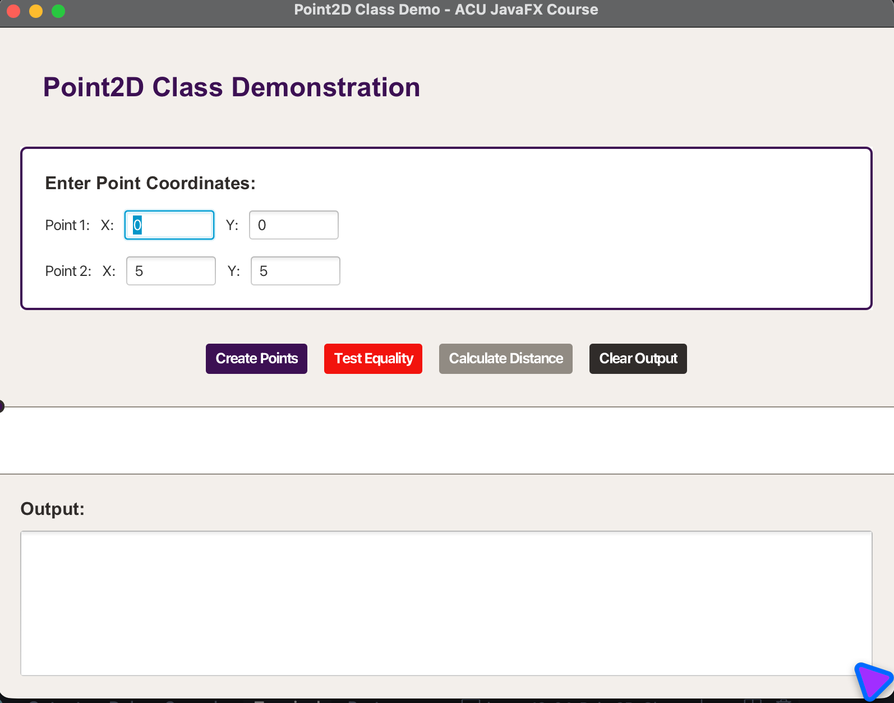

# Point2D Class Implementation - JavaFX Application

## Overview

This JavaFX application demonstrates the implementation of a custom `Point2D` class that meets specific requirements for object-oriented programming. The application showcases constructors, getter methods, `equals` method, `hashCode` method, and distance calculations through both a graphical user interface and command-line interface.



## Features

### 🎯 Core Point2D Class Implementation

1. **Two Data Fields**: `x` and `y` coordinates with getter methods
2. **No-arg Constructor**: Creates a point at origin `(0, 0)`
3. **Parameterized Constructor**: Creates a point with specified `x` and `y` values
4. **Equals Method**: Compares two points for equality based on coordinates
5. **HashCode Method**: Provides hash code implementation following Java API patterns
6. **Distance Calculations**: Methods for calculating distances between points

### 🚀 Application Features

- **Interactive GUI**: Modern JavaFX interface with ACU color schema
- **Real-time Visualization**: Canvas showing point positions
- **Comprehensive Testing**: Complete test suite with JUnit 5
- **CLI Demo**: Command-line interface for testing
- **Educational Focus**: Detailed comments explaining OOP concepts

## Project Structure

```
12-04-Point2D-Class/
├── src/main/java/com/acu/javafx/point2d/
│   ├── Point2D.java              # Main Point2D class implementation
│   ├── Point2DDemo.java          # JavaFX GUI demonstration
│   └── Point2DCLIDemo.java       # CLI demonstration
├── src/test/java/com/acu/javafx/point2d/
│   ├── Point2DTest.java          # Comprehensive test suite
│   └── Point2DDemoTest.java      # Demo application tests
├── docs/
│   ├── concepts.md               # OOP concepts explanation
│   └── implementation.md         # Implementation details
├── pom.xml                      # Maven configuration
├── run.sh                       # Unix/Linux/macOS script
├── run.bat                      # Windows script
└── README.md                    # This file
```

## Quick Start

### Prerequisites

- **Java**: OpenJDK 24 or later
- **Maven**: 3.9.x or later
- **JavaFX**: 24 (included in dependencies)

### Running the Application

#### Option 1: Using Run Scripts (Recommended)
```bash
# Unix/Linux/macOS
./run.sh

# Windows
run.bat
```

#### Option 2: Direct Maven Commands
```bash
# Run JavaFX GUI Demo
mvn clean javafx:run

# Run CLI Demo
mvn clean exec:java

# Run Tests
mvn clean test
```

#### Option 3: Build and Run
```bash
# Build the project
mvn clean package

# Run the JavaFX application
java -jar target/point2d-class-demo-1.0.jar
```

## Application Logic

### Point2D Class Design

The `Point2D` class implements a mathematical point in 2D space with the following key components:

#### 1. Data Fields
```java
private double x;  // x-coordinate of the point
private double y;  // y-coordinate of the point
```

#### 2. Constructors
- **Default Constructor**: Initializes point at origin `(0, 0)`
- **Parameterized Constructor**: Accepts `x` and `y` coordinates

#### 3. Getter Methods
- `getX()`: Returns the x-coordinate
- `getY()`: Returns the y-coordinate

#### 4. Equals Method Implementation
The `equals` method follows Java best practices:
- Checks for reference equality (`this == obj`)
- Validates null and type checking
- Uses `Double.compare()` for precise floating-point comparison
- Ensures both x and y coordinates are equal

#### 5. HashCode Method Implementation
The `hashCode` method follows the same pattern as Java's `Point2D` class:
- Uses `Double.doubleToLongBits()` for consistent hash generation
- Combines x and y hash codes using bit manipulation
- Ensures equal objects have equal hash codes

#### 6. Distance Calculations
- `distance(Point2D other)`: Calculates distance between two points
- `distanceFromOrigin()`: Calculates distance from origin
- Uses Euclidean distance formula: `√((x₂-x₁)² + (y₂-y₁)²)`

### JavaFX GUI Application Logic

The GUI application (`Point2DDemo`) provides an interactive interface:

#### 1. User Input Section
- Text fields for entering x and y coordinates for two points
- Input validation and error handling

#### 2. Visualization Canvas
- Real-time display of point positions
- Color-coded points using ACU color schema
- Coordinate scaling for proper display

#### 3. Action Buttons
- **Create Points**: Instantiates Point2D objects and displays results
- **Test Equality**: Compares two points for equality
- **Calculate Distance**: Computes distances between points
- **Clear Output**: Clears the output area

#### 4. Output Display
- Real-time results of operations
- Formatted output with clear explanations
- Error messages for invalid inputs

### CLI Application Logic

The CLI application (`Point2DCLIDemo`) provides comprehensive testing:

#### 1. Constructor Testing
- Tests default constructor behavior
- Tests parameterized constructor with various values
- Validates coordinate initialization

#### 2. Equality Testing
- Tests equality with same objects
- Tests equality with equal coordinates
- Tests inequality with different coordinates
- Tests floating-point precision handling

#### 3. HashCode Testing
- Validates hash code consistency
- Tests hash code equality for equal objects
- Tests hash code differences for different objects

#### 4. Distance Testing
- Tests distance calculations
- Tests edge cases (origin, negative coordinates)
- Tests symmetric distance property

## Technical Implementation Details

### Object-Oriented Programming Concepts

#### 1. Encapsulation
- Private data fields with public getter methods
- Controlled access to object state

#### 2. Constructor Overloading
- Multiple constructors for different initialization scenarios
- Default and parameterized constructors

#### 3. Method Overriding
- `equals()` method overrides `Object.equals()`
- `hashCode()` method overrides `Object.hashCode()`
- `toString()` method overrides `Object.toString()`

#### 4. Floating-Point Precision
- Uses `Double.compare()` for precise equality testing
- Handles floating-point arithmetic correctly

### ACU Color Schema Integration

The application uses the official ACU color palette:
- **Purple**: `#3C1053` - Primary brand color
- **Red**: `#F2120C` - Accent color
- **Warm Stone**: `#918B83` - Secondary color
- **Deep Charcoal**: `#302C2A` - Text color
- **Soft Ivory**: `#F2EFEB` - Background color

### Testing Strategy

#### 1. Unit Tests (`Point2DTest`)
- **Constructor Tests**: Validate all constructor behaviors
- **Getter/Setter Tests**: Test data access methods
- **Equals Tests**: Comprehensive equality testing
- **HashCode Tests**: Hash code consistency and correctness
- **Distance Tests**: Mathematical accuracy of distance calculations
- **Edge Cases**: Boundary conditions and special values

#### 2. Integration Tests (`Point2DDemoTest`)
- **Application Tests**: Verify demo applications work correctly
- **Class Loading Tests**: Ensure all classes are properly accessible

## Usage Guide

### JavaFX GUI Application

1. **Launch the Application**: Run using `mvn javafx:run` or the run script
2. **Enter Coordinates**: Input x and y values for two points
3. **Create Points**: Click "Create Points" to instantiate Point2D objects
4. **Test Equality**: Click "Test Equality" to compare points
5. **Calculate Distance**: Click "Calculate Distance" for distance calculations
6. **View Results**: Check the output area for detailed results

### CLI Application

1. **Run CLI Demo**: Execute `mvn exec:java` or use run script option 2
2. **View Test Results**: The application runs comprehensive tests automatically
3. **Analyze Output**: Review test results for understanding class behavior

### Testing

1. **Run All Tests**: Execute `mvn test`
2. **View Test Results**: Maven displays test execution results
3. **Debug Issues**: Use IDE integration for detailed test analysis

## Educational Value

This implementation demonstrates:

- **Class Design**: Proper encapsulation and method design
- **Constructor Patterns**: Default and parameterized constructors
- **Object Equality**: Correct implementation of `equals()` and `hashCode()`
- **Mathematical Operations**: Distance calculations in 2D space
- **JavaFX Integration**: Modern GUI development
- **Testing Practices**: Comprehensive unit testing
- **Documentation**: Educational comments and explanations

## Development

### Building from Source

```bash
# Clone the repository
git clone <repository-url>
cd 12-04-Point2D-Class

# Build the project
mvn clean package

# Run tests
mvn test

# Run the application
mvn javafx:run
```

### Adding Features

1. **Extend Point2D**: Add new methods like `midpoint()`, `angle()`, etc.
2. **Enhance GUI**: Add more visualization features
3. **Improve Tests**: Add more edge cases and scenarios

## Troubleshooting

### Common Issues

#### 1. JavaFX Not Found
**Solution**: Ensure JavaFX dependencies are properly configured in `pom.xml`

#### 2. Compilation Errors
**Solution**: Verify Java 24+ is installed and Maven is properly configured

#### 3. Test Failures
**Solution**: Check that all dependencies are resolved and tests are properly written

### Debug Mode

Run with debug output:
```bash
mvn javafx:run -Djavafx.debug=true
```

## Screenshots

The application features a modern interface with:
- Clean input forms for coordinate entry
- Real-time visualization canvas
- Comprehensive output display
- ACU-branded color scheme

## License

This project is part of the ACU JavaFX Course educational materials.
