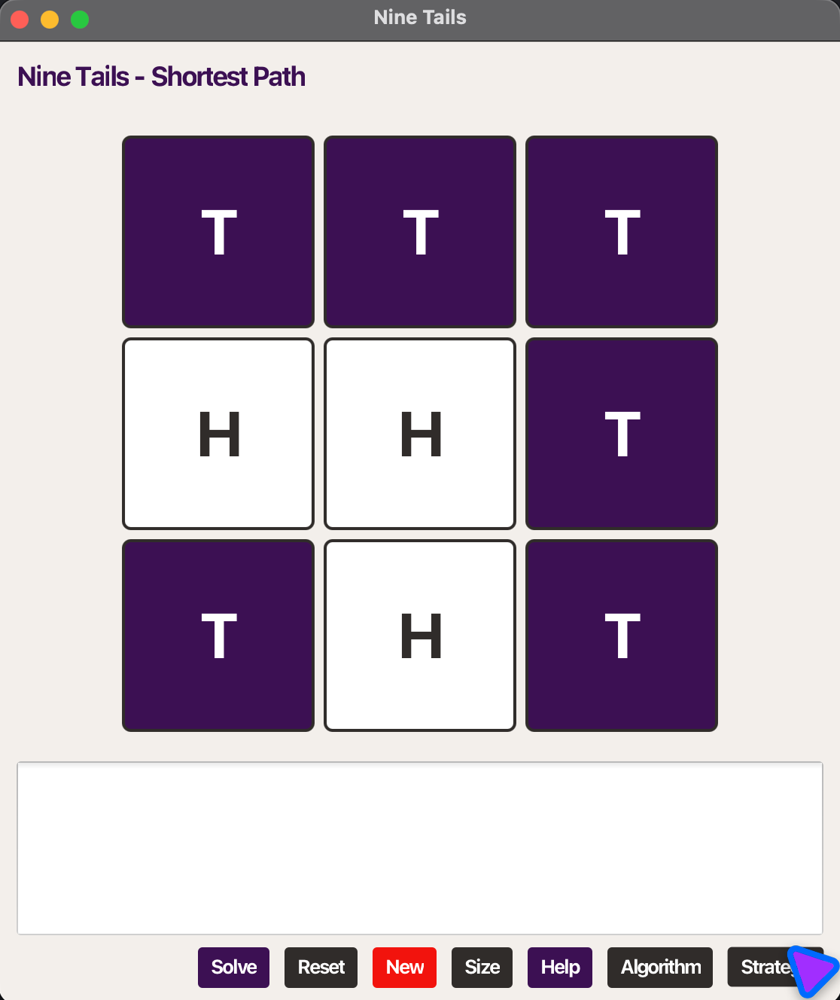

# 13-01 – Nine Tails Problem (JavaFX)

A simple JavaFX app for the classic Nine Tails problem.



# What is Nine Tails?

Nine Tails is a puzzle consisting of a 3x3 grid of coins, each showing either Heads or Tails. The goal is to flip all coins to Tails by clicking on coins showing Heads. Clicking a coin flips it and its adjacent coins (up, down, left, right).

# How to Play Nine Tails

- Click on a coin showing Heads (white) to flip it and its adjacent coins (up, down, left, right).
- The objective is to turn all coins to Tails (purple) in the fewest moves possible.
- Use the "Solve" button to find the minimum steps from the current configuration to the goal state.

## What it shows
- The board is an N x N grid of coins (default 3 x 3). 0 = Head (white), 1 = Tail (purple).
- A legal move: click a Head to flip it and its 4-neighbors (up/down/left/right).
- The goal is all coins Tail. The Solve button finds the minimum steps.

## How it works (short and sharp)
- Each board state is encoded as an integer bitset. Bit i corresponds to cell i.
- We precompute masks that toggle a cell and its neighbors.
- We build a BFS tree rooted at the target state (all tails). From that tree we read the
  shortest path from any start to the target.

## Run
```
mvn clean javafx:run -f 13-01-NineTailsProblem/pom.xml
```

## UI
- ACU colors: Purple for tails, white for heads; dark strokes and accent buttons.
- Buttons: Solve, Reset, New, Size.

## Structure
- `src/main/java/com/acu/ninetails/NineTailsModel.java` – core model + BFS.
- `src/main/java/com/acu/ninetails/App.java` – JavaFX UI.
- `src/test/java/com/acu/ninetails/NineTailsModelTest.java` – unit tests for model.


