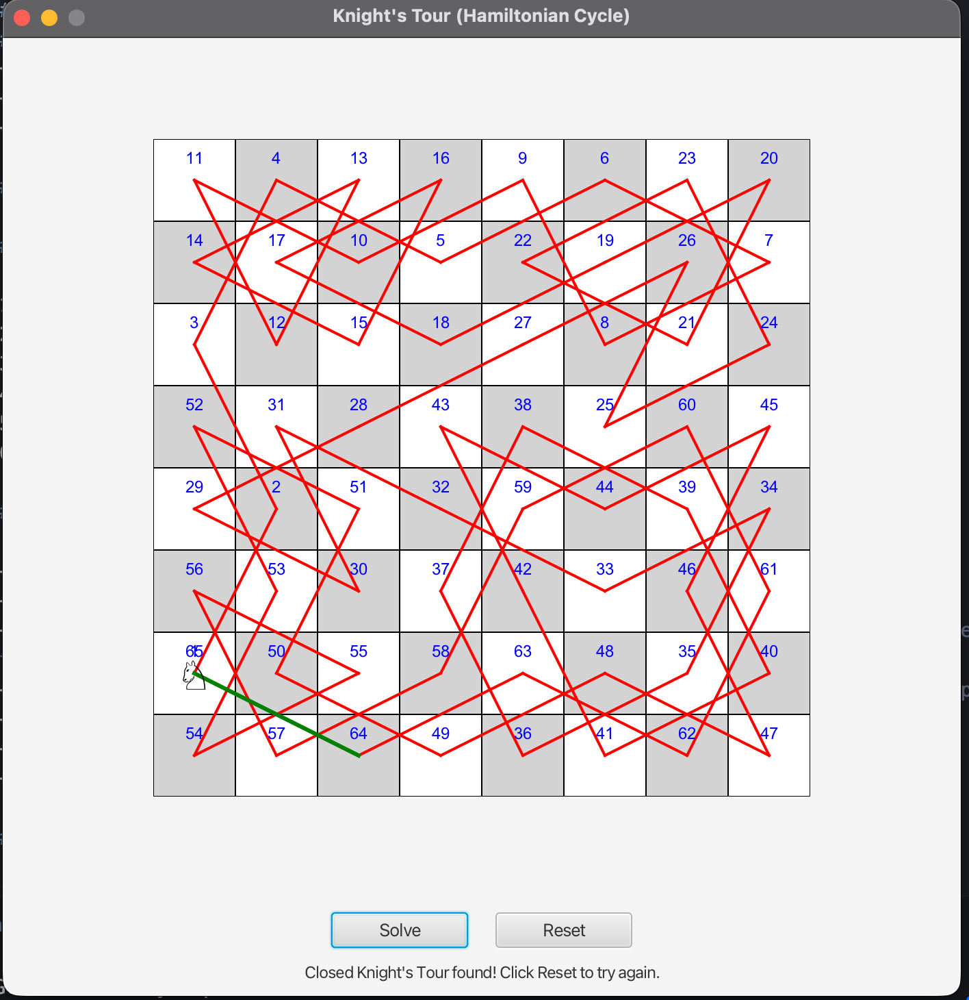

# Knight's Tour as a Hamiltonian Cycle – JavaFX Application



## Overview

This JavaFX application demonstrates the **Knight's Tour as a Hamiltonian cycle**. We model the 8×8 chessboard as a graph where each square is a vertex and edges connect squares that are a valid knight move apart. A closed knight’s tour corresponds to a **Hamiltonian cycle** in this graph: a cycle that visits each vertex exactly once and returns to the start.

The application provides an interactive visualization where users can:
- Place a knight on any starting square by clicking
- Watch an animated solution of a closed Knight's Tour (cycle)
- See the complete path traced on the chessboard
- Reset and try different starting positions

## Features

### 🎯 Core Functionality

1. **Interactive Chessboard** - 8x8 grid with alternating light and dark squares
2. **Knight Placement** - Click any square to place the knight (♘ symbol)
3. **Animated Solution** - Watch the knight move through the complete tour
4. **Path Visualization** - Red lines show the knight's path
5. **Move Numbering** - Each visited square shows its move number
6. **Reset Functionality** - Start over with a new position

### 🚀 Key Features

- **Modern JavaFX Interface**: Clean, intuitive user interface
- **Real-time Animation**: Smooth knight movement with timing control
- **Hamiltonian Cycle Reduction**: Solves a closed tour by enforcing a return edge to the start
- **Backtracking Algorithm**: Depth-first search with pruning over the knight graph
- **Visual Feedback**: Clear indication of current position and path
- **Cross-platform**: Works on Windows, macOS, and Linux
- **Educational**: Perfect for learning algorithms and JavaFX

## Project Structure

```
13-02-KnightTour-Hamiltonian/
├── src/main/java/com/acu/javafx/knighttour/
│   ├── KnightTourDemo.java          # Main JavaFX application
│   ├── ChessBoard.java              # Interactive chessboard component
│   └── KnightTourSolver.java        # Knight's Tour algorithm implementation
├── src/test/java/com/acu/javafx/knighttour/
│   └── KnightTourSolverTest.java    # JUnit tests for the algorithm
├── docs/
│   ├── algorithm.md                 # Algorithm explanation
│   └── architecture.md              # Application architecture
├── images/
│   └── KnightTour-Hamiltonian.png    # Application screenshot
├── pom.xml                          # Maven configuration
├── run.sh                           # Unix/Linux/macOS run script
├── run.bat                          # Windows run script
└── README.md                        # This file
```

## Quick Start

### Prerequisites

- **Java**: OpenJDK 24 or later
- **Maven**: 3.9.x or later
- **JavaFX**: 24 (included in dependencies)

### Running the Application

#### Option 1: Using Run Scripts (Recommended)
```bash
# Unix/Linux/macOS
./run.sh

# Windows
run.bat
```

#### Option 2: Direct Maven Commands
```bash
# Clean and compile
mvn clean compile

# Run the application
mvn javafx:run

# Run tests
mvn test

# Build executable JAR
mvn clean package
```

#### Option 3: Build and Run JAR
```bash
# Build the project
mvn clean package

# Run the application
java -jar target/knight-tour-demo-hamiltonian-cycle-1.0.0.jar
```

## Usage Guide

### Getting Started

1. **Launch the Application**: Run using one of the methods above
2. **Place the Knight**: Click on any square to place the knight
3. **Start the Tour**: Click the "Solve" button to begin the animation
4. **Watch the Solution**: Observe the knight moving through all 64 squares
5. **Try Again**: Click "Reset" to try a different starting position

### Understanding the Interface

- **Chessboard**: 8x8 grid with alternating colors
- **Knight Symbol**: ♘ represents the knight piece
- **Red Lines**: Show the path the knight will take
- **Blue Numbers**: Indicate the order of moves
- **Status Bar**: Shows current instructions and progress

### How the Algorithm Works (Reduction to Hamiltonian Cycle)

The application reduces the Knight’s Tour to a Hamiltonian cycle problem on the knight move graph and uses **backtracking with pruning**:

1. **Start**: Place knight on chosen square (start vertex)
2. **Explore**: Try edges to unvisited neighbors (valid knight moves)
3. **Recurse**: Continue until all 64 vertices are visited
4. **Cycle Constraint**: Only accept solutions where the last vertex has an edge back to the start
5. **Backtrack**: Undo moves when stuck and try alternatives

## Technical Details

### Knight's Tour as Hamiltonian Cycle

#### What is the Knight's Tour?
The Knight's Tour is a sequence of moves by a knight on a chessboard such that:
- The knight visits every square exactly once
- The knight follows standard chess movement rules (L-shaped moves)
- The tour can be either open (start and end are different) or closed (start and end are adjacent)

#### Knight Movement Rules
A knight moves in an L-shape:
- 2 squares in one direction (horizontal or vertical)
- 1 square in the perpendicular direction
- Total of 8 possible moves from any position (except near edges)

#### Algorithm Implementation (Closed Tour)
```java
// Backtracking for closed tour (Hamiltonian cycle)
private boolean solveRecursiveClosed(int row, int col, Position start,
                                     boolean[][] visited, List<Position> path, int moveCount) {
    if (moveCount == 64) {
        return isValidKnightMove(new Position(row, col), start);
    }
    for (int[] move : KNIGHT_MOVES) {
        int newRow = row + move[0];
        int newCol = col + move[1];
        if (isValidMove(newRow, newCol, visited)) {
            visited[newRow][newCol] = true;
            path.add(new Position(newRow, newCol));
            if (solveRecursiveClosed(newRow, newCol, start, visited, path, moveCount + 1)) {
                return true;
            }
            visited[newRow][newCol] = false;
            path.remove(path.size() - 1);
        }
    }
    return false;
}
```

### Architecture

The application follows a clean architecture pattern:

- **KnightTourDemo**: Main application class, handles UI and user interactions
- **ChessBoard**: Custom JavaFX component for the chessboard visualization
- **KnightTourSolver**: Contains the core algorithm and animation logic

#### Key Design Patterns
- **MVC Pattern**: Separation of UI, logic, and data
- **Observer Pattern**: Event handling for user interactions
- **Strategy Pattern**: Different solving approaches (extensible)
- **Command Pattern**: Animation and user action handling

## Testing

### Running Tests

```bash
# Run all tests
mvn test

# Run specific test class
mvn test -Dtest=KnightTourSolverTest

# Run with verbose output
mvn test -X
```

### Test Coverage

The test suite covers:
- **Knight Move Validation**: Verifies L-shaped movement rules
- **Position Handling**: Tests position creation, equality, and hashing
- **ChessBoard State**: Tests knight placement, path tracking, and reset
- **Solver Logic**: Tests algorithm state and solution finding
- **Integration Tests**: End-to-end workflow validation

### Test Categories

1. **Unit Tests**: Individual component testing
2. **Integration Tests**: Component interaction testing
3. **Edge Case Tests**: Boundary condition testing
4. **Performance Tests**: Algorithm efficiency testing

## Development

### Building from Source

```bash
# Clone the repository
git clone <repository-url>
cd 13-02-KnightTour-Hamiltonian

# Build the project
mvn clean package

# Run tests
mvn test

# Run the application
mvn javafx:run
```

### Adding New Features

1. **New Solving Algorithms**: Implement different approaches (Warnsdorff's algorithm, etc.)
2. **Different Board Sizes**: Support for non-8x8 boards
3. **Tour Types**: Open vs. closed tours
4. **Performance Metrics**: Timing and move counting
5. **Save/Load**: Persist solutions to files

### Code Style

The project follows Java coding conventions:
- **Naming**: camelCase for methods/variables, PascalCase for classes
- **Documentation**: Comprehensive JavaDoc comments
- **Structure**: Clear separation of concerns
- **Error Handling**: Proper exception handling and validation

## Troubleshooting

### Common Issues

#### 1. JavaFX Not Found
**Error**: `JavaFX runtime components are missing`
**Solution**: Ensure JavaFX dependencies are properly configured in `pom.xml`

#### 2. Compilation Errors
**Error**: `Cannot find symbol` or compilation failures
**Solution**: 
```bash
mvn clean compile
```

#### 3. No Solution Found
**Error**: Application shows "No solution found"
**Solution**: This is normal for some starting positions. Try different starting squares.

#### 4. Animation Too Fast/Slow
**Solution**: Modify `ANIMATION_INTERVAL` in `KnightTourSolver.java`

### Debug Mode

Run with debug output:
```bash
mvn javafx:run -Djavafx.debug=true
```

### Performance Issues

For large boards or slow performance:
```bash
# Increase JVM heap size
export MAVEN_OPTS="-Xmx2g"
mvn javafx:run
```

## Educational Value

### Learning Objectives

This project demonstrates:
- **Algorithm Design**: Backtracking and recursive problem solving
- **JavaFX Programming**: Custom components and animations
- **Object-Oriented Design**: Clean architecture and design patterns
- **Testing**: Unit testing and test-driven development
- **Problem Solving**: Breaking down complex problems

### Related Concepts

- **Graph Theory**: Knight's Tour as a Hamiltonian path problem
- **Backtracking**: Systematic exploration of solution space
- **Recursion**: Self-referential problem solving
- **Animation**: Smooth visual transitions in JavaFX
- **Event Handling**: User interaction and response

## Screenshots


<!--  -->
[](https://youtu.be/44tY0SFZCPo)


