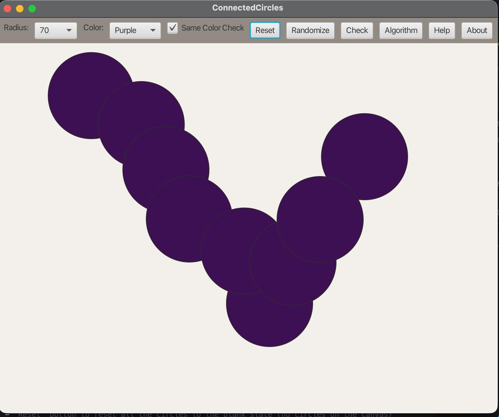

# Connected Circles – JavaFX Application

## Overview

An educational JavaFX app that applies Depth‑First Search (DFS) to determine whether user‑created circles on a plane form a connected graph. Each circle is a vertex; two vertices are adjacent if the circles overlap or touch.

## Features

### 🎯 Interactions
1. Click to add a circle at the cursor (radius selector: 10–100; default 20)
2. Drag to move circles
3. Color selector: Purple, Red, Green, Blue, Yellow (default Purple)
4. Same Color Check (on by default): validates connectivity within each color group
5. Randomize: adds 10 circles with random positions/radii/colors
6. Reset: clears the canvas
7. Check: paints circles filled when connected and shows the result dialog
8. Algorithm / Help / About dialogs

### 🎨 ACU Color Scheme
The UI uses ACU colors (Purple, Red, Warm Stone, Deep Charcoal, Soft Ivory).

## Project Structure

```
13-03-ConnectedCircles-Problem/
├── src/main/java/com/acu/connectedcircles/
│   ├── App.java            # JavaFX UI and interactions
│   ├── CircleItem.java     # Circle model
│   └── GraphUtils.java     # Graph building + DFS
├── src/test/java/com/acu/connectedcircles/
│   └── GraphUtilsTest.java # Unit tests for connectivity
├── docs/
│   ├── concepts.md         # Graph model + DFS notes
│   └── architecture.md     # UI + logic design
├── images/ConnectedCircles.png
└── pom.xml
```

## Quick Start

### Prerequisites
- Java 21+
- Maven 3.9+

### Run
```bash
mvn clean compile
mvn test
mvn javafx:run
```

## How It Works

1. Build an overlap graph: add an edge when distance(centerA, centerB) ≤ rA + rB
2. Run DFS from any vertex
3. If all vertices are discovered, the set is connected
4. With Same Color Check enabled, each color group must be connected

## Screenshot


